# Start-up Growth Engineering (SUGE) - Week 1 Study Sheet

This sheet accompanies the lecture for the above week and highlights the main points to understand and remember from the lecture. It is not a substitute for watching the lecture during revision. Instead, it is intended to help consolidate the key points.

The most important points from this lecture are as follows:

## The Fundamental Mechanisms of Growth

Below is the simplest model of a start-up. We attract users to our product through marketing and they become active users of our product:


In such a model, the corresponding growth in active users would be a linear growth, like this:


<table>
  <thead>
    <tr>
        <th>Time</th>
        <th>Active Users</th>
    </tr>
  </thead>
  <tbody>
    <tr>
        <td>0</td>
        <td>0</td>
    </tr>
    <tr>
        <td>10</td>
        <td>10</td>
    </tr>
  </tbody>
</table>


If we could additionally persuade most or all of our users to tell their friends and colleagues about our product, which resulted in them signing up for the product, our start-up machine would look like this:

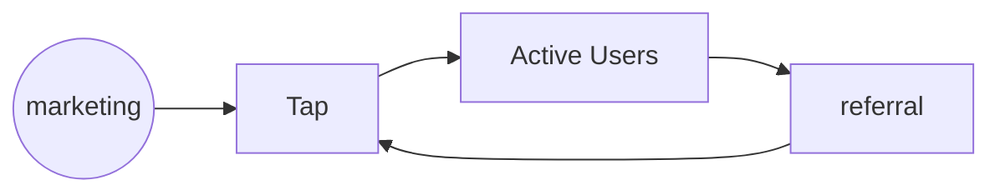

And our growth would become exponential (i.e. it would be proportional in some way to the number of active users of the product – the more users we have the more referrals we would have, and so on):


<table>
  <thead>
    <tr>
        <th>Time</th>
        <th>Active Users</th>
    </tr>
  </thead>
  <tbody>
    <tr>
        <td>Start</td>
        <td>Low</td>
    </tr>
    <tr>
        <td>End</td>
        <td>High (Exponential Growth)</td>
    </tr>
  </tbody>
</table>


But this simple model doesn’t take account of the fact that some users may stop using our product. Therefore, let’s update our start-up machine further:

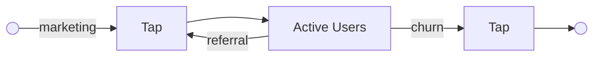

Now our growth depends on whether we are gaining users faster than we are losing them. Often, start-ups find users and then start to lose them quite quickly because, for example, the product doesn’t do what the market wants. If we start losing users faster than we are finding new ones, then we could end up with this growth curve:


<table>
  <thead>
    <tr>
        <th>Time</th>
        <th>Active Users</th>
    </tr>
  </thead>
  <tbody>
    <tr>
        <td>Start</td>
        <td>Low</td>
    </tr>
    <tr>
        <td>Middle</td>
        <td>Peak</td>
    </tr>
    <tr>
        <td>End</td>
        <td>Low (Failure)</td>
    </tr>
  </tbody>
</table>

Although we’ve increased the sophistication of our start-up model, it’s still overly simplified, and leaves many questions still to be answered. For example, how do we improve the likelihood that users we attract to the product become long-term active users? How do we encourage them to refer their friends and colleagues, and how do we optimize that process? How can we reduce the likelihood of users leaving our product? Depending on our success in answering these questions, our start-up is going to experience one of these growth curves:


<table>
  <tbody>
    <tr>
        <td>Time</td>
        <td>exponential</td>
        <td>linear</td>
        <td>failure</td>
    </tr>
    <tr>
        <td>Start</td>
        <td>0</td>
        <td>0</td>
        <td>0</td>
    </tr>
    <tr>
        <td>Middle</td>
        <td>High</td>
        <td>Medium</td>
        <td>Low</td>
    </tr>
    <tr>
        <td>End</td>
        <td>Very High</td>
        <td>High</td>
        <td>0</td>
    </tr>
  </tbody>
</table>


Although serendipity plays a part in the success of any start-up, you can see that understanding the techniques of growing a start-up in its market is likely to vastly improve your chances of success. This is where Growth Engineering comes in…

## What is Growth Engineering?

Growth Engineering can be defined as follows:

### (Start-up) Growth Engineering

> Techniques for systematically introducing a new product idea into a large-scale market and driving it to scale.

It asserts that successfully growth a start-up to scale is not wholly luck, but is, to a large extent, governed by a systematic approach to driving growth. This approach is a distillation of techniques tested and evolved in large tech ecosystems such as Silicon Valley. In the course we study these approaches.

Growth Engineering can reveal why businesses experience exponential growth…

<table>
  <tbody>
    <tr>
        <td>Year</td>
        <td>Users (Millions)</td>
    </tr>
    <tr>
        <td>2013</td>
        <td>0.1</td>
    </tr>
    <tr>
        <td>2014</td>
        <td>0.5</td>
    </tr>
    <tr>
        <td>2015</td>
        <td>1.2</td>
    </tr>
    <tr>
        <td>2016</td>
        <td>4.0</td>
    </tr>
  </tbody>
</table>


...and why it all goes wrong sometimes, such as With Viddy, in 2012:


<table>
  <tbody>
    <tr>
        <td>Year</td>
        <td>Interest Index</td>
    </tr>
    <tr>
        <td>2012</td>
        <td>100</td>
    </tr>
    <tr>
        <td>2013</td>
        <td>5</td>
    </tr>
  </tbody>
</table>


# The conditions for Growth Engineering to become a discipline evolved over time.

There were four main pre-cursors, or "journeys" in industrial product engineering that created the conditions for Growth Engineering to be successfully practiced:


## Delusion of Certainty -> Embracing Uncertainty

Software engineering has gravitated over time to embrace the reality that new product introduction is a highly uncertain task. When we are not working to a specific customer, it is even more uncertain. Techniques have evolved to help start-ups work successfully amidst this uncertainty. Embracing this uncertainty, and adjusting our approach to accommodate that reality, is usually referred to as the *Lean Start-up methodology*.

Lean start-up principles can be summarised as follows:


The fail-fast approach works on the idea that, firstly, there’s a very good chance that your idea, or your specific implementation of your idea is wrong, (remembering that 80% of start-ups fail), i.e., that the market doesn’t want to adopt your proposition. And, if that *is* true, then you certainly will want to discover that truth as quickly as possible, and with the least effort. This implies, in turn, a range of approaches to prototyping and testing ideas that optimise for speed of discovery with minimum effort spent.

Related to this concept, is the concept of Pivot-or-Persevere. This is a discipline whereby the start-up team regularly discusses whether the product is making progress towards being adopted by its market. If not, the team decides whether to continue with the current product approach (Persevere) or to alter the direction of the product in some way (Pivot), or even to abandon the product altogether. By operating to this frequent discipline, it is more likely that the team will realise early that a product is not going to be successful and perhaps make changes of direction that result in eventual success.

To support this process, the start-up must first establish Learning Metrics. These are distinct from Vanity Metrics. Learning metrics give insight into whether a product is gaining adoption in the market, whereas vanity metrics superficially convey a similar picture but are misleading as to actual performance. A classic example of a vanity metric is *Number of App Downloads*. The problem with such a metric is that it doesn’t reveal whether users are still using an app after downloading it. A more appropriate metric example, therefore, is *App Active Users*, because it *does* incorporate on-going usage. Vanity metrics are addictive and dangerous, because they are often relatively easier to collect but mask actual performance, which can lead to late detection of a lack of market adoption.

We call this market adoption of a product “achieving *Product Market Fit*” (PMF). In the remainder of the course, we’ll study how to tell when we have PMF and whether we are heading towards it, amongst other things.

A common mistake that many start-ups make is to assume that they have product-market fit and to prematurely start trying to scale marketing efforts. This is wasteful of money and time because they are spending resources to acquire users that they don’t manage to retain. A general rule of thumb here is that it is always better to retain a user than to lose that user and have to acquire a new one. But many well-funded start-ups attempt to operate the reverse philosophy, always with eventual, disastrous results.

# Functional Pre-Eminence -> Model Pre-Eminence

Growth engineering requires that teams operate seamlessly across organisational boundaries. This matters because the task of acquiring customers, convincing them to form a habit around our product in their lives, ensuring that they retain that habit, monetizing them, and encouraging them to recommend our product, all of these steps require multiple skillsets working together. (We’ll return to the diagram below many times in the course, as it is a key part of Growth Engineering.)

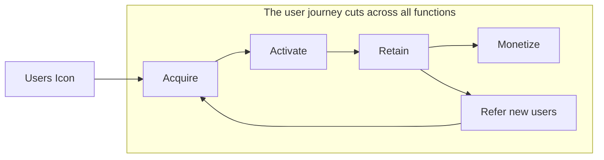

Traditional tech businesses don’t do this well. Different skillsets are organized into strict functional hierarchies, and people tend to stay within them.

## A typical functional structure


This tends to create boundaries within the process of customer acquisition (for example), and makes it very difficult to optimise the customer journey:


The above discussion is an illustration of *Conway’s Law*. The formal way of expressing it is as follows:


The short-hand way of saying this is “you ship your organization.” Essentially, interfaces within the organization become interfaces within the product. Some of these are visible to users/customers and limit the product’s effectiveness.

## Low to High-speed iteration

Over time, tech companies have become much faster at iterating. The most obvious example of this is the rate of software release in tech businesses. Twenty years ago, once or twice a year was a typical release frequency, whereas many businesses now release product at a weekly or even daily cadence. There’s a considerable investment required in process and infrastructure to be able to operate in this way at scale. But the benefit is that the organization can experiment far more quickly, test ideas, learn more quickly and optimise the performance and product-market fit of the product.

The underlying “law” that drives this approach is Boyd’s law:


A note of caution: Iterating/experimenting without a directing strategy is wasteful, “busy work”. As Elon Musk once said:


> “If you’re digging your grave, you don’t want to dig faster, you want to stop digging.”

## Metric Soup – to Model-based metrics

We’ve already seen how key learning metrics are essential to the lean start-up approach and how vanity metrics must be avoided. Two other common issues in businesses concerning metrics are:

* An explosion of metrics, driven partly by the emergence of dashboarding tools and similar, that make it easy to collect metrics. Unless we understand the context for those metrics, this can lead to noisy information that actually obscures insight into what is happening in the business.
* Making the “measurable important” rather than making what’s important measurable. The latter is harder to do, which is why many businesses don’t do it. They end up with pretty dashboards that have no value.

These issues have been improved upon by building more comprehensive models of how the business works, and enabling the metrics required to illuminate that model, in the context of the model. This is a key approach in Growth Engineering, where we establish a Growth Model to manage and predict growth performance.

## Internet Economy Companies

A type of company has emerged that can be described as an Internet Economy company. Such a company exhibits many of the properties we have just described. They can usually move much more quickly than more traditional companies and tend to disrupt those businesses over the medium term.

### An “Internet-Economy” Company

* **High-Speed Iteration**: -> Fast learning rate-> Organizational agility
* **Embraces uncertainty**: -> Experimentation, Fail-fast, Data-driven
* **Explicit growth model**: -> Drives strategy implementation and team activities

# Introducing the Growth Model

Now that we have reviewed some of the pre-cursors to Growth Engineering, let’s now examine the key construct in Growth Engineering, namely the Growth Model. The Growth Model defines, both in qualitative and quantitative terms, how the business grows. It can be depicted as follows:

## Introducing: The Growth Model...


The model consists of three elements:

* Optimizing the customer journey; essentially bringing potential users through to the point where they have formed a habit around our product.
* Compounding Growth – various mechanisms to encourage users to refer other users, thereby creating a new source of “free” acquisition of users.
* Linear Marketing – techniques to bring potential users to our product for the first time.

These elements work together as one growth engine for the business. In the remainder of this course, we’ll study this model in significant detail. We’ll first examine the qualitative aspects of the mechanisms involved. Later we’ll develop analogous quantitative models. Each type of model (qualitative and quantitative) addresses different requirements and needs of a start-up team in growing the business.

## The Growth Model in Context

The highest-level generic strategy of a start-up or later-stage business can be summarised as below.

# Where the Growth Model Fits

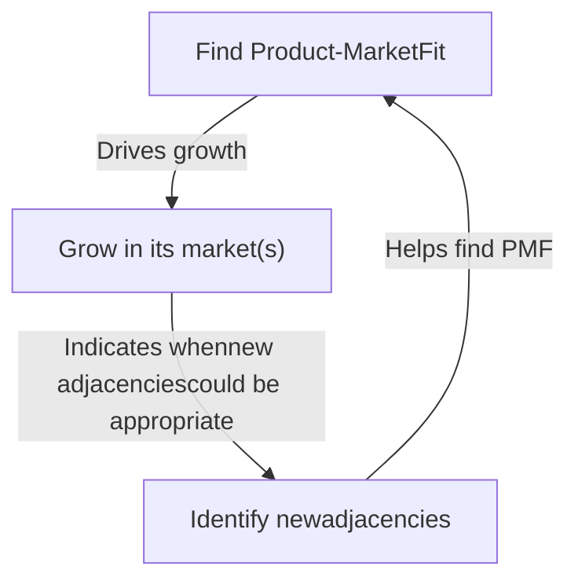

Firstly, the start-up must achieve product-market fit for its current product. Once achieved, the start-up attempts to maximally exploit that product-market fit by growing its markets as much as possible. Eventually, as the market saturates, the start-up must move into new adjacencies and repeat the process all over again. Adjacencies include new geographies, new use cases, and new user domains.

The Growth Model helps us in each area. It helps us navigate towards PMF, it helps us drive growth after PMF, and it helps us detect when we are nearing the point where new adjacencies must be explored.

# Start-up Growth Engineering (SUGE) - Week 2 Study Sheet

This sheet accompanies the lecture for the above week and highlights some of the main points to understand and remember from the lecture. It is not a substitute for watching the lecture. Instead, it is intended to help consolidate the key points.

In this lecture, we covered the following four areas:

1. How start-up Strategy relates to the Growth Model
2. Growth Model – The Customer Journey
3. Growth Model – Driving Compounding Growth Effects
4. Growth Model – Linear Marketing

## Start-up strategy and the growth model

People often talk about strategy in business without having a clear idea what constitutes a strategy. In start-up terms, it is very useful in practice to think of strategy as the answer to the question: How do we grow? A start-up that doesn’t grow to sufficient scale doesn’t become a sustainable business – it doesn’t make impact and it probably can’t pay its bills or its employees.

But if you ask each employee of a start-up (or, often, a larger company) this question (“How do we grow?”) you may well receive multiple different answers, or not clear answer at all. In these cases, the chances are that the start-up has no clear strategy.

The growth model is essentially the answer to “How do we grow?” and, so, is the practical implementation of a strategy.

At the next level of detail down from “How do we grow?” a start-up’s high-level general strategy concerns three areas, which we discussed at the end of Week 1’s lecture:

High-level Product-Growth strategy:
A start-up must do three things to survive & thrive

```mermaid
graph TD
    A[Find Product-MarketFit] --> B[Grow in its market(s)]
    B --> C[Identify newadjacencies]
    C --> A
```

In summary, the start-up must find product-market fit, then exploit that to grow the market opened to it by having product-market fit. As the market starts to saturate (i.e., it’s getting progressively harder to find new customers for our product) we need to identify adjacent areas into which to move. These could be new geographies, or new domains for our existing

product or new products, for example. At that point, we must once again establish product-market fit for our new adjacency, and the process repeats.

Taken together, these three steps are the highest-level answer to "How do we grow". But this is a very general answer. The next step is to move to specifics for our particular start-up in its particular market. This is where the *Growth Model* comes in. It helps us to address each of the three strategic areas. The Growth Model helps us to know when we are approaching (or moving away from) product-market fit, it especially helps define how to grow to exploit that product-market fit and it signals to us when it is time to move to new adjacencies.

### Where the Growth Model Fits

```mermaid
graph TD
    A[Find Product-Market Fit] -- "Indicates when new adjacencies could be appropriate" --> B[Identify new adjacencies]
    B -- "Drives growth" --> C[Grow in its market(s)]
    C -- "Helps find PMF" --> A
```

## The Growth Model

We can depict the Growth Model as having three components that, together, define how we fulfil the higher levels of the strategy.


We’ll examine each of these in turn, in overview, in this lecture. In the remainder of the course, we’ll go into each area in much more detail. Initially, we’ll do that from a qualitative perspective, then from a quantitative perspective.

# The User Journey

Users of virtually every product or service go through the following journey as they engage with that product or service¹.

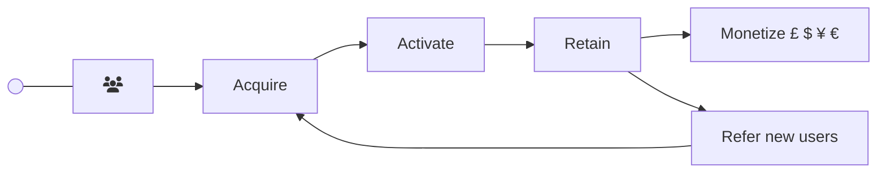

**Acquisition** – Users must be acquired. That means that they are made aware of the product in some way. For example, they visit the product’s website for the first time, or download the app for the first time. We often call this task Marketing. Note that those people that we acquire are not properly users of the product at this point. To make them users, we must *activate* them, which leads us to…

**Activation** – Activating a user means getting that user into the habit of using our product for the first time. As you will discover, exactly what constitutes habitual use is an extremely important question in growth engineering, and we’ll return to it in detail later in the course. For now, the important thing to know is that, if users are not activated, that is to say, if they do not form a habit around our product at this stage, they will quickly stop using the product and are lost to us. Our acquisition costs and effort directed towards these people are then wasted.

Some examples of habits are: whenever I want to book a hotel, I go to booking.com, whenever I want to buy some household item, I go to amazon.co.uk, and whenever I want to incite a mass insurrection to attempt to overturn an election result, I open the twitter app.

If we are able to activate our users into forming a habit around our product, then the next stage is to *retain* them in that habit…

**Retention** – When the user is in this state, our primary task is to keep them in it. Our second task is to try to deepen that habit. Why? Retention matters enormously because, only when users are retained can we…

…**Monetize** them to generate revenue for the business. Examples of monetization are: subscription fees, charges for buying items and advertising.

¹ We’ll usually use “product” as shorthand for “product or service”

... **Drive Referrals** The other important thing we can do when users are retained is encourage them to tell other people about the product. This creates a new – and essentially free – acquisition channel for the business and is one of the foundations for *compounding growth*, which we’ll talk about shortly (it’s the second part of our Growth Model).

Retention is therefore arguably the most important of all the states. The better our retention of existing users, the better our monetization and referral rates, which means that our revenue growth will be better too. This pays our wages, pays back investors faster and allows us to invest further in the business.

## Compounding Growth

The second major component of the growth model is Compounding Growth:


## What is Compounding Growth?

A product experiences Compounding Growth is when the rate of growth of the product’s user base at any given point is proportional to the number of users at that point. If sustained over a sufficiently long period, this leads to accelerating growth, such as Twitter experienced in its early years (see below).


It’s obviously attractive for a start-up to experience something like this growth trajectory. But even if growth is not as extreme, it is still very desirable for a start-up to be able to grow its customer base and revenue far in excess of its marketing budget or its staff headcount. In this lecture, we’re going to examine techniques that tech start-ups employ to attempt to achieve these desirable states.

## What causes Compounding Growth in products?

Compounding Growth in products is driven by two forces: Compounding Growth Mechanisms and Network Effects. These can exist entirely separately (i.e., a product exhibits either but not both) or together (i.e., both operate together upon one product). When these forces operate together, they are usually mutually reinforcing.

An important point is that products can be designed in such a way that such mechanisms are more likely to operate. A large part of a product’s Growth Model is about attempting to do just that.

In the lecture we focus on the first of these mechanisms Compounding Growth Mechanisms, hereafter referred to CGMs. As we build our knowledge, we’ll return to CGMs in more detail, we’ll study network effects in detail, and we’ll also look at how CGMs and network effects inter-operate. For now, to keep things simple, we’ll ignore network effects.

## What are Compounding Growth Mechanisms (CGMs)?

Generically speaking, a CGM is a mechanism where the output of the mechanism drives the input in a repeating fashion. In product terms, the input of the CGM is users and the output is more users – i.e., the CGM produces more users of a product from an existing set of users. The more users that are input to the CGM, the more additional users it produces. These new users, in turn, act as input to the CGM, leading to a compounding effect.

# Compounding Growth (Generic)


<table>
  <tbody>
    <tr>
        <td>Users attract other people to consider the product</td>
        <td>Some of those people become new users</td>
    </tr>
  </tbody>
</table>


We’ve already studied the user/customer journey. The Referral state in that user journey is the link between the customer journey and these compounding mechanisms. Part of our task in optimizing the user journey is to retain users and encourage them, in various ways, to refer other users to sign-up for the product. Remember that users will only be able to refer other users if they are using the product (i.e., they are retained).


## CGM Types

There are two main types of CGM corresponding to the different ways that users can refer other users.

### Direct and Indirect Compounding Growth, Core Currency


The lecture slides illustrate each of these CGMs with real-world examples, and you should also try to think of your own examples, to help you become familiar with these mechanisms. In the meantime, here are some important points associated with CGMs:

*   **Direct CGMs** are so-called because users *directly invite* other users to the product. We can also say that the *currency* of the CGM is users. The more currency (users) we have the better, because the more referrals we will generate, which will lead to even more referrals.

*   **Indirect CGMs** don’t operate by direct invitation. Instead, some intermediate currency is used to attract new users. Indeed, in this type of CGM, the user isn’t necessarily even aware that she is attracting new users to the product. There are two sub-types in this category.

    *   Content-based, Indirect CGMs (currency = content). In this case some form of content (text, audio, video) is created and/or shared by users which leads to new users being attracted to the product.

    *   Money-based Indirect CGMs (currency = literally, currency). In this case, the company earns money from users and employs (some of) that money in advertising to attract new users.

Indirect CGMs can also act as powerful retention mechanisms because they remind existing users that our product exists between buying events.

Later in the course, we’ll learn that each of these categories has, in turn, important sub-types. This is an important area, and is a cornerstone for modern, fast-growth start-ups. And we’ll also learn how to predict how many users such mechanisms will bring to the business. For now, it’s important that you study the examples in the lecture of how these mechanisms operate; understanding this will be very important for later in the course.<sup>2</sup>

## Linear Marketing

The final major component of the Growth Model is Linear Marketing.


<sup>2</sup> i.e., these notes are designed to support your review after having attended the lecture, or to temporarily mitigate the fact that you weren’t able to attend, so that you can understand the next lecture. But they are NOT a substitute for watching the lecture!

Linear marketing can be thought of as traditional marketing; making users aware of a product and bringing them to that product for the first time. Linear Marketing answers the question: Where do our initial users come from, to drive the customer journey and compounding growth? A CGM needs an initial supply of users that it can then amplify through compounding. These users very often come from linear marketing.

There are many forms of linear marketing, for example:

### Examples of Linear Marketing


We’ll study the topic in much more detail later in the course. But for now, here are some key points.

#### Why not just use Linear Marketing and forget about building CGMs?

In fact, this was exactly what used to happen in all businesses and still does in many, though to reduced effectiveness when compared to Internet Economy growth engineering techniques. Companies spent money on various marketing channels, events etc. In the background, customer word-of-mouth also brought new users (or lost users from a product, if that sentiment was negative). So, what’s changed?

Firstly, the cost of marketing has risen significantly on most linear marketing channels, and their effectiveness has decreased. Essentially, overcrowding on these channels pushes up the cost and brings down the conversation rates from potential customers to actual customers.

Channels decay in effectiveness and increase in cost over time


<table>
  <thead>
    <tr>
        <th>Time</th>
        <th>Cost</th>
        <th>Effectiveness</th>
        <th>Annotations</th>
    </tr>
  </thead>
  <tbody>
    <tr>
        <td>Start</td>
        <td>Low</td>
        <td>High</td>
        <td>New channel</td>
    </tr>
    <tr>
        <td>Middle</td>
        <td>Medium</td>
        <td>Medium</td>
        <td>More participants compete with your product for attention</td>
    </tr>
    <tr>
        <td>End</td>
        <td>High</td>
        <td>Low</td>
        <td>Saturation</td>
    </tr>
  </tbody>
</table>


Secondly, through the evolution of growth engineering techniques, we have learned how to move from simple word-of-mouth compounding mechanisms to a more deliberate and sophisticated treatment of compounding growth, including accelerating word-of-mouth

growth, and other techniques that we will study on this course. When these mechanisms are working effectively, they essentially acquire users “for free” <sup>3</sup> and, because of their compounding effects, can lead to exponential growth in the most successful cases.


<table>
  <tbody>
    <tr>
        <td>Growth Type</td>
        <td>Trend</td>
    </tr>
    <tr>
        <td>Compounding Growth</td>
        <td>Exponential</td>
    </tr>
    <tr>
        <td>Linear Growth</td>
        <td>Linear</td>
    </tr>
  </tbody>
</table>


## Relationship between Linear Marketing and Compounding Growth

The following two analogies are helpful in understanding the relationship between linear marketing and compounding growth. In summary, without linear marketing to bring users to seed our CGMs, they won’t have anything to operate upon, and to amplify.


There are some start-ups that don’t require to do any classical linear marketing and yet still experience growth from their CGMs and network effects alone. This is because their CGMs – especially word-of-mouth referrals (we call these *Organic, Direct CGMs* in this course, and we’ll study them later) are so powerful that no further marketing is necessary to seed the CGMs. But, for most start-ups, linear marketing is important to seed the compounding mechanisms.

In the remainder of the course, we are going to study all of the elements that we have introduced today in much more detail, with lots of real-world start-up examples to illustrate them. We’ll first examine the user journey in detail and qualitatively. Then we’ll move to compounding growth, network effects and their relationships, again in qualitative terms. Then we’ll move to a quantitative treatment of these mechanisms, eventually getting to the

<sup>3</sup> of course we have to build the mechanisms first, which has a cost, but afterwards there is no marginal cost incurred with each new user attracted to the product

stage where we are able to build complete qualitative and quantitative models of any start-up or scale-up. We’ll use these models to optimize growth and predict future growth.

# Start-up Growth Engineering (SUGE) - Week 3 Study Sheet

This study sheet accompanies the lecture for the above week and highlights some of the main points to understand and remember from the lecture. It is not a substitute for watching the lecture. Instead, it is intended to help consolidate the key points.

In this lecture, we covered the following three areas:

1. Why retention is so important
2. Understanding and working with retention
3. Factors which influence retention

Before we examine these topics, let’s recap where retention fits into the Customer Journey part of the Growth Model:

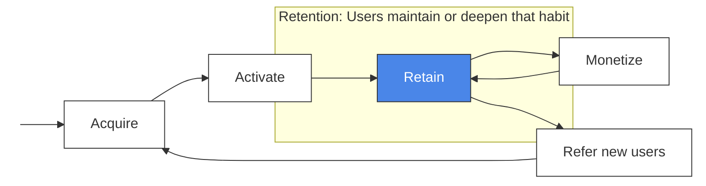

## Why Retention is so Important

Retention is arguably the most important state in the customer journey. The most obvious answer to why retention matters so much is that only when users are retained can we monetize them in some way (for example, by showing them ads, selling them things or charging them subscriptions). Also, only when users are retained can we encourage them to tell others about the product (known as referral). If they’re not using the product, clearly users won’t do these things.

But retention’s influence upon overall user growth is far more profound than it might at first appear. For example, FarmVille’s active user trend<sup>1</sup> (see next page) is dominated by issues with retention. The shape of this graph is so common in the start-up world that it has a name: “Jumping the Shark” (for the very technical reason that the chart looks like the fin of a shark).

<sup>1</sup> Proxied here by Google Trends


<table>
  <tbody>
    <tr>
        <td>Year</td>
        <td>Interest index</td>
    </tr>
    <tr>
        <td>2009</td>
        <td>0</td>
    </tr>
    <tr>
        <td>[illegible]</td>
        <td>100</td>
    </tr>
    <tr>
        <td>2012</td>
        <td>5</td>
    </tr>
  </tbody>
</table>


To understand how retention issues act to bring about such an outcome, we’re next going to study how retention affects growth in detail.

Let’s start with a theoretical case where a start-up retains *all* of the users that it acquires and activates. The chart below shows what the start-up’s active user growth would look like over a long period of time. Why do you think the chart has this shape, even though no active users are being lost?

### Theoretical Case: Zero Churn

<table>
  <tbody>
    <tr>
        <td>Time Period</td>
        <td>Active Users</td>
    </tr>
    <tr>
        <td>0</td>
        <td>1000</td>
    </tr>
    <tr>
        <td>1</td>
        <td>1800</td>
    </tr>
    <tr>
        <td>2</td>
        <td>2500</td>
    </tr>
    <tr>
        <td>3</td>
        <td>3100</td>
    </tr>
    <tr>
        <td>4</td>
        <td>3600</td>
    </tr>
    <tr>
        <td>5</td>
        <td>4000</td>
    </tr>
    <tr>
        <td>6</td>
        <td>4400</td>
    </tr>
    <tr>
        <td>7</td>
        <td>4700</td>
    </tr>
    <tr>
        <td>8</td>
        <td>5000</td>
    </tr>
    <tr>
        <td>9</td>
        <td>5200</td>
    </tr>
    <tr>
        <td>10</td>
        <td>5400</td>
    </tr>
    <tr>
        <td>11</td>
        <td>5500</td>
    </tr>
    <tr>
        <td>12</td>
        <td>5600</td>
    </tr>
    <tr>
        <td>13</td>
        <td>5700</td>
    </tr>
    <tr>
        <td>14</td>
        <td>5750</td>
    </tr>
    <tr>
        <td>15</td>
        <td>5800</td>
    </tr>
    <tr>
        <td>16</td>
        <td>5850</td>
    </tr>
    <tr>
        <td>17</td>
        <td>5900</td>
    </tr>
    <tr>
        <td>18</td>
        <td>5920</td>
    </tr>
    <tr>
        <td>19</td>
        <td>5940</td>
    </tr>
    <tr>
        <td>20</td>
        <td>5960</td>
    </tr>
    <tr>
        <td>21</td>
        <td>5980</td>
    </tr>
    <tr>
        <td>22</td>
        <td>6000</td>
    </tr>
    <tr>
        <td>23</td>
        <td>6000</td>
    </tr>
    <tr>
        <td>24</td>
        <td>6000</td>
    </tr>
  </tbody>
</table>
<table>
    <tr>
        <th>Parameter</th>
        <th>Value</th>
    </tr>
    <tr>
        <td>Churn</td>
        <td>0%</td>
    </tr>
    <tr>
        <td>Saturation</td>
        <td>17%</td>
    </tr>
    <tr>
        <td>Retention Floor</td>
        <td>0%</td>
    </tr>
    <tr>
        <td>Referral Dividend</td>
        <td>0%</td>
    </tr>
</table>
The answer is that the market addressable by the start-up is not infinite. Eventually, there’ll be no more users to acquire, and the graph will stop rising. At this point we say that the market is *saturated*.

### Saturation:

*The point when the volume of a product or service in a marketplace has been maximized. The number of customers willing to try the product who have not yet done so, falls to zero.*

The reason why the graph curves in the way it does is because, as we acquire users, it gets more and more difficult to acquire new users from those that are left, in general. For example, we tend to acquire all of those people that are highly enthusiastic about our product first. We then progress through less enthusiastic people to those that are only casually interested, and so on. Also, when most people in a market are using our product, it gets more difficult to find those that haven’t previously come across the product – extra efforts are required, but they return a smaller harvest.

We can see this effect more clearly if we colour-code each *cohort* of users. A cohort is the users signed-up in a given time period. For example, in time period 1 we signed up X number of users, in time period 2, we signed up Y number of users, and so on. Let’s see how that looks when we reveal the cohorts contributing to the above chart:


Theoretical Case: Zero Churn –
Cohort View

<table>
  <thead>
    <tr>
        <th>Time Period</th>
        <th>Total Active Users</th>
    </tr>
  </thead>
  <tbody>
    <tr>
        <td>1</td>
        <td>1000</td>
    </tr>
    <tr>
        <td>2</td>
        <td>1800</td>
    </tr>
    <tr>
        <td>3</td>
        <td>2500</td>
    </tr>
    <tr>
        <td>4</td>
        <td>3100</td>
    </tr>
    <tr>
        <td>5</td>
        <td>3600</td>
    </tr>
    <tr>
        <td>6</td>
        <td>4000</td>
    </tr>
    <tr>
        <td>7</td>
        <td>4350</td>
    </tr>
    <tr>
        <td>8</td>
        <td>4650</td>
    </tr>
    <tr>
        <td>9</td>
        <td>4900</td>
    </tr>
    <tr>
        <td>10</td>
        <td>5100</td>
    </tr>
    <tr>
        <td>11</td>
        <td>5250</td>
    </tr>
    <tr>
        <td>12</td>
        <td>5380</td>
    </tr>
    <tr>
        <td>13</td>
        <td>5490</td>
    </tr>
    <tr>
        <td>14</td>
        <td>5580</td>
    </tr>
    <tr>
        <td>15</td>
        <td>5650</td>
    </tr>
    <tr>
        <td>16</td>
        <td>5710</td>
    </tr>
    <tr>
        <td>17</td>
        <td>5760</td>
    </tr>
    <tr>
        <td>18</td>
        <td>5800</td>
    </tr>
    <tr>
        <td>19</td>
        <td>5830</td>
    </tr>
    <tr>
        <td>20</td>
        <td>5850</td>
    </tr>
    <tr>
        <td>21</td>
        <td>5870</td>
    </tr>
    <tr>
        <td>22</td>
        <td>5885</td>
    </tr>
    <tr>
        <td>23</td>
        <td>5895</td>
    </tr>
    <tr>
        <td>24</td>
        <td>5900</td>
    </tr>
    <tr>
        <td>25</td>
        <td>5905</td>
    </tr>
  </tbody>
</table>
<table>
  <tbody>
    <tr>
        <td>Churn</td>
        <td>0%</td>
    </tr>
    <tr>
        <td>Saturation</td>
        <td>17%</td>
    </tr>
    <tr>
        <td>RetentionFloor</td>
        <td>0%</td>
    </tr>
    <tr>
        <td>ReferralDividend</td>
        <td>0%</td>
    </tr>
  </tbody>
</table>


You can see that each cohort is a little smaller than the previous one, as it becomes progressively a little more difficult to attract new users.

Now, let’s introduce another term: *churn*.

### Churn:

*The percentage of total customers that stop using/paying over a given period of time.*

Churn describes the phenomenon of users discontinuing their use of a product. What happens to the above graph if we add 1% churn? In other words, for each time period, 1% of users who were active in the previous time period stop using the product. Let’s see…

# *1% Churn*


*In every time-period, 1% of customers active in the previous time-period are lost.*

<table>
  <thead>
    <tr>
        <th>Time Period</th>
        <th>Active Users</th>
    </tr>
  </thead>
  <tbody>
    <tr>
        <td>0</td>
        <td>1000</td>
    </tr>
    <tr>
        <td>1</td>
        <td>1800</td>
    </tr>
    <tr>
        <td>2</td>
        <td>2500</td>
    </tr>
    <tr>
        <td>3</td>
        <td>3100</td>
    </tr>
    <tr>
        <td>4</td>
        <td>3600</td>
    </tr>
    <tr>
        <td>5</td>
        <td>4000</td>
    </tr>
    <tr>
        <td>6</td>
        <td>4300</td>
    </tr>
    <tr>
        <td>7</td>
        <td>4550</td>
    </tr>
    <tr>
        <td>8</td>
        <td>4700</td>
    </tr>
    <tr>
        <td>9</td>
        <td>4850</td>
    </tr>
    <tr>
        <td>10</td>
        <td>4950</td>
    </tr>
    <tr>
        <td>11</td>
        <td>5000</td>
    </tr>
    <tr>
        <td>12</td>
        <td>5050</td>
    </tr>
    <tr>
        <td>13</td>
        <td>5050</td>
    </tr>
    <tr>
        <td>14</td>
        <td>5050</td>
    </tr>
    <tr>
        <td>15</td>
        <td>5050</td>
    </tr>
    <tr>
        <td>16</td>
        <td>5050</td>
    </tr>
    <tr>
        <td>17</td>
        <td>5000</td>
    </tr>
    <tr>
        <td>18</td>
        <td>5000</td>
    </tr>
    <tr>
        <td>19</td>
        <td>4950</td>
    </tr>
    <tr>
        <td>20</td>
        <td>4900</td>
    </tr>
    <tr>
        <td>21</td>
        <td>4850</td>
    </tr>
    <tr>
        <td>22</td>
        <td>4800</td>
    </tr>
    <tr>
        <td>23</td>
        <td>4750</td>
    </tr>
    <tr>
        <td>24</td>
        <td>4700</td>
    </tr>
  </tbody>
</table>
<table>
    <tr>
        <th>Parameter</th>
        <th>Value</th>
    </tr>
    <tr>
        <td>Churn</td>
        <td>1%</td>
    </tr>
    <tr>
        <td>Saturation</td>
        <td>17%</td>
    </tr>
    <tr>
        <td>RetentionFloor</td>
        <td>0%</td>
    </tr>
    <tr>
        <td>ReferralDividend</td>
        <td>0%</td>
    </tr>
</table>
We can see that even just 1% churn causes the active user count to top-out much earlier, and then to fall. Eventually, we’d run out of users for the product unless we could arrest this decline, though it would take quite a long time to happen.

Let’s see what’s happening at the cohort-level in this case:

## *1% Churn – Cohort View*


Because each cohort is losing users in each time period since sign-up, the net effect is to bring down the overall curve.

So, far this doesn’t look terrible, but look what happens when we progressively increase churn:

### *5%+ Churn*


<table>
  <thead>
    <tr>
        <th>Time Period</th>
        <th>5% Churn</th>
        <th>10% Churn</th>
        <th>15% Churn</th>
        <th>25% Churn</th>
    </tr>
  </thead>
  <tbody>
    <tr>
        <td>1</td>
        <td>1000</td>
        <td>1000</td>
        <td>1000</td>
        <td>1000</td>
    </tr>
    <tr>
        <td>2</td>
        <td>1500</td>
        <td>1450</td>
        <td>1400</td>
        <td>1350</td>
    </tr>
    <tr>
        <td>3</td>
        <td>2000</td>
        <td>1850</td>
        <td>1700</td>
        <td>1550</td>
    </tr>
    <tr>
        <td>4</td>
        <td>2300</td>
        <td>2050</td>
        <td>1850</td>
        <td>1550</td>
    </tr>
    <tr>
        <td>5</td>
        <td>2450</td>
        <td>2100</td>
        <td>1850</td>
        <td>1450</td>
    </tr>
    <tr>
        <td>6</td>
        <td>2500</td>
        <td>2100</td>
        <td>1750</td>
        <td>1300</td>
    </tr>
    <tr>
        <td>7</td>
        <td>2500</td>
        <td>2000</td>
        <td>1600</td>
        <td>1150</td>
    </tr>
    <tr>
        <td>8</td>
        <td>2450</td>
        <td>1900</td>
        <td>1450</td>
        <td>1000</td>
    </tr>
    <tr>
        <td>9</td>
        <td>2400</td>
        <td>1800</td>
        <td>1300</td>
        <td>850</td>
    </tr>
    <tr>
        <td>10</td>
        <td>2300</td>
        <td>1650</td>
        <td>1150</td>
        <td>700</td>
    </tr>
    <tr>
        <td>11</td>
        <td>2200</td>
        <td>1500</td>
        <td>1000</td>
        <td>600</td>
    </tr>
    <tr>
        <td>12</td>
        <td>2100</td>
        <td>1400</td>
        <td>900</td>
        <td>500</td>
    </tr>
    <tr>
        <td>13</td>
        <td>2000</td>
        <td>1300</td>
        <td>800</td>
        <td>400</td>
    </tr>
    <tr>
        <td>14</td>
        <td>1900</td>
        <td>1200</td>
        <td>700</td>
        <td>350</td>
    </tr>
    <tr>
        <td>15</td>
        <td>1800</td>
        <td>1100</td>
        <td>600</td>
        <td>300</td>
    </tr>
    <tr>
        <td>16</td>
        <td>1700</td>
        <td>1000</td>
        <td>550</td>
        <td>250</td>
    </tr>
    <tr>
        <td>17</td>
        <td>1600</td>
        <td>900</td>
        <td>500</td>
        <td>200</td>
    </tr>
    <tr>
        <td>18</td>
        <td>1500</td>
        <td>850</td>
        <td>450</td>
        <td>150</td>
    </tr>
    <tr>
        <td>19</td>
        <td>1450</td>
        <td>800</td>
        <td>400</td>
        <td>100</td>
    </tr>
    <tr>
        <td>20</td>
        <td>1400</td>
        <td>750</td>
        <td>350</td>
        <td>100</td>
    </tr>
    <tr>
        <td>21</td>
        <td>1300</td>
        <td>700</td>
        <td>300</td>
        <td>50</td>
    </tr>
    <tr>
        <td>22</td>
        <td>1250</td>
        <td>650</td>
        <td>250</td>
        <td>50</td>
    </tr>
    <tr>
        <td>23</td>
        <td>1200</td>
        <td>600</td>
        <td>200</td>
        <td>50</td>
    </tr>
    <tr>
        <td>24</td>
        <td>1150</td>
        <td>550</td>
        <td>150</td>
        <td>50</td>
    </tr>
    <tr>
        <td>25</td>
        <td>1100</td>
        <td>500</td>
        <td>100</td>
        <td>50</td>
    </tr>
  </tbody>
</table>


Even a 5% churn rate has a very severe impact on the active user count for this product. And as churn increases, the situation increasingly resembles the same jumping-the-shark graph as we saw for our real-world example of FarmVille, earlier.

What this analysis reveals is that, no matter how sophisticated or successful a start-up’s marketing efforts are, and no matter how viral a product is, retention wins in the end – poor retention will dominate eventually.

### Compounding Growth and Retention

Now let’s examine the relationship between retention and referral (and therefore on compounding growth). We’ve already discussed that referrals only happen when users are retained. Let’s compare two cases: that where a product has 20% churn versus a case where it has zero churn. We can see that there’s an enormous difference in the overall number of active users between the two cases:

### *Effect of Retention of Compounding Growth: Add 10% Referral Dividend*


<table>
  <thead>
    <tr>
        <th>Churn =</th>
        <th>20%</th>
    </tr>
  </thead>
  <tbody>
    <tr>
        <td>Saturation =</td>
        <td>0%</td>
    </tr>
    <tr>
        <td>Retention Floor =</td>
        <td>0%</td>
    </tr>
    <tr>
        <td>Referral Dividend</td>
        <td>10%</td>
    </tr>
  </tbody>
</table>


## *Effect of Retention of Compounding Growth: Assume zero churn*

 
<table>
  <thead>
    <tr>
      <th>Churn=</th>
      <th>0%</th>
    </tr>
  </thead>
  <tbody>
    <tr>
      <td>Saturation=</td>
      <td>0%</td>
    </tr>
    <tr>
      <td>RetentionFloor=</td>
      <td>0%</td>
    </tr>
    <tr>
      <td>ReferralDividend</td>
      <td>10%</td>
    </tr>
  </tbody>
</table>


For similar reasons poor retention will also severely impact the revenue earned from users.

## Understanding and Working with Retention

The above analysis is somewhat “after the fact” – it tells us that the start-up has failed or succeeded. But, for start-up teams we need a more in-the-moment treatment that can alert us to retention problems and guide our actions to address them. If we can do this, then we are also creating a powerful tool that will tell us when we are heading towards product market fit and when we are heading away from it.

To do that, we’ll examine retention characteristics on a cohort-by-cohort basis. And this time, we’ll plot the data differently. For each cohort, we’ll plot the percentage of users still retained in each subsequent time period relative to when they first signed up. One implication of this is that each cohort graph will always start at 100%. Can you think why?

Anyway, this is what such cohort percentage-retained charts typically look like (see next page):

# Retention-Cohort Graph, showing three typical cohort trends


<table>
  <thead>
    <tr>
        <th>Time Period</th>
        <th>Retention levels off</th>
        <th>Retention continues to fall</th>
        <th>Retention fall slowly</th>
    </tr>
  </thead>
  <tbody>
    <tr>
        <td>1</td>
        <td>100</td>
        <td>100</td>
        <td>100</td>
    </tr>
    <tr>
        <td>2</td>
        <td>85</td>
        <td>85</td>
        <td>85</td>
    </tr>
    <tr>
        <td>3</td>
        <td>75</td>
        <td>75</td>
        <td>75</td>
    </tr>
    <tr>
        <td>4</td>
        <td>68</td>
        <td>65</td>
        <td>68</td>
    </tr>
    <tr>
        <td>5</td>
        <td>64</td>
        <td>60</td>
        <td>64</td>
    </tr>
    <tr>
        <td>6</td>
        <td>61</td>
        <td>55</td>
        <td>61</td>
    </tr>
    <tr>
        <td>7</td>
        <td>59</td>
        <td>50</td>
        <td>59</td>
    </tr>
    <tr>
        <td>8</td>
        <td>58</td>
        <td>45</td>
        <td>57</td>
    </tr>
    <tr>
        <td>9</td>
        <td>58</td>
        <td>40</td>
        <td>56</td>
    </tr>
    <tr>
        <td>10</td>
        <td>58</td>
        <td>35</td>
        <td>55</td>
    </tr>
    <tr>
        <td>11</td>
        <td>58</td>
        <td>30</td>
        <td>54</td>
    </tr>
    <tr>
        <td>12</td>
        <td>58</td>
        <td>25</td>
        <td>53</td>
    </tr>
    <tr>
        <td>13</td>
        <td>58</td>
        <td>20</td>
        <td>52</td>
    </tr>
    <tr>
        <td>14</td>
        <td>58</td>
        <td>15</td>
        <td>51</td>
    </tr>
    <tr>
        <td>15</td>
        <td>58</td>
        <td>10</td>
        <td>50</td>
    </tr>
    <tr>
        <td>16</td>
        <td>58</td>
        <td>5</td>
        <td>49</td>
    </tr>
    <tr>
        <td>17</td>
        <td>58</td>
        <td>0</td>
        <td>48</td>
    </tr>
    <tr>
        <td>18</td>
        <td>58</td>
        <td>0</td>
        <td>47</td>
    </tr>
    <tr>
        <td>19</td>
        <td>58</td>
        <td>0</td>
        <td>46</td>
    </tr>
    <tr>
        <td>20</td>
        <td>58</td>
        <td>0</td>
        <td>45</td>
    </tr>
    <tr>
        <td>21</td>
        <td>58</td>
        <td>0</td>
        <td>44</td>
    </tr>
    <tr>
        <td>22</td>
        <td>58</td>
        <td>0</td>
        <td>43</td>
    </tr>
    <tr>
        <td>23</td>
        <td>58</td>
        <td>0</td>
        <td>42</td>
    </tr>
    <tr>
        <td>24</td>
        <td>58</td>
        <td>0</td>
        <td>41</td>
    </tr>
  </tbody>
</table>


By far the most desirable state is the top (green) line. This tells us that, although we lose some users between sign-up and the end of activation, eventually the losses cease, and we retain the remaining users over the long term. In this case, we have a viable business. We’ll still want to work to improve the levelling-off point, of course, if we possibly can. But this is a great position in which to be in.

If most of our cohorts level off in this way, then we can be confident that we have achieved product-market fit, as long as the levelling-off percentage is not very low.

The second case – the middle, yellow, line – is less desirable. We’re still losing some users after activation, but we have time to take steps to attempt to arrest this decline. It’s very common for start-ups to initially experience this case. We’ll shortly discuss some of the steps start-ups can take to attempt to bring the chart to the more desirable horizontal state that we just examined.

The remaining case is highly undesirable. We continue losing users at a high rate until, quite quickly, there are no users left in the cohort Unless we can significantly improve this situation, the start-up won’t survive.

We can summarise the situation as follows (see next page):

# Retention-Cohort Graph, showing three typical cohort trends


<table>
  <thead>
    <tr>
        <th>Time Period</th>
        <th>Retention levels off (%)</th>
        <th>Retention continues to fall (%)</th>
        <th>Retention falls slowly (%)</th>
    </tr>
  </thead>
  <tbody>
    <tr>
        <td>1</td>
        <td>100</td>
        <td>100</td>
        <td>100</td>
    </tr>
    <tr>
        <td>2</td>
        <td>85</td>
        <td>85</td>
        <td>85</td>
    </tr>
    <tr>
        <td>3</td>
        <td>75</td>
        <td>75</td>
        <td>75</td>
    </tr>
    <tr>
        <td>4</td>
        <td>70</td>
        <td>68</td>
        <td>69</td>
    </tr>
    <tr>
        <td>5</td>
        <td>67</td>
        <td>64</td>
        <td>66</td>
    </tr>
    <tr>
        <td>6</td>
        <td>64</td>
        <td>60</td>
        <td>63</td>
    </tr>
    <tr>
        <td>7</td>
        <td>62</td>
        <td>56</td>
        <td>61</td>
    </tr>
    <tr>
        <td>8</td>
        <td>60</td>
        <td>52</td>
        <td>59</td>
    </tr>
    <tr>
        <td>9</td>
        <td>59</td>
        <td>48</td>
        <td>57</td>
    </tr>
    <tr>
        <td>10</td>
        <td>58</td>
        <td>44</td>
        <td>56</td>
    </tr>
    <tr>
        <td>11</td>
        <td>58</td>
        <td>40</td>
        <td>55</td>
    </tr>
    <tr>
        <td>12</td>
        <td>58</td>
        <td>36</td>
        <td>54</td>
    </tr>
    <tr>
        <td>13</td>
        <td>58</td>
        <td>32</td>
        <td>53</td>
    </tr>
    <tr>
        <td>14</td>
        <td>58</td>
        <td>28</td>
        <td>52</td>
    </tr>
    <tr>
        <td>15</td>
        <td>58</td>
        <td>24</td>
        <td>51</td>
    </tr>
    <tr>
        <td>16</td>
        <td>58</td>
        <td>20</td>
        <td>50</td>
    </tr>
    <tr>
        <td>17</td>
        <td>58</td>
        <td>16</td>
        <td>49</td>
    </tr>
    <tr>
        <td>18</td>
        <td>58</td>
        <td>12</td>
        <td>48</td>
    </tr>
    <tr>
        <td>19</td>
        <td>58</td>
        <td>8</td>
        <td>47</td>
    </tr>
    <tr>
        <td>20</td>
        <td>58</td>
        <td>4</td>
        <td>46</td>
    </tr>
    <tr>
        <td>21</td>
        <td>58</td>
        <td>0</td>
        <td>45</td>
    </tr>
    <tr>
        <td>22</td>
        <td>58</td>
        <td> </td>
        <td>44</td>
    </tr>
    <tr>
        <td>23</td>
        <td>58</td>
        <td> </td>
        <td>43</td>
    </tr>
    <tr>
        <td>24</td>
        <td>58</td>
        <td> </td>
        <td>42</td>
    </tr>
  </tbody>
</table>


If a start-up regularly plots such charts for each of its user cohorts and uses this information to guide its product and marketing activities, it has a far better chance of finding product market fit than if it doesn’t have this visibility. For this reason, this is probably the most important chart in the start-up world.

## Factors which Influence Retention

We generally increase retention by increasing the *engagement intensity* of users:

### **Retention** | **Engagement Intensity**

How long I use the product | How often and how much I use it

The more intensely engaged users are, the more they will monetize and refer other users.

Different product categories exhibit different levels of engagement intensity. This is because they have different *natural frequencies of usage*. For example, a social-media product is used far more intensively than a travel booking product, in general.

The greater the natural frequency of use of a product, the better it tends to retain users. This is because the engagement intensity is higher. Users are more likely to form and maintain a habit around the product.

A category of product exists which has high engagement intensity for a period, which then abruptly falls away. These products are often in the area of educating a user about their life habits, for example, dietary of fitness habits. After a period of time, the user discovers that their weekly habits don’t alter very much, after which the effort to continue using the product becomes questionable.

# Natural Frequency of Use


We can improve retention by increasing the natural frequency of the product.

1) We can add new features and use cases
2) We can increase the usage rate of existing features

For example, Amazon increased its natural frequency over time as follows:


The lecture slides contain several other real-world examples of increasing natural frequency.

A related concept is the transaction frequency a product. This is the rate at which users transact with the product in some way. Transaction frequency is tied closely to natural frequency. We can’t sustainably increase transaction frequency beyond the natural frequency of use of the product. So, if we want to transact more, we need to find a way to increase the natural frequency of usage, just as we saw with the Amazon example, above.

But, on the other hand, it may still be valuable to add other additional frequencies over and above the transaction and natural frequencies. We can do this to increase user awareness between buying events, so that users are more likely to remember our product when they come to transact.


<table>
  <tbody>
    <tr>
        <td>Event</td>
        <td>Type</td>
    </tr>
    <tr>
        <td>1</td>
        <td>User A Returns With Intent</td>
    </tr>
    <tr>
        <td>2</td>
        <td>User A Returns To Browse</td>
    </tr>
    <tr>
        <td>3</td>
        <td>User A Returns With Intent</td>
    </tr>
    <tr>
        <td>4</td>
        <td>User A Returns To Browse</td>
    </tr>
    <tr>
        <td>5</td>
        <td>User A Returns With Intent</td>
    </tr>
    <tr>
        <td>6</td>
        <td>User A Returns To Browse</td>
    </tr>
    <tr>
        <td>7</td>
        <td>User A Returns With Intent</td>
    </tr>
    <tr>
        <td>8</td>
        <td>User A Returns To Browse</td>
    </tr>
    <tr>
        <td>9</td>
        <td>User A Returns With Intent</td>
    </tr>
    <tr>
        <td>10</td>
        <td>User A Returns To Browse</td>
    </tr>
    <tr>
        <td>11</td>
        <td>User A Returns With Intent</td>
    </tr>
    <tr>
        <td>12</td>
        <td>User A Returns To Browse</td>
    </tr>
    <tr>
        <td>13</td>
        <td>User A Returns With Intent</td>
    </tr>
  </tbody>
</table>


This is a very common technique in low-frequency product categories – travel, for example (think of those newsletters and emails that travel companies send you each month).

You can think of this technique as a *retention/awareness mechanism*, similar in some ways to the CGMs that we studied in the last lecture. In fact, Indirect CGMs often also act as retention/awareness mechanisms.

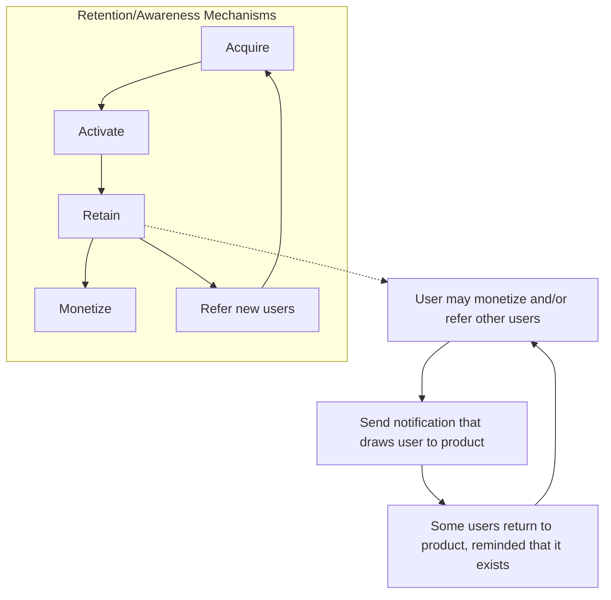

> Adding awareness mechanisms beyond the transaction frequency can still increase retention.

> This is because users are reminded, between transactions, that the product still exists. In essence, we improve their engagement intensity.

Another way that we can increase engagement intensity is to increase the time that users spend using the product during usage events.

For example, think of those autoplay features in streaming products like Netflix, Amazon Prime, YouTube, etc. These are designed to increase your viewing time. More viewing time equals more engagement, which leads, in turn, to greater retention.

## Summary - Factors which influence Retention

1. The core natural frequency of the product
2. Increasing the natural frequency by adding new use cases and features
3. Adding retention/awareness loops to remind users that the product exists between transactions
4. Increasing the time spent in the product

# Start-up Growth Engineering (SUGE) - Week 4 Study Sheet

This study sheet accompanies the lecture for the above week and highlights some of the main points to understand and remember from the lecture. It is not a substitute for watching the lecture. Instead, it is intended to help consolidate the key points.

In the previous lecture, we focussed on the Retention state of the customer journey. In this lecture, we focus on the two states preceding Retention:

1. Acquisition Strategies and Techniques
2. Activation Strategies and Techniques

## Acquisition Strategies and Techniques

Acquisition involves bringing users to the product – or to awareness of the product – for the first time. As such, it is the first stage in the Customer Journey:

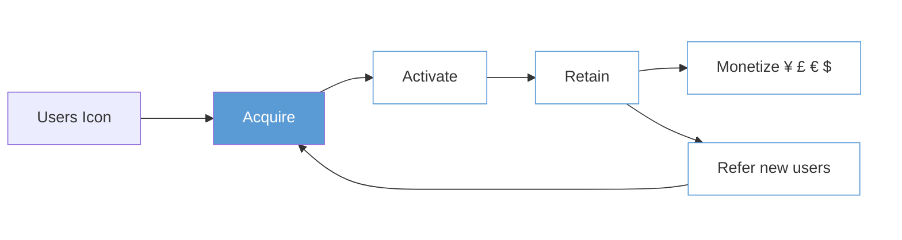
**Acquisition:**bring users to the product

In this course, we are less concerned with the tactics and specific techniques of optimizing any given marketing channel. Instead, our focus is on the higher-level strategic context of our acquisition approach. That said, we’ll first provide a brief introduction to the basics of channel marketing before returning to the strategic context:

## Basics of Channel Acquisition

There are three basic types of acquisition, as listed below:

# Types of Acquisition - Examples


<table>
  <thead>
    <tr>
        <th>Category</th>
        <th>Characterisation</th>
        <th>Examples</th>
        <th>Marginal Cost Structure</th>
    </tr>
  </thead>
  <tbody>
    <tr>
        <td rowspan="2">Intent-based</td>
        <td rowspan="2">Targetting users who have high intent to act/purchase</td>
        <td>SEM</td>
        <td>Pay-Per-Click (PPC)</td>
    </tr>
    <tr>
        <td>SEO/Organic</td>
        <td>None</td>
    </tr>
    <tr>
        <td>Awareness-based</td>
        <td>Targetting users who don't necessarily have high intent to act/purchase.</td>
        <td>Facebook, Affiliate Ads, TV, written articles</td>
        <td>PPC or cost per thousand impressions (CPM)</td>
    </tr>
    <tr>
        <td>Referral-based</td>
        <td>User-initiated referral, using direct invitation or indirect currency such as content. See Week 2 and Week 5.</td>
        <td>Currency=User<br/>Currency=Content</td>
        <td>None</td>
    </tr>
  </tbody>
</table>


These channel types differ significantly in performance, reach and purpose. It’s very common for a start-up to use all three types in combination, to maximise audience reach and overall acquisition performance. But it is very important to understand the differences between each type, in order to design an effective and affordable acquisition strategy.

## *Intent-based channels*

Intent-based channels typically exhibit high *conversion performance* (the percentage of users who arrive on the channel going on to activate) because they attract users who were actively searching for a product like ours, or related information, when they discovered our product.

Organic Search, or SEO (Search Engine Optimization) and SEM (Search Engine Marketing) are two major channel types in this category. The purpose of them is that people searching for information or a solution to a particular scenario will discover the start-up’s product or service in the search results of search engines (usually on Google or Baidu). The difference between them is that SEM requires the business to pay advertising fees to the search engine company in a competitive bid process, while SEO/Organic Search concerns designing and optimizing a set of web pages (called “landing pages”) that will most closely align to the search engine’s algorithm for deciding what results to return and in what order of preference. The first group will appear as ads at the top of search results, while the second appear as organic search results.

## SEO

Let’s first examine SEO. To recap:

# Search Engine Optimization (SEO)
Intent-Based, “free”

The practice of growing traffic from organic search results.

The approach improves a website’s ranking on the Search Engine Results Page (SERP).

Companies that are more successful at SEO will find that they place higher in search result rankings. This has a very significant effect on conversion rates – the higher up the results page your result, the better conversion will be. If you don’t appear on the first page (called being “below the fold”) you can forget it – no one is going to see your entry.


There are various techniques used to optimise landing pages, for example:


This is not the whole story, though. Another important concept is *domain authority*. For example, Google will tend to rank those websites more highly where the company in question is considered by Google to have more authority on the search topic. For example, if more websites reference the website in question, it will be deemed to have more authority. So, even if a landing page is highly optimized for Google’s algorithms, domain authority may result in it still being less highly ranked than a higher-authority competitor’s results. This is a problem for start-ups attempting to displace existing large businesses.

Companies often underperform on SEO because they tend to treat the subject as a marketing problem whereas it is best thought of as a marketing and engineering problem. For example, Skyscanner required hundreds of thousands of landing pages to match the various flight location search strings that searchers may enter. Each of these required to be optimized and maintained. If this task was not addressed by engineering and marketing teams together, it would be impossible to create so many well-optimized landing pages. This is an example of Conway’s law in operation.

## SEM

### Recapping, SEM:


<table>
  <thead>
    <tr>
        <th colspan="2">Search Engine Marketing (SEM)</th>
    </tr>
  </thead>
  <tbody>
    <tr>
        <td>Intent-Based, Pay-per-click (PPC)</td>
        <td> </td>
    </tr>
    <tr>
        <td>Optimizing bid strategy to improve search rankings</td>
        <td> </td>
    </tr>
    <tr>
        <td>Goal - bring a target audience to your website, particularly for keywords where you are not likely to be the top organic result.</td>
        <td> </td>
    </tr>
  </tbody>
</table>


In practice, many businesses use tools to manage SEM optimization, to maximise the effectiveness of their advertising budget. For example:


### SEM Tools

Search engine marketing tools help marketers manage and optimize paid search ads.

Allow users to
* research keywords,
* set a budget,
* run paid ad campaigns,
* act on intelligent bidding recommendations,
* automate bidding and copy generation,
* analyze and forecast results.

### Awareness-based channels

Awareness-based channels are somewhat the opposite of Intent-based channels. In this case we are attempting to reach audiences that do *not* have a current intent that is satisfied by our product. Instead, we are attempting to make those people aware of our product so that, in future, they will remember us when they do have intent.

Not surprisingly, conversion performance of awareness-based channels is much lower than for intent-based channels. But awareness-based marketing often improves the performance of those intent-based channels (because people remember our product when they do come to search, and they may even trust it more because it is a "brand"). That is why many companies blend both channel types. On the other hand, it's also why many start-ups don't perform any awareness-based marketing; they can't afford to and would rather spend time and money on higher-converting intent-based channels and/or in developing CGMs.

The most well-known awareness-based channels are TV (and radio) advertising and Facebook. All such channels provide some level of audience targeting, to improve the effectiveness of allocated budgets. But Facebook's targeting capabilities far exceed all other channels.

Here is a selection of the attributes that Facebook can use to select audiences that will see a given ad:


For example, if we really wanted to, we could ensure that only people conforming to the following selection would see our ad:


**French- & English-speaking women**, <mark>between the ages of 31 and 56</mark>, <mark>located in a 10-mile radius of Boston, MA</mark>, <mark>who work either from home or from a small office in the retail production industry</mark>, <mark>who are "green moms" of grade school kids</mark>, <mark>who have friends with an anniversary within 30 days or friends with upcoming birthdays</mark>, <mark>who have college degrees from either **Northeastern University**, **Simmons College**, **Fairfield University**, or **Emmanuel College**</mark>, <mark>who are active in US politics and either liberal or very liberal and self-proclaimed democrats</mark>, <mark>who live in a condo or apartment built after 2011, between 2,000 and 2,999 square feet</mark>, <mark>who enjoy attending ballet, theatre and musical theatre movies</mark>, <mark>who frequently travel internationally, plan to travel to Spain</mark>, and <mark>used a travel app within the last month</mark>.

# *Referral-based channels*

We’ve already examined these in the previous lectures – remember that CGMs are a form of user referral which means that they are also a special type of acquisition channel. They are considerably different from intent and awareness channels:

1. They can potentially drive compounding, exponential growth.
2. Most (though not all<sup>1</sup>) have no associated marginal costs (i.e., we don’t pay a third-party to acquire users) but they incur costs in development and optimization.

## Acquisition – The strategic context

Armed as we now are with a basic knowledge of acquisition channels, let’s now return to the strategic context, which is where we must locate ourselves if we are to build an effective acquisition strategy, as part of our overall Growth Model. The strategic context will help us address questions such as which channels we should be using, targeting which demographics, and blended in which proportions.

## *The Four Fits Model*

We previously studied *product-market fit* – the question of whether a product is suited to and wanted by its target market. But there are actually four main “fits” to consider when setting strategy for a start-up, and these have a significant bearing on our acquisition strategy. The four fits are shown below, and we’re going to examine each in turn.

### Acquisition-Product-Market-Channel Architecture

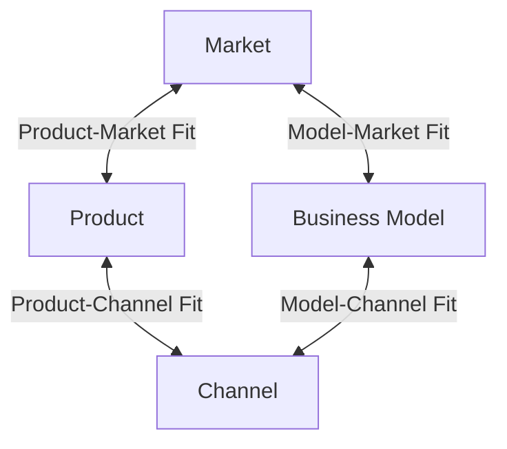

The first of these fits is Product-Market fit, which we’ve already studied, so we won’t address it further here:

<sup>1</sup> We’ll discuss the different sub-types of CGMS including one type that does incur marginal costs, later in this course – so far, we have just skimmed the surface of CGMs.


The second fit is *Business-Model<->Market Fit*. This is a very important consideration but one which is regularly completely ignored by start-ups to their later detriment.

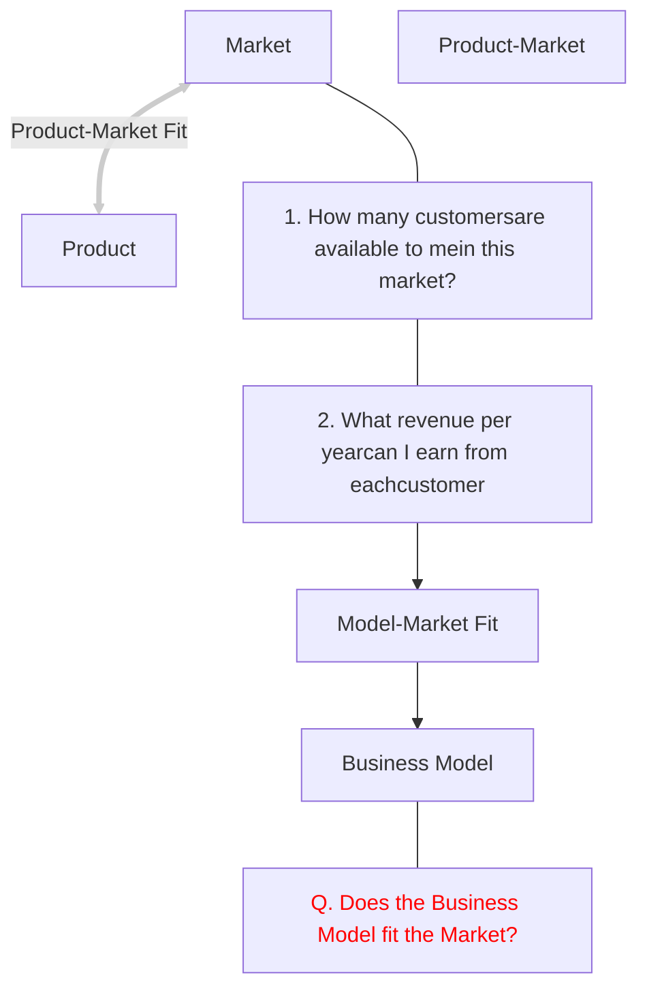

The term *business model* has many definitions. Here, we’ll use a very simple version: can the business sustainably meet its annual revenue target from its target market. In more detail, will the combination of number of addressable customers in the market and our ability to make a certain revenue from each of those customers meet our annual revenue target?

For example, see the table below. Here we consider three businesses. Let’s imagine that each, at some point in their lives had a $100million annual revenue target (which at one point in time, was true). Can each business realistically achieve that? If they can, then they have Business-Model<->Market fit – i.e., the market can sustain the combination of revenue per customer and market size requirements sufficient to generate $100million revenue annually.

## What does a $100M p.a. business look like?


<table>
  <thead>
    <tr>
        <th>Business</th>
        <th>Addressable Market Size</th>
        <th>Realistic Annual Revenue per Cust.</th>
        <th>Total Revenue per Year</th>
    </tr>
  </thead>
  <tbody>
    <tr>
        <td>WhatsApp</td>
        <td>100,000,000</td>
        <td>X $1</td>
        <td>= $100,000,000</td>
    </tr>
    <tr>
        <td>DropBox</td>
        <td>1,000,000</td>
        <td>X $100</td>
        <td>= $100,000,000</td>
    </tr>
    <tr>
        <td>SAP</td>
        <td>10,000</td>
        <td>X $10,000</td>
        <td>= $100,000,000</td>
    </tr>
  </tbody>
</table>


Note: These are only for illustration, and relate to different periods in each company's growth history

In these cases, each business can, even though they are very diverse. For example, it was realistic for WhatsApp to try to find 100,000,000 users of its messaging app and charge them $1 per year (which was WhatsApp’s original revenue model). But it wouldn’t have been realistic to charge them $100 per year. In the case of Dropbox, it is realistic to charge circa $100, but a smaller number of users need a product like Dropbox and are willing to pay $100.

Note that there is nothing magical about the $100million figure. It’s just to illustrate that, whatever your target annual revenue is, your business-model<->market fit better be credible².

Start-ups frequently get this wrong. They either believe that they can address a market much larger than is realistic, or that they can extract more revenue per customer than is realistic. In such cases, they don’t have business-model market fit. Even if they have product-market fit (i.e., people like the product) they will still fail as a result. You have to be both ambitious *and* realistic on this point.

The next fit is *Business-Model<->Channel* fit. In other words, does the Business Model fit the acquisition channels?

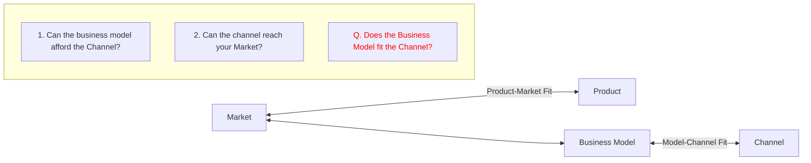

For example, if you are charging $1 per year per customer but intend to hire an expensive sales team to find new customers, you don’t have Business-Model<->Channel fit. Your revenues from existing customers won’t support the acquisition of new users in sufficient volumes. That’s essentially why WhatsApp, for example, didn’t advertise on digital channels at all and used referral-based acquisition instead (and very effectively, as it turned out).

We can see here how important it is to consider the Business Model when designing an acquisition strategy. Hence why it is important to consider the strategic context before diving into details of channel optimization.

The question of channel cost is not a static one. Channel costs and effectiveness often change significantly over a channel’s lifetime, as shown below. In summary, costs tend to rise, and effectiveness tends to fall as more companies compete to advertise on the channel.

² Of course, at a minimum, your target annual revenue needs to cover your business costs, make a profit and satisfy investors.

# Channel effectiveness cost over time


<table>
  <thead>
    <tr>
        <th>Stage</th>
        <th>cost</th>
        <th>effectiveness</th>
    </tr>
  </thead>
  <tbody>
    <tr>
        <td>New channel</td>
        <td>Low</td>
        <td>High</td>
    </tr>
    <tr>
        <td>More participants compete with your product for attention</td>
        <td>Increasing</td>
        <td>Decreasing</td>
    </tr>
    <tr>
        <td>Moving further away from High-Intent Audiences</td>
        <td>Increasing</td>
        <td>Decreasing</td>
    </tr>
    <tr>
        <td>Saturation</td>
        <td>High</td>
        <td>Low</td>
    </tr>
  </tbody>
</table>


*Super-Aggregation and its impact on channel costs.*

A small number of products have reached “super-aggregator” status. An aggregator is an internet-based product/service that has come to be regarded as the “point-of-discovery” for a certain inventory. For example, booking.com is generally regarded as the place to go to find hotels (at least, for European users). There is so much hotels inventory on booking.com that it seems not worth also looking elsewhere. Amazon has made significant progress in become the aggregator for general household and lifestyle items – “Why take extra time to look at multiple sites when I can find it easily on Amazon?” goes the argument. Becoming an aggregator in a particular domain is very powerful because it creates a strong acquisition effect without having to advertise.

A super-aggregator is one that has reached aggregator status and then become so dominant that its strength starts to further accelerate, cementing its position as the domain aggregator. Google is one such example: every business needs to be on Google’s search results, so much so that they even change their websites to fit Google’s requirements. This strengthens Google’s search results, which attracts more users to Google. Advertisers and news sources do the same thing for Facebook, which is a super-aggregator of information about people. These actions make these products become even stronger aggregators, and so more inventory arrives and is adapted to their needs, more users are attracted to use these products, and so on.

Consider what effect such super-aggregation has on the costs of advertising on these platforms – everybody wants to appear on Google’s search results page, for example, so everybody has to pay more to compete for that small page on your computer screen:

# Channel effectiveness cost over time – Super Aggregation


<table>
  <tbody>
    <tr>
        <td>Stage</td>
        <td>cost</td>
        <td>effectiveness</td>
    </tr>
    <tr>
        <td>New channel</td>
        <td>Low</td>
        <td>High</td>
    </tr>
    <tr>
        <td>More participants compete with your product for attention</td>
        <td>Increasing</td>
        <td>Decreasing</td>
    </tr>
    <tr>
        <td>Moving further away from High-Intent Audiences</td>
        <td>Increasing</td>
        <td>Decreasing</td>
    </tr>
    <tr>
        <td>Saturation</td>
        <td>High</td>
        <td>Low</td>
    </tr>
  </tbody>
</table>


This is one big reason why start-ups must often consider establishing their own acquisition engines using CGMs – although they aren’t cost-free to develop, they usually incur much lower marginal costs than advertising on Google, for example.


Another reason why this is important is that major channels make significant changes to their ranking algorithms. This can have dramatic effects on some businesses. There are many anecdotes of businesses that were highly optimised to the then behaviour of Facebook, Google, Twitter or Snapchat advertising platforms that then lost almost all of their traffic after a change to those algorithms.

Returning to our four-fits model, our final fit is *Channel<->Product Fit*.

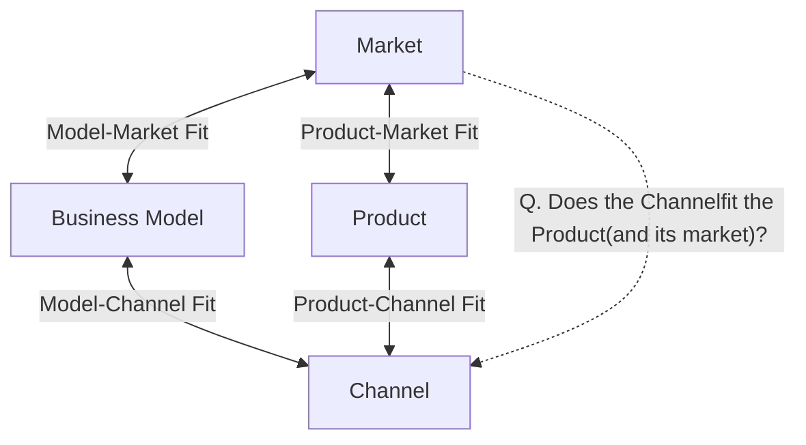


The question is here is whether the channel is appropriate for the product and its market? For example, a product aimed at teenagers likely won’t have much success using email marketing.

## Relationship between Acquisition and Activation

We’re shortly going to move from acquisition to study activation. Before leaving acquisition, though, it is important to understand the relationship between the two. It’s very common for businesses to celebrate high acquisition numbers and to incentivise marketing teams to bring in the greatest number of leads/visits/downloads that they can. This often leads to poor quality acquisition which doesn’t activate well. But because the marketing team isn’t tasked with activation in such companies, they still feel successful. This is another example of Conway’s law in action.

**Low quality acquisition = Poor activation**

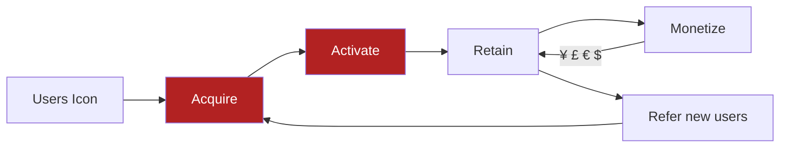

86

For example, suppose I put this picture of my dog<sup>3</sup> on my ads. I’ll get a lot of clicks, but I won’t convert many of those to paid-up users of my enterprise-CRM product.


## Activation Strategies and Techniques

Activation is the bridging state between Acquisition and Retention. It’s task is to take newly acquired, potential users and deliver them into a *habit* around our product. The job of retention is then to maintain them in that habit (and, ideally, to deepen that habit). If we fail to activate acquired users, they will quickly be lost.

### Activation:
### Users form a habit around the product

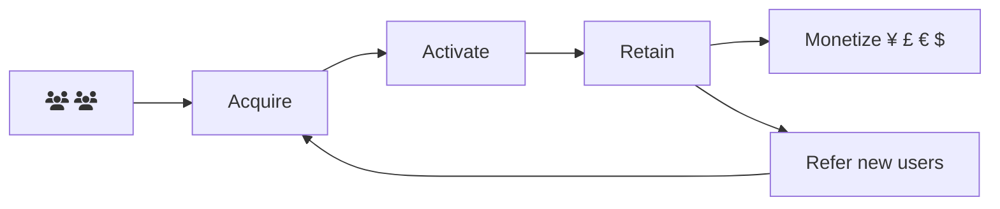

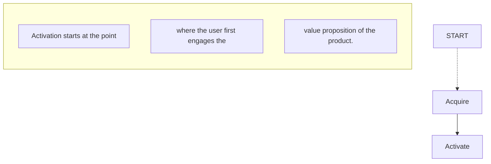

<sup>3</sup> This really is my dog. Meet Snoopy.

In particular, it’s important to understand the end boundary for activation. Users who have used the product once or twice are *not* activated. Only when we deliver them into a *habit state*, have we activated them. Start-ups often use a more casual definition of activation, and then wonder what happened to their users.


A habit is based on a frequency with which we practice that habit. Recall, from our previous lecture on Retention, that we discussed the *natural frequency* of a product. Habits are formed at this frequency. This is why it is more difficult for products with a low frequency to activate users than for those with a high frequency – users are more likely to stop using the product before a habit has been established.


<table>
  <thead>
    <tr>
      <th>Product
<br/>
Facebook</th>
      <th>Category
<br/>
Social Media</th>
      <th>Habit Frequency
<br/>
Daily</th>
    </tr>
  </thead>
  <tbody>
    <tr>
      <td>Pinterest</td>
      <td>Social Networking</td>
      <td>Weekly</td>
    </tr>
    <tr>
      <td>Booking.com</td>
      <td>Travel</td>
      <td>Quarterly</td>
    </tr>
  </tbody>
</table>


The activation stage is responsible for the rapid initial decline that we studied in cohort retention charts.

Retention-Cohort Graph, showing three typical cohort trends


<table>
  <thead>
    <tr>
        <th>Time Period</th>
        <th>Retention levels off</th>
        <th>Retention continues to fall</th>
        <th>Retention falls slowly</th>
    </tr>
  </thead>
  <tbody>
    <tr>
        <td>1</td>
        <td>100</td>
        <td>100</td>
        <td>100</td>
    </tr>
    <tr>
        <td>2</td>
        <td>85</td>
        <td>85</td>
        <td>85</td>
    </tr>
    <tr>
        <td>3</td>
        <td>75</td>
        <td>75</td>
        <td>75</td>
    </tr>
    <tr>
        <td>4</td>
        <td>70</td>
        <td>70</td>
        <td>70</td>
    </tr>
    <tr>
        <td>5</td>
        <td>65</td>
        <td>65</td>
        <td>67</td>
    </tr>
    <tr>
        <td>6</td>
        <td>62</td>
        <td>60</td>
        <td>64</td>
    </tr>
    <tr>
        <td>7</td>
        <td>60</td>
        <td>55</td>
        <td>62</td>
    </tr>
    <tr>
        <td>8</td>
        <td>59</td>
        <td>50</td>
        <td>60</td>
    </tr>
    <tr>
        <td>9</td>
        <td>58</td>
        <td>45</td>
        <td>58</td>
    </tr>
    <tr>
        <td>10</td>
        <td>58</td>
        <td>40</td>
        <td>56</td>
    </tr>
    <tr>
        <td>11</td>
        <td>58</td>
        <td>35</td>
        <td>54</td>
    </tr>
    <tr>
        <td>12</td>
        <td>58</td>
        <td>30</td>
        <td>52</td>
    </tr>
    <tr>
        <td>13</td>
        <td>58</td>
        <td>25</td>
        <td>50</td>
    </tr>
    <tr>
        <td>14</td>
        <td>58</td>
        <td>20</td>
        <td>48</td>
    </tr>
    <tr>
        <td>15</td>
        <td>58</td>
        <td>15</td>
        <td>46</td>
    </tr>
    <tr>
        <td>16</td>
        <td>58</td>
        <td>10</td>
        <td>44</td>
    </tr>
    <tr>
        <td>17</td>
        <td>58</td>
        <td>5</td>
        <td>42</td>
    </tr>
    <tr>
        <td>18</td>
        <td>58</td>
        <td>0</td>
        <td>40</td>
    </tr>
    <tr>
        <td>19</td>
        <td>58</td>
        <td>0</td>
        <td>38</td>
    </tr>
    <tr>
        <td>20</td>
        <td>58</td>
        <td>0</td>
        <td>36</td>
    </tr>
    <tr>
        <td>21</td>
        <td>58</td>
        <td>0</td>
        <td>34</td>
    </tr>
    <tr>
        <td>22</td>
        <td>58</td>
        <td>0</td>
        <td>32</td>
    </tr>
    <tr>
        <td>23</td>
        <td>58</td>
        <td>0</td>
        <td>30</td>
    </tr>
    <tr>
        <td>24</td>
        <td>58</td>
        <td>0</td>
        <td>28</td>
    </tr>
  </tbody>
</table>


This is quite natural - we are more likely to lose users before they have formed a habit than afterwards. On the other hand, if we could improve activation performance, this would have a significant impact on on-going retention (and monetization & referral) because we would be continuing from a higher base.

## Improving Activation Performance

To improve activation performance, we first need to establish a framework in which to place our interventions and improvements. There are two main stages in this framework, as shown below.

### Activation – High level steps


The first stage involves demonstrating value to the potential user as quickly as possible. If we don’t do that, the risk of losing the user before she has activated is much higher. The second stage involves building upon that perception of initial value through on-going delivery of value until the user establishes habitual use.

Let’s first drill into step 1. This step has two sub-stages as shown below.

# Activation Step 1 – Deliver Initial Value


In the general case, though not always, we need some information from the user before we can deliver value to them. A very simple example of this is that Skyscanner needs to know where you might wish to fly before offering you travel options.

Much of the success of activating users lies in getting this balance right, between asking the user for information and delivering value. In the lecture we walk through a detailed, best-practice example of how to do this well, using Pinterest’s onboarding process. If you haven’t already done so, you should study that example.

But it is easier to get this balance wrong. For example, if we ask the user for her name, address, credit-card details etc, before demonstrating or foreshadowing sufficient value for her to expend this effort, the user won’t activate.

To help us design an optimum workflow for activation, we can use the *Activation Inequality* concept.

## Activation Inequality

*For the first stage of activation to be successful, the following must be true:*

### Value perceived > Effort required to receive value

Although we can’t be precise about the user’s value perception nor their perception of effort, this is nevertheless a very useful mental model in designing workflows. It reminds us to ensure that value delivery takes precedence over information gathering and that only the minimum information required to deliver that value should be sought.

We can visualise this using a Cognitive Energy chart. Each step in the activation workflow does one of two things to the user’s cognitive energy:

* Reduces it (fatigues the user)
* Increases it (energises an excites the user)

It is very unlikely that a step will be neutral to the user’s cognitive energy levels.

By the time we get to the end of the activation workflow, if the user’s cognitive energy has fallen to zero, then they won’t activate.

## Activation Inequality – Illustration


<table>
  <thead>
    <tr>
        <th>Step</th>
        <th>Cognitive energy</th>
    </tr>
  </thead>
  <tbody>
    <tr>
        <td>1</td>
        <td>100</td>
    </tr>
    <tr>
        <td>2</td>
        <td>85</td>
    </tr>
    <tr>
        <td>3</td>
        <td>75</td>
    </tr>
    <tr>
        <td>4</td>
        <td>85</td>
    </tr>
    <tr>
        <td>5</td>
        <td>70</td>
    </tr>
    <tr>
        <td>6</td>
        <td>30</td>
    </tr>
    <tr>
        <td>7</td>
        <td>10</td>
    </tr>
    <tr>
        <td>8</td>
        <td>10</td>
    </tr>
  </tbody>
</table>


Through careful design, we can minimise the number of cognitive energy-depleting steps and add steps that raise the user’s cognitive energy.

### Example Techniques to improve Cognitive Energy levels

**Adding Energy**
* Re-ordering - demonstrate future value before asking for information.
* Progress indicator
* Positive messages “you’re almost done” etc.

**Reducing Energy Depletion**
* “Cross-out” exercise
* “Long-distance page view exercise”
* Don’t mandate email verification or billing in for until after value has been delivered.

Note that we can’t just apply these concepts mechanically, without careful thought and experimentation. For example, if we ask users for basic sign-up information, then demonstrate some future value, then ask for credit card details, this will generally give better activation performance. But, if that period of value demonstration – between the initial request for limited information and the later request for credit-card information - is too long, this no longer feels like one sign-up process, but two. This can *increase* the perception of friction to the user, leading to lower sign-ups. So, careful, thoughtful application of these techniques is important.

Assuming that we have successfully made it to the far side of the above chart, let’s now return to the top-level view of activation and remind ourselves of the next step in the process.

# Activation – High level steps


Now that we have delivered initial value to the user, the challenge changes to one of increasing the frequency of value delivery until a habit is established:

## Activation – High level steps


The following techniques are frequently employed to perform this task. The first set, below, remind the user that the product exists and has value to deliver to them. The second helps to reduce friction for the user in discovering that value.

### Example Techniques to drive frequency and value discovery

**Frequency**
* Push notifications
* Email notifications

**Value Discovery**
* Temporary product prompts
* Permanent product prompts
* Eliminate Dead-Ends

The lecture material contains several real-world examples of the above techniques being employed in practice.

We have now completed our qualitative analysis of Acquisition, Activation and Retention (though we’ll return to them later in this course to perform a quantitative treatment).

In our next lecture, we’ll move on to study the Referral state, which is the doorway to Compounding Growth. We’ve previously briefly overviewed CGMs. In the next lecture, we will study these mechanisms in more detail. We’ll also examine network effects, which are another way of driving compounding growth. And we’ll study how network effects and CGMs interact.

What we'll cover in the next lecture:
Deep Dive into Compounding Growth & Network Effects


# Start-up Growth Engineering (SUGE) - Week 5 Study Sheet

This sheet accompanies the lecture for the above week and highlights some of the main points to understand and remember from the lecture. It is not a substitute for watching the lecture during revision. Instead, it is intended to help consolidate the key points.

## What is Compounding Growth?

A product experiences Compounding Growth is when the rate of growth of the product’s user base at any given point is proportional to the number of users at that point. If sustained over a sufficiently long period, this leads to accelerating growth, such as Twitter experienced in its early years (see below).


Tweets per Day
<table>
  <thead>
    <tr>
        <th>Date</th>
        <th>Jan 07</th>
        <th>Jul 07</th>
        <th>Jan 08</th>
        <th>Jul 08</th>
        <th>Jan 09</th>
        <th>Jul 09</th>
        <th>Jan 10</th>
    </tr>
  </thead>
  <tbody>
    <tr>
        <td>Tweets per Day (Millions)</td>
        <td>0</td>
        <td>~1</td>
        <td>~2</td>
        <td>~3</td>
        <td>~5</td>
        <td>~15</td>
        <td>~45</td>
    </tr>
  </tbody>
</table>


It’s obviously attractive for a start-up to experience something like this growth trajectory. But even if growth is not as extreme, it is still very desirable for a start-up to be able to grow its customer base and revenue far in excess of its marketing budget or its staff headcount. In this lecture, we’re going to examine techniques that tech start-ups employ to attempt to achieve these desirable states.

## What causes Compounding Growth in products?

Compounding Growth in products is driven by two forces: Compounding Growth Mechanisms and Network Effects. These can exist entirely separately (i.e., a product exhibits either but not both) or together (i.e., both operate together upon one product). When these forces operate together, they are usually mutually reinforcing.

An important point is that products can be designed in such a way that such mechanisms are more likely to operate. A large part of a product’s Growth Model is about attempting to do just that.

In the lecture we study each of these mechanisms. We’ll start with Compounding Growth Mechanisms, hereafter referred to CGMs.

## What are Compounding Growth Mechanisms (CGMs)?

Generically speaking, a CGM is a mechanism where the output of the mechanism drives the input in a repeating fashion. In product terms, the input of the CGM is users and the output is more users – i.e., the CGM produces more users of a product from an existing set of users. The more users that are input to the CGM, the more additional users it produces. These new users, in turn, act as input to the CGM, leading to a compounding effect.

### Compounding Growth (Generic)

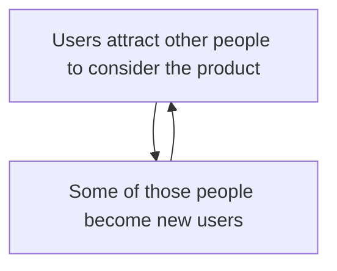

We’ve already studied the user/customer journey. The Referral state in that user journey is the link between the customer journey and these compounding mechanisms. Part of our task in optimizing the user journey is to retain users and encourage them, in various ways, to refer other users to sign-up for the product.


## CGM Types

There are different types of CGM corresponding to all the different ways that users can refer other users. Overleaf is a mind map that summarises all of these types.

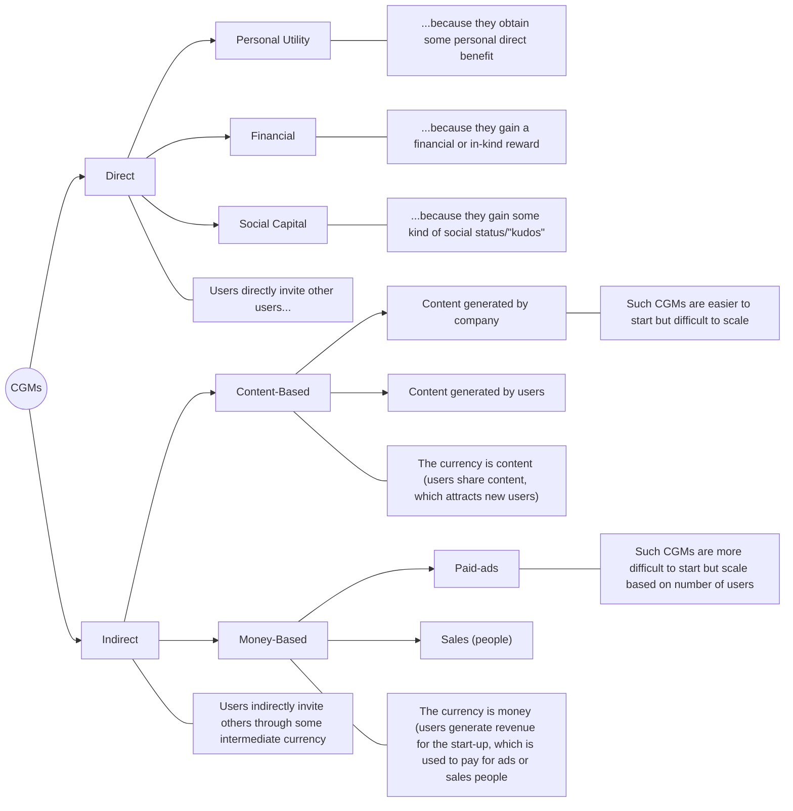

The lecture slides illustrate each of these CGMs with real-world examples, and you should also try to think of your own examples, to help you become familiar with these mechanisms. In the meantime, here are some important points associated with CGMs:

## Direct CGMs

* The most desirable Direct CGM is Personal Utility-based, because the referring impetus is the strongest, and there’s little to no cost to the business, on a marginal customer basis. However, not all products are appropriate to establishing such a CGM (because there’s little personal utility for users in referring other users)

* When we can’t establish a Personal-Utility, Direct CGM¹, we can set up a financially incentivised Direct CGM. These work best when both the referrer *and* the user being referred benefit as a result of the referred user signing up and using the product. They are less attractive for the business because each new user comes at a cost (the financial incentivisation). Many businesses won’t be able to make the economics work in such a mechanism, because they don’t earn enough money from users to cover these costs. But it is often possible to create *financial asymmetry* in a financial CGM, where the value of the incentive perceived by the user is greater than the cost of the incentive to the business.

* Businesses can also establish a CGM where the user earns “social capital” of some type by referring other users. In other words, users may feel that others view them positively in some way as a result of the recommendation. Or they may feel a sense of fulfilment in helping others access a useful service or product. Social capital is often also acting in the case of other Direct CGMs too. The way to decide whether a CGM is a Social-Capital driven CGM is to ask the question: “what is the primary motivation for the referral?”

¹ Or we may wish to set up a Direct, Financial CGM in *addition* to a successful Direct, Personal Utility CGM (but we should ask why, given the costs involved).

# Indirect CGMs

* In Content-based CGMs, content is the indirect mechanism by which we attract new users. The content can be written by the company (or a partner of some kind) or by users. The first case has the following advantages: It’s easier to start attracting users – the company can make a decision to write content, it doesn’t need to persuade users to do so. It can control for quality and relevance. The disadvantage is that the company has a relatively low upper limit on the amount of content it can produce (it’s a function of staff numbers, for example).

When users write the content, we have a properly potentially compounding mechanism. The more users who write content, the more users we can attract who will (in theory) write more content. The advantages and disadvantages of this mechanism are the inverse of the company-generated content case. Principally, it is harder to persuade users, especially in the early stages of a company, to write content – after all, there’s no user engaged base, so who is going to read it? But the content can be scaled much further, as a function of a growing number of users.

### Indirect Compounding Growth Mechanism, *Currency = Content*


Sometimes, these respective advantages and disadvantages lead to businesses combining approaches. The CGM is initiated using company-generated content and then driven to scale on user-generated content.

### Sequencing Company-Generated and User-generated Approaches

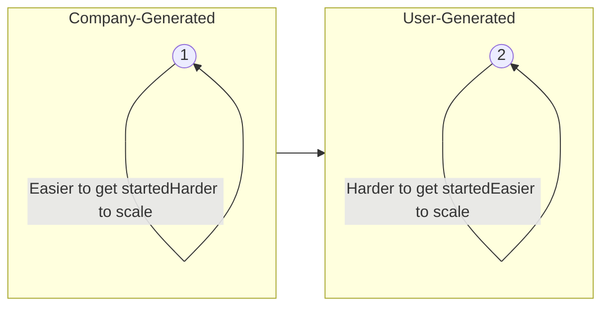

What effect will Generative AI have on indirect, content-based CGMS? One effect is that companies can generate content in greater volumes and more quickly. In principle, this means that the company can generate a lot more content before

needing to consider adding or migrating to user-generated CGMs. The downside in that situation may be that the quality of the content isn’t as original or as good as human-generated content (for example, it may be repetitive over time ,etc.) and users may object to reading machine-generated content in some contexts. One hybrid approach that attempts to address these potential downsides is to auto-generate content that prompts users to comment on it. This combines the benefits of the scalability of AI-generated content with a level of freshness and “humanity” resulting from user comments.

The other major effect of is that people are using LLM-generated summaries more and more, and clicking through to the original content less and less. It used to be the case that for every 2 pages on a website Google scraped, you would expect 1 visitor. In late 2024 that that deteriorated to 6 pages scraped to get 1 visitor. By mid 2025, the traffic ratio was: for every 18 pages Google scrapes, you get 1 visitor. What changed? AI Overviews.

For OpenAI’s ChatGPT, the ratio in late 2024 was around 250:1. By mid 2025, it was 1,500:1. What's changed? People trust the AI more, so they're not reading original content.

Clearly, this trend is hugely significant. It certainly means that content-based CGMs will be less effective. Will it also mean that content stops being produced, because businesses that rely on being able to monetize their content will close?

If so, that would clearly affect the LLMs too. To avoid this, perhaps a solution is needed whereby LLMs automatically pay for scraped content. Where will this solution come from? It may lead to the importance of existing cybersecurity gatekeepers like Cloudflare adopting this role.

Returning to content-based, indirect CGMs, these will continue to have value as retention mechanisms within a platform. For example, users of medium.com, Linked-In, Instagram, etc, are more likely to be retained on those platforms if content is being produced.

* In Money-based, Indirect CGMs the currency involved is monetary. There are two main types of such CGMs: those where the money is used to buy ads which attract users, some of whom sign-up and generate revenue to buy more ads; and those employing sales people to sign-up users, who generate revenue sufficient to pay the salaries of the sales team. We can summarise these mechanisms as follows:

# Indirect Compounding Growth Mechanism, *Currency = Money*


<table>
  <thead>
    <tr>
        <th>Characteristic</th>
        <th>Left Flow</th>
        <th>Right Flow</th>
    </tr>
    <tr>
        <th>Initial Costs</th>
        <th>Low initial costs</th>
        <th>Higher initial-costs</th>
    </tr>
    <tr>
        <th>Inertia</th>
        <th>Low inertia</th>
        <th>Higher inertia</th>
    </tr>
    <tr>
        <th>Product/Service Fit</th>
        <th>Best with simple products/services, relatively low-cost</th>
        <th>Best with complex or expensive services</th>
    </tr>
    <tr>
        <th>Core Element</th>
        <th>Money</th>
        <th>Money</th>
    </tr>
    <tr>
        <th>Target</th>
        <th>Paid-Ads (SEM, FB, etc)</th>
        <th>Sales-People</th>
    </tr>
  </thead>
</table>


Often the two approaches are combined, for example:

## Sales-based, Hybrid Compounding Growth Mechanisms


The reason for combining approaches is that sales-people are relatively expensive. Perhaps we can attract leads using Paid-Ads (or cheaper, prospecting sales reps) and then hand these leads over to the more expensive sales executives to close the sale? This is the rationale for such model.

Whatever, the combination, it is important to pay attention to the affordability of Money-based, Indirect CGMs. Often the business loses money on such mechanisms because the lifetime value of the customer doesn’t cover these acquisition costs.

The rise of AI is causing SEO to decline in effectiveness, which is resulting in more businesses buying ads on Google and other search engines. In the short term, this is driving up advertising costs. When LLMs such as ChatGPT enable advertising, this will open a new type of channel, which is also likely to quickly become expensive, due to scarcity being driven by SEO’s decline. The net result is that advertising costs are likely to stay high, which will make money-based CGMs more difficult to operate profitably.

# Network Effects

The other force, besides CGMs, that can drive compounding growth in a product’s userbase are Network Effects.


Certain products consist of a network of participants. Examples include social media products or purchasing platforms, with supply-side and demand-side participants. In such networks, the greater the number of participants there are in the network then, in general, the greater the value of the network to those participants. This acts as an attractive force to bring new participants to the network. The dynamic nature of that value is described by Metcalfe’s law:


It can be seen from Metcalfe’s law that network effects become *much* stronger as the network grows. Put another way, network effects are insignificant when the network is small but become very quickly more important with scale. It’s also why products that rely only on network effects (instead of, for example, also using CGM-based referral) often struggle to scale from a low user base (and therefor why building a social media platform is difficult, to name one example).

## Network Effects are not the same as Compounding Growth Mechanisms

Note that this attractive force of network effects is separate to the act of users referring other users though CGMs – it will still operate if no referral mechanisms exist. Similarly, many products don’t exhibit network effects but can still use referral mechanisms.

It’s common, but not required, for a product that exhibits network effects to also employ various CGMs. When this is done, the CGMs and network effects are often mutually reinforcing:

# Relationship between Compounding Growth Mechanisms and Network Effects

Network effects and CGMs are not the same. Network effects attract participants. But the attractor is not a referral mechanism. CGMs are a referral-based mechanism that:
* can be accelerated by network effects
* can accelerate network effects
* but can operate independently of network effects

There are various example architectures combining network effects and CGMs contained in the lecture slides. You should also try to think of your own examples, of products you know, to help you cement these concepts in your mind.

## Types of Network Effects

In this course, we study three main types of network effects:

### Some Major Network Types

* 1-Sided (Direct) Networks
* 2-Sided (Indirect) Networks
* n-sided Networks

1-Sided network effects exist where all participants are of the same type. For example, Facebook before advertisers and content creators joined the network. The more people I know on Facebook the more valuable being on Facebook is for me (if you I can put up with also having Donald Trump as president, or Brexit).

In a 2-sided network, there are two participants that attract each other. A common configuration is where buyers and sellers exist on the network. Buyers attract sellers and vice-versa.

### 2-Sided Networks


Here are some examples of this relationship:

## 2-sided Network Examples


As an aside, let’s consider these products in the context of CGMs. It’s very common for the demand-side of the network (i.e., the buyers) to have CGMs operating. Assuming a liquid supply-side, there’s no penalty to demand-side participants attracting other participants. It’s much less common to see CGMs operating at the supply-side, because, in so-doing, participants at this side of the network would be attracting competition for themselves. But it does happen – consider Uber drivers being incentivised to attract other drivers, for example. However, supply-side CGMs only work if the supply-side considers the demand-side to be large enough to accommodate new suppliers without competition impacting the referring supplier.

*n*-Sided networks often evolve out of 2-sided networks. The additional participant type is usually Advertisers or Content Providers.

## *n*-Sided Networks

```mermaid
graph TD
    Advertisers((Advertisers))
    SellerBuyer1((Seller/  Buyer))
    SellerBuyer2((Seller/  Buyer))
    Seller((Seller))
    ContentProducers((Content  Producers))
    Buyer1((Buyer))
    Buyer2((Buyer))
    Buyer3((Buyer))

    Advertisers --- SellerBuyer1
    Advertisers --- Buyer1
    SellerBuyer1 --- Buyer1
    SellerBuyer1 --- Buyer2
    SellerBuyer2 --- Buyer1
    SellerBuyer2 --- Buyer2
    SellerBuyer2 --- Buyer3
    Seller --- Buyer2
    Seller --- Buyer3
    ContentProducers --- Seller
    ContentProducers --- Buyer3

    subgraph Transactions
        SellerBuyer1 -- "$" --- Buyer1
        SellerBuyer1 -- "$" --- Buyer2
        SellerBuyer2 -- "$" --- Buyer1
        SellerBuyer2 -- "$" --- Buyer2
        SellerBuyer2 -- "$" --- Buyer3
        Seller -- "$" --- Buyer2
        Seller -- "$" --- Buyer3
    end
```

### Combining multiple network effects

Some products exhibit more than one network effect simultaneously. For example, Facebook has, as we’ve seen, a strong 1-sided network operating, of users being attracted to the network because of the large number of existing users. But it also has the additional network effects of users attracting advertisers and content producers and, to some extent, vice-versa.


## Scale-based Network Effects

We’ve already seen that core network effects are, in practical terms, a function of scale (remembering Metcalfe’s law). As a network scales additional, specific scale-based effect often also become available. These are:

# Scale-based network effects

### These additional network effects increase with the size of the network

* Data-power
* Brand-power
* Purchasing-power

As a network generates increasing usage data, this can be used to optimize the product thereby increasing the value of the network to its participants (and the profits of the network owner). As a network grows, it tends to create brand-power. If everyone else is using this product, the brand must be trustworthy, goes the argument. Purchasing power effects involve the network owner being able to buy in bulk from suppliers and, through the size of those orders, secure discounts. The network owner can choose to retain those benefits or share them – in whole or in part – with its users.

The lecture slides offer examples of companies that benefit from each of these network effects, and you should take a look at these, to bring the above points to life.

## Some important dynamics associated with network effects

The following are important properties to bear in mind regarding network effects:

# Network Effects and Trust

> The brand is undermined when trust is lost/damaged. This weakens the power of network effects.

> Conversely, we can add factors to increase trust, such as star-ratings.

For example, Airbnb allows hosts and guests to rate each other, and contains other trust-mechanisms to create greater trust between network participants. Amazon will usually immediately reimburse buyers if there’s a problem regarding a purchase involving one of its third-party agents.

## Network Liquidity

To scale smoothly:
* There must be sufficient supply
* There must be sufficient demand
* Supply and Demand must be in balance

If suppliers join a network and find too few buyers, they will soon leave that network. The same applies to buyers finding too few sellers. This is particularly a problem in a new network (i.e., in a network-based start-up) and the business must have a strategy to overcome it. This usually involves subsidising one side of the network to attract the other. Consider the example of Uber subsidising drivers to participate in the network in the early stage of Uber entering a new city.

Later on, once the network gets to scale, it is still important to manage liquidity. For example, during busy periods, Uber uses “surge-pricing” to discourage some riders and attract more drivers onto the network, so that the overall network still has reasonable liquidity.

## Bootstrapping Strategies

Starting a new network is a particularly difficult problem. It’s hard to attract participants when the network is empty or sparse because the value delivered by the network is correspondingly lower. There are a variety of techniques to address this problem. Two we examine in the course are:

* Focus on the “hard-side” of the network
* Build small, dense, atomic networks, and build out from there.

The first of these approaches recognises that one side of a two-sided network, or a subset of participants in a one-side network produce most value, and that we should identify and nurture this part of the network. Examples include suppliers in a marketplace-based network, or active content creators in a social network.

The second approach recognises that a small but dense network, combining the right participants doing the right things at the right time is more valuable and stronger than a

larger but sparse network. Accordingly, we identify subsets of participants initially, nurture these small networks, and grow into other networks over time from there. A good example of this is how Facebook initially targeted college networks. Each college network attracted other colleges onto Facebook.

## Anti-Network Effects

As networks grow, they begin to attract anti-network effects. These compete against network-effects and have the effect of slowing or even reversing growth. These effects include: loss of netiquette (new users don’t know the social rules of the network, and we’re growing too fast for those to be transferred to them effectively), trolling, fake-news etc.

A related phenomenon is when our “hard-side” (i.e. most valuable participants) start to rebel against the network, as it grows. For example, Uber’s most valuable drivers (the full-time drivers) eventually started to protest their working conditions, generating negative publicity for the company. Many of them then also became susceptible to poaching by Lyft, for example.


Often anti-network effects arise through the process of “enshittification”, essentially self-inflicted harm by the business by chasing greater revenue at the expense of user and supplier experience on the network.

## Enshittification Process

1) Run services at a loss until users locked-in
2) Abuse users to better support suppliers, until locked-in
3) Abuse both users and suppliers to extract greater profits


Leads to anti-network effect pressure build-up

107

# Overview

Finally, here is an overview of the Network Effects map, to help you place key concepts in your mind. Use this diagram in conjunction with the class slides.

```mermaid
graph LR
    subgraph LeftSide [ ]
        direction LR
        BP[Brand-Powered] --- SB[Scale-based]
        DP[Data-Powered] --- SB
        PP[Purchase-Powered] --- SB
        
        L[Liquidity] --- ID[Important Dynamics]
        T[Trust] --- ID
        B[Bootstrapping] --- ID
        ANE[Anti-Network Effects] --- ID
    end

    SB --- NE((Network Effects))
    ID --- NE
    
    NE --- MT[Main Types]
    
    subgraph RightSide [ ]
        direction LR
        MT --- S1[1-Sided]
        MT --- S2[2-Sided]
        MT --- SN[n-Sided]
    end

    style NE fill:#f9f,stroke:#333,stroke-width:2px
    style LeftSide fill:none,stroke:none
    style RightSide fill:none,stroke:none
```

# Start-up Growth Engineering (SUGE) - Week 6 Study Sheet

This sheet accompanies the lecture for the above week and highlights some of the main points to understand and remember from the lecture. It is not a substitute for watching the lecture during revision. Instead, it is intended to help consolidate the key points.

## Growth Models overview

This lecture moves our discussion from qualitative growth models to quantitative models. In this lecture, we begin to study component models, which we’ll complete in Lecture 7.

The following diagram (overleaf) summarises the different types of growth model, including the different types of quantitative growth models that we’ll be studying in detail.

There are two types of quantitative growth model: component models focus on specific parts of the growth engine for a product while integrated models bring all these pieces together into an integrated whole. Each of these sub-types has a specific, separate purpose.


```mermaid
graph LR
    GM[Growth Models] --- Qual[Qualitative]
    GM --- Quant[Quantitative]

    Qual --- QAdv[Advantages]
    QAdv --- QAdv1[Clarify what's strategically important and what's not]
    QAdv --- QAdv2[Holistic and communicable explanation of how the product grows]
    QAdv --- QAdv3[Indicate where and how effort should be directed]

    Quant --- T[Types]
    Note1[A numerical version of the model, corresponding to a qualitative model] -.-> Quant

    T --- Comp[Component]
    Note2[Detailed numerical models focussing on a part of the overall model] -.-> Comp
    
    Comp --- SubT[Sub-Types]
    SubT --- Acq[Acquisition]
    SubT --- CG[Compounding Growth]
    SubT --- Ret[Retention]
    SubT --- Act[Activation]

    Comp --- CUsage[Usage]
    CUsage --- CU1[Supports detailed prioritisation of experiments]
    CUsage --- CU2[Provides deep insight into a particular mechanism, to aid idea generation]

    Comp --- CChar[Characteristics]
    CChar --- CC1[Focus deeply on one area of the product in the market]
    CChar --- CC2[Easier to build/get started]
    CChar --- CC3[Easier to iterate]
    CChar --- CC4[Ultimately form basis of an integrated model]

    T --- Int[Integrated]
    Note3[An overall model, incorporating all sub-models into one full model of the growth engine for a product. Each sub-model tends to be less detailed than its corresponding component equivalent.] -.-> Int

    Int --- IUsage[Usage]
    IUsage --- IU1[Predictive model for future overall product market performance]
    IUsage --- IU2[Explains dynamics of current growth]
    IUsage --- IU3[Helpful in building credibility with stakeholders for example, investors]

    Int --- IChar[Characteristics]
    IChar --- IC1[Powerful tool for modelling the whole product in the market]
    IChar --- IC2[Can be used for prediction]
    IChar --- IC3[More difficult to build]
    IChar --- IC4[Often start with Component Models and migrate to Integrated Mode]

    Quant --- Adv[Advantages]
    Adv --- Adv1[Model Optimization]
    Adv --- Adv2[Deciding, at a detailed level, what priorities to pursue]
    Adv --- Adv3[Ability to predict future growth]
    Adv --- Adv4[Justifying a course of action]
```

<mark>This lecture</mark>

*(Note: In the original image, a red circle is drawn around the "Sub-Types" of "Component" models, specifically highlighting Acquisition, Compounding Growth, Retention, and Activation.)*

This lecture focuses on the area marked above, namely Component Quantitative Growth Models.

## Component Quantitative Growth Models

There are four sub-types of component models:


## Compounding Growth Component Models

We’ve already seen that, although the fundamental mechanism of a CGM can be simplified to this form…

```mermaid
graph TD
    A[Users attract other people to consider the product] --> B[Some of those people become new users]
    B --> A
```

…in practice, CGMs have multiple sub-steps:

```mermaid
graph TD
    A[Decide to visit product] --> B[Signs-up for the product]
    B --> C[Becomes an active user]
    C --> D[Is prompted to take an action that attracts other users]
    D --> E[Decides to take that action]
    E --> F[Potential users become aware]
    F --> A
```

In the round-trip journey from users signing-up for a product to new users being attracted by those users through a CGM, each of these sub-steps “leaks” users. This lowers the eventual effectiveness of the mechanism in attracting new users. Conversely, if we can optimise individual sub-steps of the mechanism, then its overall performance will improve – and potentially improve significantly due to compounding effects.

The purpose of a component compounding growth model for CGMs is to present these sub-steps in such a way that we can:

* Analyse the leakage
* Identify the steps we can take to optimise these sub-steps
* Make a prediction on the resultant compound performance of the CGM.

To put such models in context, we also must recognise that CGMs have three distinct lifecycle phases, and they perform differently in each of these phases.


<table>
  <tbody>
    <tr>
        <td>Phase</td>
        <td>Description</td>
    </tr>
    <tr>
        <td>Inertial Phase</td>
        <td>Initial slow growth</td>
    </tr>
    <tr>
        <td>Growth Phase</td>
        <td>Rapid exponential growth</td>
    </tr>
    <tr>
        <td>Starvation Phase</td>
        <td>Growth plateauing</td>
    </tr>
  </tbody>
</table>


## Inertial Phase

At the outset of a new product - or new CGM within an existing product – it is usually difficult to establish user-to-user referral (whether direct or indirect). These is, in effect, an “inertia” associated with this phase. Here are two examples:

### Growth Mechanisms, Initial Inertia – Examples
#### Poor Liquidity, Weak Brand


1. At the outset, invitees are less likely to join a market with few members
2. Potential referrers are less likely to refer an unknown brand, for personal reputation reasons

### Growth Mechanisms, Initial Inertia – Examples
*Weak Network Effects, Poor Market Liquidity*

```mermaid
graph LR
    subgraph Circles
    C1((Travellers)) --- C2((Skyscanner))
    C2 --- C3((AirlinesTravel Agents))
    end
    
    Text[1. At the outset, there aren'tenough suppliers to attractcustomers and vice-versa2. This in turn makescustomers reluctant to inviteother customers]
```

Overcoming this initial inertia often requires special tactics. These generally involve concentrating efforts in a subset of the market or temporarily operating in a way that is financially unsustainable in the long term, in both cases to create a critical mass of users sufficient to move the CGM past its inertial stage. This critical mass overcomes user reluctance to refer, increases the visibility of the product within that market sub-domain and enables faster experimentation. For example, Uber’s approach in a new city is:


* • Geo-Concentration
* • Subsidize the supply-side
* • Unsustainable Marketing Spend

As Uber has perhaps demonstrated, it can be difficult to wean a business off such tactics, money permitting, and discipline is required.

### Growth Phase

Our main CGM component quantitative model is focussed on the Growth Phase of the CGM:


<table>
  <thead>
    <tr>
        <th>Time</th>
        <th>Acquired Users</th>
    </tr>
  </thead>
  <tbody>
    <tr>
        <td>Start</td>
        <td>Low</td>
    </tr>
    <tr>
        <td>Growth Phase</td>
        <td>High (S-curve)</td>
    </tr>
  </tbody>
</table>


We create the model by starting with the CGM diagram…

#  Email-Scanning Growth Mechanism

```mermaid
graph TD
    A[Signs-up for the product] --> B[Scan email contacts]
    B --> C[Sends invitations to non-members]
    C --> D[Non-members click on invitation]
    D --> E[Non-members visit Linked-In]
    E --> A
```

…and tabulating each sub-step – in the main table below, each column corresponds to one of the sub-steps in the CGM above.


<table>
  <thead>
    <tr>
        <th>Parameters</th>
        <th> </th>
    </tr>
  </thead>
  <tbody>
    <tr>
        <td>Scan Contacts</td>
        <td>20%</td>
    </tr>
    <tr>
        <td>Send Invites</td>
        <td>60%</td>
    </tr>
    <tr>
        <td>Invitations Sent</td>
        <td>35</td>
    </tr>
    <tr>
        <td>Click</td>
        <td>70%</td>
    </tr>
    <tr>
        <td>Visit</td>
        <td>40%</td>
    </tr>
    <tr>
        <td>Sign-up</td>
        <td>40%</td>
    </tr>
  </tbody>
</table>
<table>
  <thead>
    <tr>
        <th>Cycle</th>
        <th>Sign-ups</th>
        <th>Scan Contacts</th>
        <th>Send Invites</th>
        <th>Invitations Sent</th>
        <th>Clicks</th>
        <th>Visit</th>
    </tr>
  </thead>
  <tbody>
    <tr>
        <td>1</td>
        <td>1000</td>
        <td> </td>
        <td> </td>
        <td> </td>
        <td> </td>
        <td> </td>
    </tr>
    <tr>
        <td>2</td>
        <td> </td>
        <td> </td>
        <td> </td>
        <td> </td>
        <td> </td>
        <td> </td>
    </tr>
    <tr>
        <td>3</td>
        <td> </td>
        <td> </td>
        <td> </td>
        <td> </td>
        <td> </td>
        <td> </td>
    </tr>
    <tr>
        <td>4</td>
        <td> </td>
        <td> </td>
        <td> </td>
        <td> </td>
        <td> </td>
        <td> </td>
    </tr>
    <tr>
        <td>5</td>
        <td> </td>
        <td> </td>
        <td> </td>
        <td> </td>
        <td> </td>
        <td> </td>
    </tr>
    <tr>
        <td>6</td>
        <td> </td>
        <td> </td>
        <td> </td>
        <td> </td>
        <td> </td>
        <td> </td>
    </tr>
    <tr>
        <td>7</td>
        <td> </td>
        <td> </td>
        <td> </td>
        <td> </td>
        <td> </td>
        <td> </td>
    </tr>
    <tr>
        <td>8</td>
        <td> </td>
        <td> </td>
        <td> </td>
        <td> </td>
        <td> </td>
        <td> </td>
    </tr>
    <tr>
        <td>9</td>
        <td> </td>
        <td> </td>
        <td> </td>
        <td> </td>
        <td> </td>
        <td> </td>
    </tr>
    <tr>
        <td>10</td>
        <td> </td>
        <td> </td>
        <td> </td>
        <td> </td>
        <td> </td>
        <td> </td>
    </tr>
  </tbody>
</table>


The table in the top-left describes the conversion performance of each sub-step currently. We can observe how the CGM performs against these parameters by initialising the second table with 1000 newly-signed-up users. We then apply the conversion parameters for one cycle through the CGM loop:


<table>
  <thead>
    <tr>
        <th>Cycle</th>
        <th>Sign-ups</th>
        <th>Scan Contacts</th>
        <th>Send Invites</th>
        <th>Invitations Sent</th>
        <th>Clicks</th>
        <th>Visit</th>
    </tr>
  </thead>
  <tbody>
    <tr>
        <td>1</td>
        <td>1000</td>
        <td>200</td>
        <td>120</td>
        <td>4200</td>
        <td>2940</td>
        <td>1176</td>
    </tr>
    <tr>
        <td>2</td>
        <td> </td>
        <td> </td>
        <td> </td>
        <td> </td>
        <td> </td>
        <td> </td>
    </tr>
    <tr>
        <td>3</td>
        <td> </td>
        <td> </td>
        <td> </td>
        <td> </td>
        <td> </td>
        <td> </td>
    </tr>
    <tr>
        <td>4</td>
        <td> </td>
        <td> </td>
        <td> </td>
        <td> </td>
        <td> </td>
        <td> </td>
    </tr>
    <tr>
        <td>5</td>
        <td> </td>
        <td> </td>
        <td> </td>
        <td> </td>
        <td> </td>
        <td> </td>
    </tr>
    <tr>
        <td>6</td>
        <td> </td>
        <td> </td>
        <td> </td>
        <td> </td>
        <td> </td>
        <td> </td>
    </tr>
    <tr>
        <td>7</td>
        <td> </td>
        <td> </td>
        <td> </td>
        <td> </td>
        <td> </td>
        <td> </td>
    </tr>
    <tr>
        <td>8</td>
        <td> </td>
        <td> </td>
        <td> </td>
        <td> </td>
        <td> </td>
        <td> </td>
    </tr>
    <tr>
        <td>9</td>
        <td> </td>
        <td> </td>
        <td> </td>
        <td> </td>
        <td> </td>
        <td> </td>
    </tr>
    <tr>
        <td>10</td>
        <td> </td>
        <td> </td>
        <td> </td>
        <td> </td>
        <td> </td>
        <td> </td>
    </tr>
  </tbody>
</table>


Applying the sign-up conversion parameter to the number of visits from this first row gives us our starting number of new sign-ups for the second iteration of the CGM. The resulting number (470) is the number of new, “free” users that were delivered by the CGM in its first

cycle. If we repeat this process enough times (until the CGM is no longer generating new users from our 1000 original users), we arrive at the following table:


**Growth Multiplier = 1.89**


<table>
<thead>
<tr>
<th>Cycle</th>
<th>Sign-ups</th>
<th>Scan Contacts</th>
<th>Send Invites</th>
<th>Invitations Sent</th>
<th>Clicks</th>
<th>Visit</th>
</tr>
</thead>
<tbody>
<tr>
<td>1</td>
<td>1000</td>
<td>200</td>
<td>120</td>
<td>4200</td>
<td>2940</td>
<td>1176</td>
</tr>
<tr>
<td>2</td>
<td>470</td>
<td>94</td>
<td>56</td>
<td>1976</td>
<td>1383</td>
<td>553</td>
</tr>
<tr>
<td>3</td>
<td>221</td>
<td>44</td>
<td>27</td>
<td>929</td>
<td>651</td>
<td>260</td>
</tr><tr>
<td>4</td>
<td>104</td>
<td>21</td>
<td>12</td>
<td>437</td>
<td>306</td>
<td>122</td>
</tr><tr>
<td>5</td>
<td>49</td>
<td>10</td>
<td>6</td>
<td>206</td>
<td>144</td>
<td>58</td>
</tr><tr>
<td>6</td>
<td>23</td>
<td>5</td>
<td>3</td>
<td>97</td>
<td>68</td>
<td>27</td>
</tr><tr>
<td>7</td>
<td>11</td>
<td>2</td>
<td>1</td>
<td>46</td>
<td>32</td>
<td>13</td>
</tr>
<tr>
<td>8</td>
<td>5</td>
<td>1</td>
<td>1</td>
<td>21</td>
<td>15</td>
<td>6</td>
</tr>
<tr>
<td>9</td>
<td>2</td>
<td>0</td>
<td>0</td>
<td>10</td>
<td>7</td>
<td>3</td>
</tr>
<tr>
<td>10</td>
<td>1</td>
<td>0</td>
<td>0</td>
<td>5</td>
<td>3</td>
<td>1</td>
</tr>
<tr>
<td></td>
<td><mark>1887</mark></td>
<td>377</td>
<td>226</td>
<td>7926</td>
<td>13211</td>
<td>9247</td>
</tr>
</tbody>
</table>


We can see that the CGM has, starting with 1000 users, generated an additional 887 “free” users. In practice, multiple instances of this CGM would be simultaneously running with new users being delivered to each instance of the CGM by other marketing efforts, which would then be amplified by the CGM in the same way.

In the above example, we say that the CGM has a Growth Multiplier effect of 1.89 – it delivers 1.89 times the starting number of users presented to the mechanism. Note that we don’t need to initialise the mechanisms with 1000 users. This number is just a nice figure to illustrate the multiplier effect.

In the above example, we had to calculate this figure by calculating the mechanism’s conversion performance line-by-line until the CGM had exhausted the ability to continue referring users from our original 1000 users.

We can achieve the same figure using the following formula:

$$ \text{Growth Multiplier – Early Prediction} $$

$$ \text{Growth Multiplier} = \frac{1}{1-V} $$

*where V = ratio of signups between two cycles*

V is calculated from the ratio of the same column from any two successive rows:

$$V = 470/1000 = 0.47$$
$$GM = 1/(1-V) = 1.89$$

<table>
<thead>
<tr>
<th>Cycle</th>
<th>Sign-ups</th>
<th>Scan Contacts</th>
<th>Send Invites</th>
<th>Invitations Sent</th>
<th>Clicks</th>
<th>Visit</th>
</tr>
</thead>
<tbody>
<tr>
<td>1</td>
<td>1000</td>
<td>200</td>
<td>120</td>
<td>4200</td>
<td>2940</td>
<td>1176</td>
</tr>
<tr>
<td>2</td>
<td>470</td>
<td>94</td>
<td>56</td>
<td>1976</td>
<td>1383</td>
<td>553</td>
</tr><tr>
<td>3</td>
<td>221</td>
<td>44</td>
<td>27</td>
<td>929</td>
<td>651</td>
<td>260</td>
</tr><tr>
<td>4</td>
<td>104</td>
<td>21</td>
<td>12</td>
<td>437</td>
<td>306</td>
<td>122</td>
</tr><tr>
<td>5</td>
<td>49</td>
<td>10</td>
<td>6</td>
<td>206</td>
<td>144</td>
<td>58</td>
</tr><tr>
<td>6</td>
<td>23</td>
<td>5</td>
<td>3</td>
<td>97</td>
<td>68</td>
<td>27</td>
</tr><tr>
<td>7</td>
<td>11</td>
<td>2</td>
<td>1</td>
<td>46</td>
<td>32</td>
<td>13</td>
</tr>
<tr>
<td>8</td>
<td>5</td>
<td>1</td>
<td>1</td>
<td>21</td>
<td>15</td>
<td>6</td>
</tr>
<tr>
<td>9</td>
<td>2</td>
<td>0</td>
<td>0</td>
<td>10</td>
<td>7</td>
<td>3</td>
</tr>
<tr>
<td>10</td>
<td>1</td>
<td>0</td>
<td>0</td>
<td>5</td>
<td>3</td>
<td>1</td>
</tr>
<tr>
<td></td>
<td>1887</td>
<td>377</td>
<td>226</td>
<td>7926</td>
<td>13211</td>
<td>9247</td>
</tr>
</tbody>
</table>


You can see, in this example, that the formula delivers us the same result for GM as before. It’s a little quicker to calculate the likely performance of the mechanism using the GM formula for this example. The formula becomes more useful when considering which optimization experiments to run or to continue – we can quickly compare the likely impact of any proposed experiment using the GM formula.

Now that we have a basic model for our CGM we can start to study the effects of improvements in the conversion performance of the various sub-steps of the mechanism. Because these improvements benefit from the compounding nature of the mechanism, small improvements can yield large uplifts to the GM. For example, changing one of the parameters below by 2 percentage points…


<table>
<thead>
<tr>
<th>Cycle</th>
<th>Sign-ups</th>
<th>Scan Contacts</th>
<th>Send Invites</th>
<th>Invitations Sent</th>
<th>Clicks</th>
<th>Visit</th>
</tr>
</thead>
<tbody>
<tr>
<td>1</td>
<td>1000</td>
<td>200 → 220</td>
<td>120</td>
<td>4200</td>
<td>2940</td>
<td>1176</td>
</tr>
<tr>
<td>2</td>
<td>470</td>
<td>94</td>
<td>56</td>
<td>1976</td>
<td>1383</td>
<td>553</td>
</tr>
<tr>
<td>3</td>
<td>221</td>
<td>44</td>
<td>27</td>
<td>929</td>
<td>651</td>
<td>260</td>
</tr>
<tr>
<td>4</td>
<td>104</td>
<td>21</td>
<td>12</td>
<td>437</td>
<td>306</td>
<td>122</td>
</tr>
<tr>
<td>5</td>
<td>49</td>
<td>10</td>
<td>6</td>
<td>206</td>
<td>144</td>
<td>58</td>
</tr>
<tr>
<td>6</td>
<td>23</td>
<td>5</td>
<td>3</td>
<td>97</td>
<td>68</td>
<td>27</td>
</tr>
<tr>
<td>7</td>
<td>11</td>
<td>2</td>
<td>1</td>
<td>46</td>
<td>32</td>
<td>13</td>
</tr>
<tr>
<td>8</td>
<td>5</td>
<td>1</td>
<td>1</td>
<td>21</td>
<td>15</td>
<td>6</td>
</tr>
<tr>
<td>9</td>
<td>2</td>
<td>0</td>
<td>0</td>
<td>10</td>
<td>7</td>
<td>3</td>
</tr>
<tr>
<td>10</td>
<td>1</td>
<td>0</td>
<td>0</td>
<td>5</td>
<td>3</td>
<td>1</td>
</tr>
<tr>
<td></td>
<td>1887</td>
<td>377</td>
<td>226</td>
<td>7926</td>
<td>13211</td>
<td>9247</td>
</tr>
</tbody>
</table>


…takes the GM from 1.89 to 2.071 in this case:

<table>
<thead>
<tr>
<th colspan="2">Ratios</th>
</tr>
</thead>
<tbody>
<tr>
<td>Scan Contacts</td>
<td>22%</td>
</tr>
<tr>
<td>Send Invites</td>
<td>60%</td>
</tr>
<tr>
<td>Invitations Sent</td>
<td>35</td>
</tr>
<tr>
<td>Click</td>
<td>70%</td>
</tr>
<tr>
<td>Visit</td>
<td>40%</td>
</tr>
<tr>
<td>Sign-up</td>
<td>40%</td>
</tr>
</tbody>
</table>


**Growth Multiplier = 2.07** (prev. 1.89)


<table>
<thead>
<tr>
<th>Cycle</th>
<th>Sign-ups</th>
<th>Scan Contacts</th>
<th>Send Invites</th>
<th>Invitations Sent</th>
<th>Clicks</th>
<th>Visit</th>
</tr>
</thead>
<tbody>
<tr>
<td>1</td>
<td>1000</td>
<td>220</td>
<td>132</td>
<td>4620</td>
<td>3234</td>
<td>1294</td>
</tr>
<tr>
<td>2</td>
<td>517</td>
<td>114</td>
<td>68</td>
<td>2391</td>
<td>1673</td>
<td>669</td>
</tr><tr>
<td>3</td>
<td>268</td>
<td>59</td>
<td>35</td>
<td>1237</td>
<td>866</td>
<td>346</td>
</tr><tr>
<td>4</td>
<td>139</td>
<td>30</td>
<td>18</td>
<td>640</td>
<td>448</td>
<td>179</td>
</tr><tr>
<td>5</td>
<td>72</td>
<td>16</td>
<td>9</td>
<td>331</td>
<td>232</td>
<td>93</td>
</tr><tr>
<td>6</td>
<td>37</td>
<td>8</td>
<td>5</td>
<td>171</td>
<td>120</td>
<td>48</td>
</tr><tr>
<td>7</td>
<td>19</td>
<td>4</td>
<td>3</td>
<td>89</td>
<td>62</td>
<td>25</td>
</tr><tr>
<td>8</td>
<td>10</td>
<td>2</td>
<td>1</td>
<td>46</td>
<td>32</td>
<td>13</td>
</tr>
<tr>
<td>9</td>
<td>5</td>
<td>1</td>
<td>1</td>
<td>24</td>
<td>17</td>
<td>7</td>
</tr>
<tr>
<td>10</td>
<td>3</td>
<td>1</td>
<td>0</td>
<td>12</td>
<td>9</td>
<td>3</td>
</tr>
<tr>
<td>11</td>
<td>1</td>
<td>0</td>
<td>0</td>
<td>6</td>
<td>4</td>
<td>2</td>
</tr>
<tr>
<td></td>
<td><strong>2071</strong></td>
<td><strong>456</strong></td>
<td><strong>273</strong></td>
<td><strong>9567</strong></td>
<td><strong>6697</strong></td>
<td><strong>2679</strong></td>
</tr>
</tbody>
</table>


Such models not only give us an insight into the workings of a CGM, they also help us make decisions as to which experiments to prioritise, in order to drive growth performance.

## Starvation Phase

Eventually, a loop runs out of ”fuel”, i.e., the users that can potentially be attracted by the mechanism. As it approaches that point, its performance starts to drop. Why is this?

Consider an example of a direct, personal-utility CGM, where users invite others to the product directly. In the early stages, everyone is inviting their friends, family etc. These referrals are likely to convert relatively well because the referred users trust the referrer, and perhaps have common interests including the subject of the product in question. But later, when all friends and family have been invited, referrals move to more casual acquaintances, or to users whose interests overlap only slightly.

Such referrals are likely to yield lower conversion performance. For users who arrive late to the product, referral performance will be poorer because many of their contacts are already using the product. Overall, the CGM’s performance in a given market starts to drop.

This is very similar to the market saturation principle that we discussed in Lecture 3, but it is operating at the individual CGM level in this case. The market, overall, may still have capacity for the product to grow into it, but a particular CGM’s overall reach is likely to be less than this total potential. Consider a content-based CGM, for example. It’s likely that only a subset of the available market can be reached via content.

Leading up to starvation point of the CGM, efforts to optimize the loop should be ramped down; we are having to work harder for the same user yield as before. Such efforts are likely better spent on establishing new growth mechanisms, moving into adjacent markets, and so on.

<table>
  <thead>
    <tr>
        <th>Time</th>
        <th>Acquired Users</th>
    </tr>
  </thead>
  <tbody>
    <tr>
        <td>Start</td>
        <td>0</td>
    </tr>
    <tr>
        <td>End (Starvation Phase)</td>
        <td>High Plateau</td>
    </tr>
  </tbody>
</table>


The growth model that we examined for the growth stage of the CGM can be adapted for both the inertial and starvation phases of the CGM’s lifespan by adding an attenuating factor to the model. We might do this to, for example, ensure the accuracy of our forecasting in a late life-stage of a CGM.


<table>
  <thead>
    <tr>
        <th>Phase / Point</th>
        <th>Attenuation (A)</th>
    </tr>
  </thead>
  <tbody>
    <tr>
        <td>Inertial Phase Start</td>
        <td>0.1</td>
    </tr>
    <tr>
        <td>Inertial Phase Mid</td>
        <td>0.2</td>
    </tr>
    <tr>
        <td>Inertial Phase End</td>
        <td>0.4</td>
    </tr>
    <tr>
        <td>Growth Phase</td>
        <td>1.0</td>
    </tr>
    <tr>
        <td>Starvation Phase Start</td>
        <td>0.4</td>
    </tr>
    <tr>
        <td>Starvation Phase Mid</td>
        <td>0.2</td>
    </tr>
    <tr>
        <td>Starvation Phase Late</td>
        <td>0.1</td>
    </tr>
    <tr>
        <td>Starvation Phase End</td>
        <td>0</td>
    </tr>
  </tbody>
</table>


We can add an attenuator to the quantitative model to reflect *Initial Inertia* and *Late Stage Starvation*

We adjust the attenuator as we move through the life-cycle of the growth mechanism


<table>
  <thead>
    <tr>
        <th>Sign-ups</th>
        <th>Scan Contacts</th>
        <th>Send Invites</th>
        <th>Invitations Sent</th>
        <th>Clicks</th>
        <th>Visit</th>
        <th> </th>
        <th> </th>
        <th> </th>
        <th> </th>
    </tr>
  </thead>
  <tbody>
    <tr>
        <td>1000</td>
        <td>200</td>
        <td>120</td>
        <td>4200</td>
        <td>2940</td>
        <td>1176</td>
        <td> </td>
        <td> </td>
        <td> </td>
        <td> </td>
    </tr>
    <tr>
        <th>141</th>
        <th>28</th>
        <th>17</th>
        <th>593</th>
        <th>415</th>
        <th>166</th>
        <th> </th>
        <th>Ratios</th>
        <th> </th>
        <th> </th>
    </tr>
    <tr>
        <td>20</td>
        <td>4</td>
        <td>2</td>
        <td>84</td>
        <td>59</td>
        <td>23</td>
        <td> </td>
        <td>Scan Contacts</td>
        <td>20%</td>
        <td> </td>
    </tr>
    <tr>
        <td>3</td>
        <td>1</td>
        <td>0</td>
        <td>12</td>
        <td>8</td>
        <td>3</td>
        <td> </td>
        <td>Send Invites</td>
        <td>60%</td>
        <td> </td>
    </tr>
    <tr>
        <td>0</td>
        <td>0</td>
        <td>0</td>
        <td>2</td>
        <td>1</td>
        <td>0</td>
        <td> </td>
        <td>Invitations Sent</td>
        <td>35</td>
        <td> </td>
    </tr>
    <tr>
        <td>0</td>
        <td>0</td>
        <td>0</td>
        <td>0</td>
        <td>0</td>
        <td>0</td>
        <td> </td>
        <td>Click</td>
        <td>70%</td>
        <td> </td>
    </tr>
    <tr>
        <td>0</td>
        <td>0</td>
        <td>0</td>
        <td>0</td>
        <td>0</td>
        <td>0</td>
        <td> </td>
        <td>Visit</td>
        <td>40%</td>
        <td> </td>
    </tr>
    <tr>
        <td>0</td>
        <td>0</td>
        <td>0</td>
        <td>0</td>
        <td>0</td>
        <td>0</td>
        <td> </td>
        <td>Sign-up</td>
        <td>40%</td>
        <td> </td>
    </tr>
    <tr>
        <td>0</td>
        <td>0</td>
        <td>0</td>
        <td>0</td>
        <td>0</td>
        <td>0</td>
        <td> </td>
        <td>NEW Attenuation</td>
        <td><mark>0.3</mark></td>
        <td> </td>
    </tr>
    <tr>
        <td>0</td>
        <td>0</td>
        <td>0</td>
        <td>0</td>
        <td>0</td>
        <td>0</td>
        <td> </td>
        <td> </td>
        <td> </td>
        <td> </td>
    </tr>
    <tr>
        <td><strong>1164</strong></td>
        <td><strong>233</strong></td>
        <td><strong>140</strong></td>
        <td><strong>4890</strong></td>
        <td><strong>8150</strong></td>
        <td><strong>5705</strong></td>
        <td> </td>
        <td> </td>
        <td> </td>
        <td> </td>
    </tr>
    <tr>
        <td> </td>
        <td> </td>
        <td> </td>
        <td> </td>
        <td> </td>
        <td> </td>
        <td> </td>
        <td>V=</td>
        <td>0.14112</td>
        <td> </td>
    </tr>
    <tr>
        <td> </td>
        <td> </td>
        <td> </td>
        <td> </td>
        <td> </td>
        <td> </td>
        <td> </td>
        <td>GM =</td>
        <td>1.16</td>
        <td> </td>
    </tr>
  </tbody>
</table>

# Retention Modelling

We’ve previously studied the qualitative behaviour of product retention. For example, we’ve discussed this chart several times:

## Retention-Cohort Graph, showing three typical cohort trends


<table>
  <thead>
    <tr>
        <th>Time Period</th>
        <th>Retention levels off (%)</th>
        <th>Retention continues to fall (%)</th>
        <th>Retention falls slowly (%)</th>
    </tr>
  </thead>
  <tbody>
    <tr>
        <td>1</td>
        <td>100</td>
        <td>100</td>
        <td>100</td>
    </tr>
    <tr>
        <td>2</td>
        <td>85</td>
        <td>85</td>
        <td>85</td>
    </tr>
    <tr>
        <td>3</td>
        <td>75</td>
        <td>75</td>
        <td>75</td>
    </tr>
    <tr>
        <td>4</td>
        <td>70</td>
        <td>68</td>
        <td>69</td>
    </tr>
    <tr>
        <td>5</td>
        <td>65</td>
        <td>62</td>
        <td>64</td>
    </tr>
    <tr>
        <td>6</td>
        <td>62</td>
        <td>57</td>
        <td>60</td>
    </tr>
    <tr>
        <td>7</td>
        <td>60</td>
        <td>52</td>
        <td>58</td>
    </tr>
    <tr>
        <td>8</td>
        <td>59</td>
        <td>47</td>
        <td>57</td>
    </tr>
    <tr>
        <td>9</td>
        <td>58</td>
        <td>42</td>
        <td>56</td>
    </tr>
    <tr>
        <td>10</td>
        <td>58</td>
        <td>37</td>
        <td>55</td>
    </tr>
    <tr>
        <td>11</td>
        <td>58</td>
        <td>32</td>
        <td>54</td>
    </tr>
    <tr>
        <td>12</td>
        <td>58</td>
        <td>27</td>
        <td>53</td>
    </tr>
    <tr>
        <td>13</td>
        <td>58</td>
        <td>22</td>
        <td>52</td>
    </tr>
    <tr>
        <td>14</td>
        <td>58</td>
        <td>17</td>
        <td>51</td>
    </tr>
    <tr>
        <td>15</td>
        <td>58</td>
        <td>12</td>
        <td>50</td>
    </tr>
    <tr>
        <td>16</td>
        <td>58</td>
        <td>7</td>
        <td>49</td>
    </tr>
    <tr>
        <td>17</td>
        <td>58</td>
        <td>2</td>
        <td>48</td>
    </tr>
    <tr>
        <td>18</td>
        <td>58</td>
        <td>0</td>
        <td>47</td>
    </tr>
    <tr>
        <td>19</td>
        <td>58</td>
        <td> </td>
        <td>46</td>
    </tr>
    <tr>
        <td>20</td>
        <td>58</td>
        <td> </td>
        <td>45</td>
    </tr>
    <tr>
        <td>21</td>
        <td>58</td>
        <td> </td>
        <td>44</td>
    </tr>
    <tr>
        <td>22</td>
        <td>58</td>
        <td> </td>
        <td>43</td>
    </tr>
    <tr>
        <td>23</td>
        <td>58</td>
        <td> </td>
        <td>42</td>
    </tr>
    <tr>
        <td>24</td>
        <td>58</td>
        <td> </td>
        <td>41</td>
    </tr>
  </tbody>
</table>


This graph shows three possible scenarios for how active users in a given cohort decline over time and, of course, we need our cohorts to ultimately resemble the top, green line, if we are to establish a viable business.

But, until now, we’ve neatly side-stepped the question of what constitutes an active user. If we can’t define this, then it isn’t possible to draw the above chart.

Businesses are often too casual in their definition of active users, and this can lead to disaster. For example, we’ve already discussed that app downloads and sign-ups don’t quality because they don’t convey a measure of ongoing usage. That discussion gives us a clue to how to think about active users. They have formed a *habit* around our product, which leads to their continued use of it. That habit consists of three elements: what they do, how many times they do it and in what period. From this observation, we can start to move towards a way of defining active usage by users.

Imagine we could track every user action at every frequency (which we can!) and then correlate those combinations with whether users are retained 12 months from now (which we can also do!). It’s likely that some combinations of specific actions performed a specific number of times in a specific period would correlate most strongly with future retention. These combinations are candidates to be our *Active User definition*, or *Habit Metric*, or *Retention Metric* (to apply some other common names for this metric). We’d simply pick one of them (ideally that which *most* correlates with future retention) and adopt it as our metric.

We could then describe the metric as below:


Here are some examples. You should try to think of some more too, to embed this important idea in your thinking:


### Some important points about this metric:

* In the early stages of a start-up or new product introduction, you likely won’t have enough data to perform the above correlation. In these circumstances the approach is to work with the data you have, pick the best metric you can (perhaps with some accompanying guesswork) and be prepared to revise the metric as data arrives. It’s better to have a working quantitative definition of active usage, even if it has limited accuracy, than none at all.

* It’s usually better to set the metric such that N is greater than 1. This makes the signal-to-noise ratio on the metric better. This matters because, otherwise, your data will signal multiple false cases of user no longer being retained.

* It’s important to ensure that P is greater than the typical periodic usage cycle of the product. For example, if you select P = 1 day for a product that is used frequently during the working week but not much on the weekend, users will appear to have not been retained in the weekend data, and then will appear to have been recovered in the subsequent week. This noise is obscures underlying retention trends.

* On the other hand, an NaP metric where P is very large is problematic because it is difficult to experiment quickly with such an unresponsive retention metric. This is a

frequent issue for products in travel, for example (see the Skyscanner example above). We can mitigate this by choosing a *proxy metric*. This is a metric which isn’t as accurate a predictor of future retention as the original metric but is more responsive. To take the Skyscanner example, a metric based on searches rather than bookings would correlate reasonably well with future retention but be more responsive (because people search for flights more often than they book them).

* User behaviour will vary over time. Recognising this, we can improve the sophistication of our model by introducing categories into our active user definition. For example, here is a hypothetical delivery example, where “o” stands for orders:


## Power, Core, Churn-Risk users


In this example, we have established three categories. Our base retention metric is 4o28 (Four orders every 28 days). Users aligning to that metric (or 5o28) are considered Core users. They are likely to be retained into the future. Of course, we’d like to increase their usage to 6+o28, and we’d consider such users *Power users*. But if we saw that their usage was slipping back, we know that they were in danger of churning, and we’d likely wish to take immediate mitigating steps to attempt to recover them back to least being Core users.

Now that we have an active user definition, let’s return now to this chart, and dig a little deeper into the type of data that lies behind it.

# Retention-Cohort Graph, showing three typical cohort trends


<table>
  <tbody>
    <tr>
        <td>Time Period</td>
        <td>Retention levels off</td>
        <td>Retention continues to fall</td>
        <td>Retention falls slowly</td>
    </tr>
    <tr>
        <td>1</td>
        <td>100</td>
        <td>100</td>
        <td>100</td>
    </tr>
    <tr>
        <td>2</td>
        <td>80</td>
        <td>78</td>
        <td>79</td>
    </tr>
    <tr>
        <td>3</td>
        <td>72</td>
        <td>68</td>
        <td>71</td>
    </tr>
    <tr>
        <td>4</td>
        <td>67</td>
        <td>62</td>
        <td>66</td>
    </tr>
    <tr>
        <td>5</td>
        <td>63</td>
        <td>58</td>
        <td>62</td>
    </tr>
    <tr>
        <td>6</td>
        <td>61</td>
        <td>54</td>
        <td>59</td>
    </tr>
    <tr>
        <td>7</td>
        <td>59</td>
        <td>50</td>
        <td>57</td>
    </tr>
    <tr>
        <td>8</td>
        <td>58</td>
        <td>46</td>
        <td>55</td>
    </tr>
    <tr>
        <td>9</td>
        <td>57</td>
        <td>42</td>
        <td>53</td>
    </tr>
    <tr>
        <td>10</td>
        <td>56</td>
        <td>38</td>
        <td>51</td>
    </tr>
    <tr>
        <td>11</td>
        <td>56</td>
        <td>34</td>
        <td>50</td>
    </tr>
    <tr>
        <td>12</td>
        <td>55</td>
        <td>30</td>
        <td>49</td>
    </tr>
    <tr>
        <td>13</td>
        <td>55</td>
        <td>26</td>
        <td>48</td>
    </tr>
    <tr>
        <td>14</td>
        <td>55</td>
        <td>22</td>
        <td>47</td>
    </tr>
    <tr>
        <td>15</td>
        <td>55</td>
        <td>18</td>
        <td>46</td>
    </tr>
    <tr>
        <td>16</td>
        <td>55</td>
        <td>14</td>
        <td>45</td>
    </tr>
    <tr>
        <td>17</td>
        <td>55</td>
        <td>10</td>
        <td>44</td>
    </tr>
    <tr>
        <td>18</td>
        <td>55</td>
        <td>6</td>
        <td>43</td>
    </tr>
    <tr>
        <td>19</td>
        <td>55</td>
        <td>2</td>
        <td>42</td>
    </tr>
    <tr>
        <td>20</td>
        <td>55</td>
        <td>0</td>
        <td>41</td>
    </tr>
    <tr>
        <td>21</td>
        <td>55</td>
        <td>0</td>
        <td>40</td>
    </tr>
    <tr>
        <td>22</td>
        <td>55</td>
        <td>0</td>
        <td>39</td>
    </tr>
    <tr>
        <td>23</td>
        <td>55</td>
        <td>0</td>
        <td>38</td>
    </tr>
    <tr>
        <td>24</td>
        <td>55</td>
        <td>0</td>
        <td>37</td>
    </tr>
  </tbody>
</table>


The data that supports such a graph will likely look something like this:

**Retention-Cohort Table, absolute number of customers retained**
Time Period (normalized to lifetime month)


<table>
  <thead>
    <tr>
        <th rowspan="2">Conversion month</th>
        <th rowspan="2">New customers</th>
        <th colspan="10"># of retained customers in lifetime month</th>
        <th rowspan="2">A2</th>
    </tr>
    <tr>
        <th>0</th>
        <th>1</th>
        <th>2</th>
        <th>3</th>
        <th>4</th>
        <th>5</th>
        <th>6</th>
        <th>7</th>
        <th>8</th>
        <th>9</th>
    </tr>
  </thead>
  <tbody>
    <tr>
        <td>Jan-13</td>
        <td>80</td>
        <td>78</td>
        <td>75</td>
        <td>72</td>
        <td>70</td>
        <td>69</td>
        <td>67</td>
        <td>66</td>
        <td>66</td>
        <td>65</td>
        <td>64</td>
        <td></td>
    </tr>
    <tr>
        <td>Feb-13</td>
        <td>88</td>
        <td>88</td>
        <td>86</td>
        <td>82</td>
        <td>78</td>
        <td>77</td>
        <td>76</td>
        <td>73</td>
        <td>72</td>
        <td>70</td>
        <td> </td>
        <td></td>
    </tr>
    <tr>
        <td>Mar-13</td>
        <td>105</td>
        <td>103</td>
        <td>103</td>
        <td>98</td>
        <td>94</td>
        <td>92</td>
        <td>90</td>
        <td>86</td>
        <td>82</td>
        <td> </td>
        <td> </td>
        <td></td>
    </tr>
    <tr>
        <td>Apr-13</td>
        <td>110</td>
        <td>107</td>
        <td>106</td>
        <td>102</td>
        <td>99</td>
        <td>97</td>
        <td>92</td>
        <td>90</td>
        <td> </td>
        <td> </td>
        <td> </td>
        <td></td>
    </tr>
    <tr>
        <td>May-13</td>
        <td>115</td>
        <td>114</td>
        <td>112</td>
        <td>105</td>
        <td>98</td>
        <td>97</td>
        <td>96</td>
        <td> </td>
        <td> </td>
        <td> </td>
        <td> </td>
        <td></td>
    </tr>
    <tr>
        <td>Jun-13</td>
        <td>128</td>
        <td>128</td>
        <td>122</td>
        <td>119</td>
        <td>115</td>
        <td>110</td>
        <td> </td>
        <td> </td>
        <td> </td>
        <td> </td>
        <td> </td>
        <td></td>
    </tr>
    <tr>
        <td>Jul-13</td>
        <td>137</td>
        <td>136</td>
        <td>129</td>
        <td>122</td>
        <td>118</td>
        <td> </td>
        <td> </td>
        <td> </td>
        <td> </td>
        <td> </td>
        <td> </td>
        <td></td>
    </tr>
    <tr>
        <td>Aug-13</td>
        <td>151</td>
        <td>149</td>
        <td>145</td>
        <td>135</td>
        <td> </td>
        <td> </td>
        <td> </td>
        <td> </td>
        <td> </td>
        <td> </td>
        <td> </td>
        <td></td>
    </tr>
    <tr>
        <td>Sep-13</td>
        <td>161</td>
        <td>158</td>
        <td>154</td>
        <td> </td>
        <td> </td>
        <td> </td>
        <td> </td>
        <td> </td>
        <td> </td>
        <td> </td>
        <td> </td>
        <td></td>
    </tr>
    <tr>
        <td>Oct-13</td>
        <td>168</td>
        <td>167</td>
        <td> </td>
        <td> </td>
        <td> </td>
        <td> </td>
        <td> </td>
        <td> </td>
        <td> </td>
        <td> </td>
        <td> </td>
        <td></td>
    </tr>
  </tbody>
</table>


This table shows several cohorts, one for each month in which they were acquired, between January and October. Later cohorts have less entries because they are younger. Eventually, all rows would be fully populated.
Note: Enables cohort comparisons

It would be easy, from this table, to draw charts like the one above for these cohorts. But we can also apply different spreadsheet filters directly to the tables to perform useful analysis. For example, this table, which shows the percentage of users still active relative to the base month, gives us a sense of how cohorts are performing relative to each other. What accounts for the differences? Seasonal variations, product outages or experiments that improved or diminished retention are all possibilities.

**Retention-Cohort Table, percentage of customers retained**
(normalized to base month)


<table>
  <thead>
    <tr>
        <th rowspan="2"> </th>
        <th rowspan="2"> </th>
        <th colspan="10">% of retained customers in lifetime month</th>
        <th rowspan="2">B1</th>
    </tr>
    <tr>
        <th>0</th>
        <th>1</th>
        <th>2</th>
        <th>3</th>
        <th>4</th>
        <th>5</th>
        <th>6</th>
        <th>7</th>
        <th>8</th>
        <th>9</th>
    </tr>
  </thead>
  <tbody>
    <tr>
        <td>Jan-13</td>
        <td>80</td>
        <td>97.50%</td>
        <td>93.75%</td>
        <td>90.00%</td>
        <td>87.50%</td>
        <td>86.25%</td>
        <td>83.75%</td>
        <td>82.50%</td>
        <td>82.50%</td>
        <td>81.25%</td>
        <td>80.00%</td>
        <td></td>
    </tr>
    <tr>
        <td>Feb-13</td>
        <td>88</td>
        <td>100.00%</td>
        <td>97.73%</td>
        <td>93.18%</td>
        <td>88.64%</td>
        <td>87.50%</td>
        <td>86.36%</td>
        <td>82.95%</td>
        <td>81.82%</td>
        <td>79.55%</td>
        <td> </td>
        <td></td>
    </tr>
    <tr>
        <td>Mar-13</td>
        <td>105</td>
        <td>98.10%</td>
        <td>98.10%</td>
        <td>93.33%</td>
        <td>89.52%</td>
        <td>87.62%</td>
        <td>85.71%</td>
        <td>81.90%</td>
        <td>78.10%</td>
        <td> </td>
        <td> </td>
        <td></td>
    </tr>
    <tr>
        <td>Apr-13</td>
        <td>110</td>
        <td>97.27%</td>
        <td>96.36%</td>
        <td>92.73%</td>
        <td>90.00%</td>
        <td>88.18%</td>
        <td>83.64%</td>
        <td>81.82%</td>
        <td> </td>
        <td> </td>
        <td> </td>
        <td></td>
    </tr>
    <tr>
        <td>May-13</td>
        <td>115</td>
        <td>99.13%</td>
        <td>97.39%</td>
        <td>91.30%</td>
        <td>85.22%</td>
        <td>84.35%</td>
        <td>83.48%</td>
        <td> </td>
        <td> </td>
        <td> </td>
        <td> </td>
        <td></td>
    </tr>
    <tr>
        <td>Jun-13</td>
        <td>128</td>
        <td>100.00%</td>
        <td>95.31%</td>
        <td>92.97%</td>
        <td>89.84%</td>
        <td>85.94%</td>
        <td> </td>
        <td> </td>
        <td> </td>
        <td> </td>
        <td> </td>
        <td></td>
    </tr>
    <tr>
        <td>Jul-13</td>
        <td>137</td>
        <td>99.27%</td>
        <td>94.16%</td>
        <td>89.05%</td>
        <td>86.13%</td>
        <td> </td>
        <td> </td>
        <td> </td>
        <td> </td>
        <td> </td>
        <td> </td>
        <td></td>
    </tr>
    <tr>
        <td>Aug-13</td>
        <td>151</td>
        <td>98.68%</td>
        <td>96.03%</td>
        <td>89.40%</td>
        <td> </td>
        <td> </td>
        <td> </td>
        <td> </td>
        <td> </td>
        <td> </td>
        <td> </td>
        <td></td>
    </tr>
    <tr>
        <td>Sep-13</td>
        <td>161</td>
        <td>98.14%</td>
        <td>95.65%</td>
        <td> </td>
        <td> </td>
        <td> </td>
        <td> </td>
        <td> </td>
        <td> </td>
        <td> </td>
        <td> </td>
        <td></td>
    </tr>
    <tr>
        <td>Oct-13</td>
        <td>168</td>
        <td>99.40%</td>
        <td> </td>
        <td> </td>
        <td> </td>
        <td> </td>
        <td> </td>
        <td> </td>
        <td> </td>
        <td> </td>
        <td> </td>
        <td></td>
    </tr>
    <tr>
        <th> </th>
        <th> </th>
        <th>98.79%</th>
        <th>96.00%</th>
        <th>91.36%</th>
        <th>88.07%</th>
        <th>86.58%</th>
        <th>84.54%</th>
        <th>82.25%</th>
        <th>80.59%</th>
        <th>80.36%</th>
        <th colspan="2">80.00%</th>
    </tr>
  </tbody>
</table>


By switching from retained to lost users, other patterns emerge. For example, it becomes easier to see at which stage after user sign-up we are losing most users:
Note: Even better for cohort comparisons (but don’t forget to check also absolute levels)

# Retention-Cohort Table, percentage of customers lost (normalized to base month)


<table>
  <thead>
    <tr>
        <th> </th>
        <th> </th>
        <th colspan="10">% of churned customers in lifetime month (relative to base number)</th>
        <th>B2</th>
    </tr>
    <tr>
        <th> </th>
        <th> </th>
        <th>0</th>
        <th>1</th>
        <th>2</th>
        <th>3</th>
        <th>4</th>
        <th>5</th>
        <th>6</th>
        <th>7</th>
        <th>8</th>
        <th colspan="2">9</th>
    </tr>
  </thead>
  <tbody>
    <tr>
        <td>Jan-13</td>
        <td>80</td>
        <td>2.50%</td>
        <td>3.75%</td>
        <td>3.75%</td>
        <td>2.50%</td>
        <td>1.25%</td>
        <td>2.50%</td>
        <td>1.25%</td>
        <td>0.00%</td>
        <td>1.25%</td>
        <td>1.25%</td>
        <td></td>
    </tr>
    <tr>
        <td>Feb-13</td>
        <td>88</td>
        <td>0.00%</td>
        <td>2.27%</td>
        <td>4.55%</td>
        <td>4.55%</td>
        <td>1.14%</td>
        <td>1.14%</td>
        <td>3.41%</td>
        <td>1.14%</td>
        <td>2.27%</td>
        <td> </td>
        <td></td>
    </tr>
    <tr>
        <td>Mar-13</td>
        <td>105</td>
        <td>1.90%</td>
        <td>0.00%</td>
        <td>4.76%</td>
        <td>3.81%</td>
        <td>1.90%</td>
        <td>1.90%</td>
        <td>3.81%</td>
        <td>3.81%</td>
        <td> </td>
        <td> </td>
        <td></td>
    </tr>
    <tr>
        <td>Apr-13</td>
        <td>110</td>
        <td>2.73%</td>
        <td>0.91%</td>
        <td>3.64%</td>
        <td>2.73%</td>
        <td>1.82%</td>
        <td>4.55%</td>
        <td>1.82%</td>
        <td> </td>
        <td> </td>
        <td> </td>
        <td></td>
    </tr>
    <tr>
        <td>May-13</td>
        <td>115</td>
        <td>0.87%</td>
        <td>1.74%</td>
        <td>6.09%</td>
        <td>6.09%</td>
        <td>0.87%</td>
        <td>0.87%</td>
        <td> </td>
        <td> </td>
        <td> </td>
        <td> </td>
        <td></td>
    </tr>
    <tr>
        <td>Jun-13</td>
        <td>128</td>
        <td>0.00%</td>
        <td>4.69%</td>
        <td>2.34%</td>
        <td>3.13%</td>
        <td>3.91%</td>
        <td> </td>
        <td> </td>
        <td> </td>
        <td> </td>
        <td> </td>
        <td></td>
    </tr>
    <tr>
        <td>Jul-13</td>
        <td>137</td>
        <td>0.73%</td>
        <td>5.11%</td>
        <td>5.11%</td>
        <td>2.92%</td>
        <td> </td>
        <td> </td>
        <td> </td>
        <td> </td>
        <td> </td>
        <td> </td>
        <td></td>
    </tr>
    <tr>
        <td>Aug-13</td>
        <td>151</td>
        <td>1.32%</td>
        <td>2.65%</td>
        <td>6.62%</td>
        <td> </td>
        <td> </td>
        <td> </td>
        <td> </td>
        <td> </td>
        <td> </td>
        <td> </td>
        <td></td>
    </tr>
    <tr>
        <td>Sep-13</td>
        <td>161</td>
        <td>1.86%</td>
        <td>2.48%</td>
        <td> </td>
        <td> </td>
        <td> </td>
        <td> </td>
        <td> </td>
        <td> </td>
        <td> </td>
        <td> </td>
        <td></td>
    </tr>
    <tr>
        <td>Oct-13</td>
        <td>168</td>
        <td>0.60%</td>
        <td> </td>
        <td> </td>
        <td> </td>
        <td> </td>
        <td> </td>
        <td> </td>
        <td> </td>
        <td> </td>
        <td> </td>
        <td></td>
    </tr>
    <tr>
        <td> </td>
        <td> </td>
        <td>1.21%</td>
        <td>2.70%</td>
        <td>4.70%</td>
        <td>3.67%</td>
        <td>1.92%</td>
        <td>2.21%</td>
        <td>2.61%</td>
        <td>1.83%</td>
        <td>1.79%</td>
        <td>1.25%</td>
        <td></td>
    </tr>
  </tbody>
</table>


Note: Clearly identifies tends in under-performing periods (but remember to check absolute levels)

The lecture slides contain further examples, and you can also download this spreadsheet from Week 6 of the course Moodle page to examine these and other views more closely. It’s worthwhile taking the time to do so.

Such analysis as this would lead to teams focussing analysis and experimentation on different parts of the product, to improve retention trends.

## Activation Component Quantitative Models

Recall that activation is complete when users are delivered into an habitual state as regards the product. In quantitative terms this means that users start to exhibit behaviour matching our retention metric for the first time:

# Activation: Overall Goal

Goal is to establish users into the active user (habit) state for the first time


Recall also that Activation consists of a potentially large set of sequential onboarding steps. These are all capable of being optimised, and we can use similar data sets to the overall retention case, but at a finer level of granularity, to support this analysis:

# Retention-Cohort Graph, showing three typical cohort trends


<table>
  <thead>
    <tr>
        <th>Time Period</th>
        <th>Retention levels off</th>
        <th>Retention continues to fall</th>
        <th>Retention fall slowly</th>
    </tr>
  </thead>
  <tbody>
    <tr>
        <td>1</td>
        <td>100</td>
        <td>100</td>
        <td>100</td>
    </tr>
    <tr>
        <td>2</td>
        <td>75</td>
        <td>75</td>
        <td>75</td>
    </tr>
    <tr>
        <td>3</td>
        <td>65</td>
        <td>65</td>
        <td>65</td>
    </tr>
    <tr>
        <td>4</td>
        <td>60</td>
        <td>60</td>
        <td>60</td>
    </tr>
    <tr>
        <td>5</td>
        <td>58</td>
        <td>55</td>
        <td>58</td>
    </tr>
    <tr>
        <td>6</td>
        <td>58</td>
        <td>50</td>
        <td>57</td>
    </tr>
    <tr>
        <td>7</td>
        <td>58</td>
        <td>45</td>
        <td>56</td>
    </tr>
    <tr>
        <td>8</td>
        <td>58</td>
        <td>40</td>
        <td>55</td>
    </tr>
    <tr>
        <td>9</td>
        <td>58</td>
        <td>35</td>
        <td>54</td>
    </tr>
    <tr>
        <td>10</td>
        <td>58</td>
        <td>30</td>
        <td>53</td>
    </tr>
    <tr>
        <td>11</td>
        <td>58</td>
        <td>25</td>
        <td>52</td>
    </tr>
    <tr>
        <td>12</td>
        <td>58</td>
        <td>20</td>
        <td>51</td>
    </tr>
    <tr>
        <td>13</td>
        <td>58</td>
        <td>15</td>
        <td>50</td>
    </tr>
    <tr>
        <td>14</td>
        <td>58</td>
        <td>10</td>
        <td>49</td>
    </tr>
    <tr>
        <td>15</td>
        <td>58</td>
        <td>5</td>
        <td>48</td>
    </tr>
    <tr>
        <td>16</td>
        <td>58</td>
        <td>0</td>
        <td>47</td>
    </tr>
    <tr>
        <td>17</td>
        <td>58</td>
        <td>0</td>
        <td>46</td>
    </tr>
    <tr>
        <td>18</td>
        <td>58</td>
        <td>0</td>
        <td>45</td>
    </tr>
    <tr>
        <td>19</td>
        <td>58</td>
        <td>0</td>
        <td>44</td>
    </tr>
    <tr>
        <td>20</td>
        <td>58</td>
        <td>0</td>
        <td>43</td>
    </tr>
    <tr>
        <td>21</td>
        <td>58</td>
        <td>0</td>
        <td>42</td>
    </tr>
    <tr>
        <td>22</td>
        <td>58</td>
        <td>0</td>
        <td>41</td>
    </tr>
    <tr>
        <td>23</td>
        <td>58</td>
        <td>0</td>
        <td>40</td>
    </tr>
    <tr>
        <td>24</td>
        <td>58</td>
        <td>0</td>
        <td>39</td>
    </tr>
  </tbody>
</table>


Zooming in on the activation stage of the overall retention chart, we can see a similar pattern, but inside the user onboarding flow itself. Tables similar to those discussed above for retention, would help us identify priority areas for improvement:

## In activation analysis, we "zoom-in" on the detailed activation steps


## Experimentation

In this course we have frequently discussed using models to identify in which areas we should focus our experimentation efforts. How do we decide between and prioritise which experiments to run?

In a large system, deciding which detailed experiments to run is quite difficult. One technique that we can use to narrow in on a specific area is called Constraint Analysis. In

this technique, we ask “which is currently the constraint on this system that determines its throughput?” A good analogy for this technique is to think of water flowing through pipes of different widths – no matter how wide the other pipes are, the overall flow rate is determined by the width of the thinnest pipe.


From this analogy we can also observe that there is only one constraint in any flow-based system determining its current throughput at any point in time (unless two constraints are of identical throughput).

This approach is often helpful for reasoning where in, for example, a CGM to focus our optimization efforts. The lecture notes provide an example of how this is done.

Another common approach, which is particularly helpful in deciding between experiments once we have decided our area of focus, but which can also be used in higher-level prioritisation, is the ICE Framework.

ICE is an acronym for Impact, Confidence and Effort. In this approach, we assign a score to each of these categories for each proposed experiment. This is typically a score between 1 and 5, arrived at through team discussion. High scoring items are more likely to be progressed.

*   *Impact* = How great is the expected positive effect of this change on the output of the subsystem under study, for example on a particular CGM? (1 = very low impact, 5 = very high)

*   *Confidence* = how certain are we that this impact will in fact be realised? (1 = very low confidence, 5 = very high)

*   *Effort* = How much effort will it take to implement this change/experiment? (1 = very high effort, 5 = very low – note that we have reversed the scoring in this case).

A similar approach is to score *Effort* as (1= very low effort, 5 = very high) and then combine *Confidence* and *Effort* into a *Risk* score, to plot the candidate experiments on a two-by-two chart:


<table>
  <thead>
    <tr>
        <th>Initiative Number</th>
        <th>Name</th>
        <th>Impact</th>
        <th>Confidence</th>
        <th>Effort</th>
        <th>Risk =<br/>Effort/Confidence</th>
    </tr>
  </thead>
  <tbody>
    <tr>
        <td>1</td>
        <td>Example 1</td>
        <td>4</td>
        <td>3</td>
        <td>4</td>
        <td>1.3</td>
    </tr>
    <tr>
        <td>2</td>
        <td>Example 2</td>
        <td>4</td>
        <td>2</td>
        <td>1</td>
        <td>0.5</td>
    </tr>
    <tr>
        <td>3</td>
        <td>Example 3</td>
        <td>1</td>
        <td>5</td>
        <td>1</td>
        <td>0.2</td>
    </tr>
    <tr>
        <td>4</td>
        <td>Example 4</td>
        <td>2</td>
        <td>4</td>
        <td>3</td>
        <td>0.8</td>
    </tr>
    <tr>
        <td>5</td>
        <td>Example 5</td>
        <td>1</td>
        <td>2</td>
        <td>4</td>
        <td>2.0</td>
    </tr>
    <tr>
        <td>6</td>
        <td>Example 6</td>
        <td>4</td>
        <td>3</td>
        <td>4</td>
        <td>1.3</td>
    </tr>
    <tr>
        <td>7</td>
        <td>Example 7</td>
        <td>4</td>
        <td>4</td>
        <td>3</td>
        <td>0.8</td>
    </tr>
    <tr>
        <td>8</td>
        <td>Example 8</td>
        <td>2</td>
        <td>4</td>
        <td>2</td>
        <td>0.5</td>
    </tr>
    <tr>
        <td>9</td>
        <td>Example 9</td>
        <td>4</td>
        <td>3</td>
        <td>1</td>
        <td>0.3</td>
    </tr>
    <tr>
        <td> </td>
        <td> </td>
        <td> </td>
        <td> </td>
        <td> </td>
        <td> </td>
    </tr>
    <tr>
        <td> </td>
        <td> </td>
        <td> </td>
        <td> </td>
        <td> </td>
        <td> </td>
    </tr>
    <tr>
        <td> </td>
        <td> </td>
        <td> </td>
        <td> </td>
        <td> </td>
        <td> </td>
    </tr>
  </tbody>
</table>
<table>
  <tbody>
    <tr>
        <td>Risk</td>
        <td>Impact</td>
    </tr>
    <tr>
        <td>1.3</td>
        <td>4</td>
    </tr>
    <tr>
        <td>0.5</td>
        <td>4</td>
    </tr>
    <tr>
        <td>0.2</td>
        <td>1</td>
    </tr>
    <tr>
        <td>0.8</td>
        <td>2</td>
    </tr>
    <tr>
        <td>2.0</td>
        <td>1</td>
    </tr>
    <tr>
        <td>1.3</td>
        <td>4</td>
    </tr>
    <tr>
        <td>0.8</td>
        <td>4</td>
    </tr>
    <tr>
        <td>0.5</td>
        <td>2</td>
    </tr>
    <tr>
        <td>0.3</td>
        <td>4</td>
    </tr>
  </tbody>
</table>


We would treat the chart as follows for prioritisation purposes, focussing on the green areas first:


Teams incorporate a prioritisation mechanism into a wider optimization process. The process typically takes the following form – an ongoing iterative process of identifying experiments, prioritising them, implementing them, learning from the results of the experiment, and repeating:

```mermaid
graph TD
    A((GenerateHypothesis)) --> B((Prioritise))
    B --> C((Test))
    C --> D((Learn))
    D --> A
```

<table>
    <tr>
        <th>Linear Marketing</th>
        <th>Optimize the customer journey</th>
        <th>Drive compounding growth</th>
    </tr>
    <tr>
        <td></td>
        <td></td>
        <td></td>
    </tr>
    <tr>
        <td>Linear Marketing</td>
        <td>Optimize the customer journey</td>
        <td>Drive compounding growth</td>
    </tr>
</table>

# Start-up Growth Engineering (SUGE) - Week 7 Study Sheet

This sheet accompanies the lecture for the above week and highlights some of the main points to understand and remember from the lecture. It is not a substitute for watching the lecture during revision. Instead, it is intended to help consolidate the key points.

In this lecture we study the main quantitative ways of measuring acquisition performance, including the typical calculations that digital marketeers and growth engineers perform in assessing that performance.

## Key Concepts

There are three important quantities to know about when assessing acquisition performance:

* Cost per Acquisition – CPA
* Cost of Customer Acquisition - CAC
* Customer Lifetime Value – LTV

It’s important to understand these variables and know how to calculate acquisition performance, which we’ll cover in this study note.

## Cost per Acquisition – CPA

CPA is essentially the average cost to acquire a new user. The calculation can be applied at an individual channel level or across all channels. The latter approach can be dangerously misleading because CPAs vary quite widely across channel types. Therefore, to properly understand channel performance, CPAs are usually treated – and compared – on a per channel basis.

### CPA – usually treated as per channel


CPA includes only the costs incurred in bringing the user to the product through the channel. The phrase “to the product” can relate to the point where users sign-up, use or explore the product for the first time.

CPA does *not* include the costs of fully activating a customer. Because it only focusses on channel performance, it is good for isolating the channel’s characteristics from other cost

centres, to study that performance more easily. It’s also relatively easy to calculate in a non-ambiguous way.

## Scope of CPA

```mermaid
graph LR
    subgraph CPA_Scope [ ]
        direction LR
        A[Acquire] --- B[Activate] --- C[Retain]
        style CPA_Scope fill:none,stroke:none
    end
    
    CPA_Line[CPA]
    CPA_Line --- A
    
    style A fill:#fff,stroke:#333,stroke-width:1px,rx:10,ry:10
    style B fill:#fff,stroke:#333,stroke-width:1px,rx:10,ry:10
    style C fill:#fff,stroke:#333,stroke-width:1px,rx:10,ry:10
```

This means that CPA is good for:

*   Comparing raw channel performance over time - e.g., is Google SEM becoming more or less expensive etc? Does it vary with the seasons, and should we adjust our marketing budget accordingly?

*   Comparing different channels, for example Google SEM versus Facebook.

CPA is not useful for understanding the full cost to the business of acquiring, activating and starting to generate revenue from a user. For this, we need a different metric, which includes CPA but includes other elements as well.

## Cost of Customer Acquisition – CAC

That variable is CAC. It’s strict definition includes all of the costs incurred in acquiring, activating and converting a customer to revenue.

## Scope of CAC Versus CPA

```mermaid
graph LR
    subgraph CAC_CPA_Scope [ ]
        direction LR
        A[Acquire] --- B[Activate] --- C[Retain]
        style CAC_CPA_Scope fill:none,stroke:none
    end

    CPA_Line[CPA]
    CAC_Line[CAC]
    
    CPA_Line --- A
    CAC_Line --- A
    CAC_Line --- B
    CAC_Line --- C
    
    Habit[Habit formed] -.-> B
    Revenue[Revenue Earned] -.-> C

    style A fill:#fff,stroke:#333,stroke-width:1px,rx:10,ry:10
    style B fill:#fff,stroke:#333,stroke-width:1px,rx:10,ry:10
    style C fill:#fff,stroke:#333,stroke-width:1px,rx:10,ry:10
```

Note that it is *possible* to earn revenue from a customer before that customer has fully activated. This reveals a slight misalignment between these older acquisition metrics (CPA, CAC, LTV) and modern growth models (the customer journey). It also reveals one of the first ambiguities that sometimes creep into calculation of CAC, which we’ll discuss later.

For our purposes, we will work on the above definition, which includes the costs of activating and bringing the customer to the point of first revenue generation.

Examples of such costs could be:
* Cost of the sales team in converting a lead (acquired customer) to revenue.
* Cost of engineering efforts to improve activation funnel.

We don’t include other costs outside of this process. For example
* Cost of overall company staff
* Cost of offices

This is because these overheads are not directly related to the cost of acquisition and conversion.

It’s clear here that a further ambiguity can enter the CAC calculation here. Some start-ups might include sales costs but not activation engineering costs, for example, while others do. Start-ups are often tempted to make the CAC figure as low as possible, because this makes the business look more viable. Sometimes, this is self-deception (we want to believe that we can acquire customers cheaply). At other times, this is an attempt to deceive potential investors. Sometimes it is both. Whatever the reason, savvy investors always ask to see the details of the start-up’s CAC calculation. Of course, the real CAC figure is the one that will determine how quickly the start-up runs out of money. Our advice is to include all relevant costs in CAC calculations.

# How to calculate CAC

To calculate CAC, use the following basic formula.

$$ CAC = \frac{\left( \begin{matrix} \text{Total Marketing Expenses} \\ + \\ \text{Total Sales Expenses} \end{matrix} \right)}{\text{# of New Customers Acquired}} $$

For example, to calculate the CAC for January 2021, we would aim to discover:
* All marketing expenditures for January, including all channel CPAs, cost of marketing staff etc.
* All additional costs to take a customer from just-acquired through to the point of first purchase/revenue generation.

We’d then divide that figure by the number of new users/customers brought to a revenue-generating state in January.

There are variations on this theme, of course. Pay careful attention to these:
* To calculate CAC for an individual channel, adjust the marketing expenses to include just that channel and adjust the marketing staff costs to be only of people working on that channel.

* To calculate CAC for a longer/shorter period, adjust the costs and users brought to the product to cover that longer or shorter period.
* Not all costs will be presented in the same units. For example, CPA is a per-customer figure, while other costs may be presented as totals for the time period. To calculate the CAC, you just need to convert all quantities into the same scale.

## Customer Lifetime Value – LTV

The next key quantity in acquisition calculations is the LTV. This simply means, on average, how much revenue do we earn from each customer during their lifetime of using our product? This is the product of how much money we earn per time-period from that customer and the length of time that the customer is retained. It’s clear, once again, that good retention is critically important to LTV.


## LTV:CAC Ratio

One of the main reasons we care about LTV is so that we can calculate the LTV:CAC ratio. This tells us whether the customers that we acquire and activate earn a profit or produce a loss for the company:


If the LTV is greater than the CAC, then our business is profitable on customer acquisition and conversion. Otherwise, we are literally losing money with each new customer that we bring to the product. Our first goal is an LTV:CAC > 1:1 because this means that the acquisition and conversion mechanism is basically profitable.

But we’d much rather LTV:CAC >> 1:1. This is because there are fixed overheads in the business (staff, buildings, etc) which must also be paid for before the business becomes profitable. As a rough guide, investors typically look for an LTV:CAC of at least 3:1. The actual level of profitability depends on many factors, however (size of fixed-overheads, number of customers, and so on), so this is just a guide.

Note that it is legitimate to run with an LTV:CAC < 1:1 (i.e., with CAC greater than LTV) for temporary periods, provided there is a strategic rationale for doing so. For example, we may do this to boost user numbers sufficient to experiment more rapidly or to “spike” a CGM in its inertial phase.

Important Considerations when measuring LTV:CAC and Common mistakes

## Misunderstanding LTV time-period.

The simplest mistake people make when thinking about LTV:CAC calculations is to think that the LTV should be measured in the same period as the CAC. The CAC is a once-only cost to acquire a given customer. The LTV covers the entire lifetime of that customer’s usage of our product. The question is then: does that LTV cover the one-time acquisition and conversion cost? So, don’t be tempted to take an LTV figure and divide it by some time period in LTV:CAC calculations.

## Time Displacement

Sometimes (not always) there is a lag between spending on marketing to attract a new user and the point where that user generates revenue. If that lag is greater than one measurement time period (for example, greater than one month, in the table below) it can cause us to misunderstand our true LTV:CAC ratio. For example, in the table, we can see Mktg expenses of $32,432 in March. But the customer figure of 481 for that month is as a result of marketing expenses incurred two months ago to attract those 481 customers that only now have earned revenue. Our $32,432 expense in March resulted in 643 customers eventually converting in May, two months later.


<table>
  <thead>
    <tr>
        <th> </th>
        <th>Jan</th>
        <th>Feb</th>
        <th>Mar</th>
        <th>April</th>
        <th>May</th>
        <th>June</th>
        <th>July</th>
        <th>Aug</th>
        <th>Sept</th>
        <th>Oct</th>
        <th>Nov</th>
        <th>Dec</th>
    </tr>
  </thead>
  <tbody>
    <tr>
        <td>Mktng Expenses</td>
        <td>$10,450</td>
        <td>$11,892</td>
        <td>$32,432</td>
        <td>$12,395</td>
        <td>$13,538</td>
        <td>$10,385</td>
        <td>$10,395</td>
        <td>$13,485</td>
        <td>$12,347</td>
        <td>$13,538</td>
        <td>$12,584</td>
        <td>$12,119</td>
    </tr>
    <tr>
        <td>Sales Expenses</td>
        <td>$30,122</td>
        <td>$34,321</td>
        <td>$38,943</td>
        <td>$38,234</td>
        <td>$40,438</td>
        <td>$44,784</td>
        <td>$48,348</td>
        <td>$44,321</td>
        <td>$44,756</td>
        <td>$44,943</td>
        <td>$48,218</td>
        <td>$50,326</td>
    </tr>
    <tr>
        <td>Total Expenses</td>
        <td>$40,572</td>
        <td>$46,213</td>
        <td>$71,375</td>
        <td>$50,629</td>
        <td>$53,976</td>
        <td>$55,169</td>
        <td>$58,743</td>
        <td>$57,806</td>
        <td>$57,103</td>
        <td>$58,481</td>
        <td>$60,802</td>
        <td>$62,445</td>
    </tr>
    <tr>
        <td>New Customers</td>
        <td>453</td>
        <td>485</td>
        <td>481</td>
        <td>502</td>
        <td>643</td>
        <td>444</td>
        <td>545</td>
        <td>589</td>
        <td>590</td>
        <td>612</td>
        <td>690</td>
        <td>700</td>
    </tr>
    <tr>
        <td>CAC</td>
        <td>n/a</td>
        <td>n/a</td>
        <td>$84</td>
        <td>$92</td>
        <td>$111</td>
        <td>$114</td>
        <td>$99</td>
        <td>$94</td>
        <td>$100</td>
        <td>$94</td>
        <td>$83</td>
        <td>$84</td>
    </tr>
  </tbody>
</table>


In this case, our calculation for CAC would be:

$$ CAC = \frac{\text{Sales and Mktg expenses from 2 months ago}}{\text{number of customers converted this month}} $$

## Over-estimating LTV

An easy way to make an LTV:CAC ratio look better is to exaggerate the period over which LTV is calculated. Often, we’ll see start-up pitch presentation assume an LTV calculated over

4 years. This means that the start-up assumes customers will stay active for at least four years. But if the start-up is only one year old, it can’t know this for sure. However, the LTV:CAC looks much better…

This is a dangerous self-deception. It can mask the fact that CAC is unsustainable. The best discipline is to calculate LTV assuming 6 months lifetime (retention) until data proves otherwise. This forces the start-up to be very careful with CAC costs.


## Underestimating CAC

We’ve already seen earlier that there are various costs we can miss out of CAC calculations to improve our apparent CAC. Again, this is a dangerous (self-)deception.


## Be careful with average CAC

Earlier, we discussed how averages can be dangerous with CPA calculations. This naturally flows through to CAC calculations (since CPA is a part of the CAC calculation).

When talking to investors we will typically, for convenience, give an average CAC figure. This is also reasonable if one channel dominates acquisition.

But when managing acquisition performance inside the company, it is much better to think of CAC at a more granular level.

The first dimension on segmentation is, of course, by channel:

```mermaid
graph LR
    AverageCAC[Average CAC] --- CustomerTypeA[Customer Type A]
    AverageCAC --- CustomerTypeB[Customer Type B]
    AverageCAC --- CustomerTypeC[Customer Type C]
    
    CustomerTypeA --- SEM[SEM]
    CustomerTypeA --- OutboundSales[Outbound Sales]
    
    CustomerTypeC --- OrganicSEO[Organic/SEO]
    CustomerTypeC --- Referral[Referral]
```

Many businesses have different customer types, that tend to be acquired through different channels.

It's important to calculate these independently.

Otherwise losses in one channel/customer type maybe masked by better performance in other channel types.

But we should also remember that different customer types, even on the same channel, will potentially have very different CACs. Here are some examples:

Customer and Channel Segmentation — Examples


For example, converting a large corporate to a Zoom Enterprise licence has very different costs to a self-service Zoom user upgrading to Pro-level.

# Start-up Growth Engineering (SUGE) - Week 8 Study Sheet

This study sheet accompanies the lecture for the above week and highlights some of the main points to understand and remember from the lecture. It is not a substitute for watching the lecture. Instead, it is intended to help consolidate the key points.

In the previous recent lectures, we built quantitative models for components of the Growth Model. In this lecture we move to building a complete quantitative growth model. We’ll cover the following topics:

1. Integrated Quantitative Growth Models – Overview
2. Building the model
3. Evolving the model

## Integrated Quantitative Growth Models – Overview

Component Models enable us to analyze one part of our overall growth model in considerable detail, for optimization. But they don’t give us an overall view of the Growth Model. Integrated models give us this overview, allowing us to understand the interaction of the various components and to perform predictions and what-if scenarios on how the business will perform under certain circumstances.

 Macro, quantitative forecasting for the business.

 Model trends and long-term impacts of improvements in key areas.

 Helps to drive identify areas for experimentation, etc.

 Building credibility with potential investors

Integrated models are typically made up of the components listed below. Note, however, that each component tends to be a simpler version of its detailed Component Model equivalent, otherwise the model would be too unwieldy to manage.

It’s very typical for such models to be created in spreadsheets. And we are going to use spreadsheets for our models.

Spreadsheets upset some software engineers because there are “more powerful and elegant ways of modelling stuff” etc. But I urge you to become very good at manipulating spreadsheets and at spreadsheet modelling.

In the real world of business, they are a currency that everyone understands, regardless of which function/department they work in. This means that ideas and models can be shared and understood far more widely. This is extremely important in Growth Engineering, but it is important everywhere. An engineer that can’t engage effectively with her colleagues in other functions isn’t an engineer, just a coder.

The other point about spreadsheets that you will shortly discover is that they are enormously powerful (at least, Excel and Google Sheets are) and they are often the fastest way to model something.

Anyway, you’ll be using a spreadsheet to build your integrated growth model in this week’s assignment, so now is the time to get to grips with them.

```mermaid
graph TD
    QM((QuantitativeModel))
    
    QM --- Activation(Activation)
    QM --- Retention(Retention)
    QM --- CG(CompoundingGrowthMechanisms)
    QM --- Costs(Costs)
    QM --- Monetization(Monetization)
    QM --- Acquisition(Acquisition)

    style QM fill:#4472C4,color:white
    style Activation fill:#70AD47,color:white
    style Retention fill:#70AD47,color:white
    style CG fill:#4472C4,color:white
    style Costs fill:#70AD47,color:white
    style Monetization fill:#70AD47,color:white
    style Acquisition fill:#70AD47,color:white
```


<table>
  <thead>
    <tr>
        <th> </th>
        <th>Jan-20</th>
        <th>Feb-20</th>
        <th>Mar-20</th>
        <th>Apr-20</th>
        <th>May-20</th>
        <th>Jun-20</th>
        <th>Jul-20</th>
        <th>Aug-20</th>
        <th>Sep-20</th>
        <th>Oct-20</th>
        <th>Nov-20</th>
        <th>Dec-20</th>
    </tr>
    <tr>
        <th>Acquisition</th>
        <th> </th>
        <th> </th>
        <th> </th>
        <th> </th>
        <th> </th>
        <th> </th>
        <th> </th>
        <th> </th>
        <th> </th>
        <th> </th>
        <th> </th>
        <th> </th>
    </tr>
  </thead>
  <tbody>
    <tr>
        <td>New Free SU</td>
        <td>4000</td>
        <td>4112</td>
        <td>4422</td>
        <td>4742</td>
        <td>5072</td>
        <td>5412</td>
        <td>5762</td>
        <td>6122</td>
        <td>6492</td>
        <td>6872</td>
        <td>7262</td>
        <td>7662</td>
    </tr>
    <tr>
        <td>Converted to Pro ISU</td>
        <td>500</td>
        <td>568</td>
        <td>656</td>
        <td>733</td>
        <td>802</td>
        <td>874</td>
        <td>949</td>
        <td>1027</td>
        <td>1162</td>
        <td>1300</td>
        <td>1492</td>
        <td>1587</td>
    </tr>
    <tr>
        <td>Converted to Business/Enterprise ISU</td>
        <td>10</td>
        <td>19</td>
        <td>27</td>
        <td>35</td>
        <td>70</td>
        <td>87</td>
        <td>104</td>
        <td>122</td>
        <td>141</td>
        <td>166</td>
        <td>191</td>
        <td>216</td>
    </tr>
    <tr>
        <th>Retention</th>
        <th> </th>
        <th> </th>
        <th> </th>
        <th> </th>
        <th> </th>
        <th> </th>
        <th> </th>
        <th> </th>
        <th> </th>
        <th> </th>
        <th> </th>
        <th> </th>
    </tr>
    <tr>
        <td>Free Monthly Active Inviters (MAI)</td>
        <td>10000</td>
        <td>10080</td>
        <td>11110</td>
        <td>12210</td>
        <td>13380</td>
        <td>14560</td>
        <td>15810</td>
        <td>17130</td>
        <td>18460</td>
        <td>19860</td>
        <td>21310</td>
        <td>22810</td>
    </tr>
    <tr>
        <td>Pro MAI</td>
        <td>500</td>
        <td>940</td>
        <td>1349</td>
        <td>1770</td>
        <td>2325</td>
        <td>2894</td>
        <td>3478</td>
        <td>4079</td>
        <td>4698</td>
        <td>5520</td>
        <td>6358</td>
        <td>7214</td>
    </tr>
    <tr>
        <td>Business/Enterprise MAI</td>
        <td>0</td>
        <td>10</td>
        <td>28</td>
        <td>52</td>
        <td>82</td>
        <td>144</td>
        <td>216</td>
        <td>299</td>
        <td>381</td>
        <td>495</td>
        <td>609</td>
        <td>739</td>
    </tr>
    <tr>
        <th>Monetization</th>
        <th> </th>
        <th> </th>
        <th> </th>
        <th> </th>
        <th> </th>
        <th> </th>
        <th> </th>
        <th> </th>
        <th> </th>
        <th> </th>
        <th> </th>
        <th> </th>
    </tr>
    <tr>
        <td>Pro MAI Revenue</td>
        <td>£9,291</td>
        <td>£13,477</td>
        <td>£17,678</td>
        <td>£21,229</td>
        <td>£28,914</td>
        <td>£34,750</td>
        <td>£40,752</td>
        <td>£46,922</td>
        <td>£55,148</td>
        <td>£62,521</td>
        <td>£72,071</td>
        <td>£80,815</td>
    </tr>
    <tr>
        <td>Business/Enterprise MAI Revenue</td>
        <td>£133</td>
        <td>£370</td>
        <td>£693</td>
        <td>£1,095</td>
        <td>£1,914</td>
        <td>£2,880</td>
        <td>£3,982</td>
        <td>£5,214</td>
        <td>£6,569</td>
        <td>£8,118</td>
        <td>£9,847</td>
        <td>£11,746</td>
    </tr>
    <tr>
        <td>Total Revenue</td>
        <td>£9,524</td>
        <td>£13,847</td>
        <td>£18,371</td>
        <td>£24,324</td>
        <td>£30,829</td>
        <td>£37,630</td>
        <td>£44,733</td>
        <td>£52,146</td>
        <td>£61,717</td>
        <td>£72,640</td>
        <td>£81,919</td>
        <td>£92,561</td>
    </tr>
    <tr>
        <th>Costs</th>
        <th> </th>
        <th> </th>
        <th> </th>
        <th> </th>
        <th> </th>
        <th> </th>
        <th> </th>
        <th> </th>
        <th> </th>
        <th> </th>
        <th> </th>
        <th> </th>
    </tr>
    <tr>
        <td>Server Costs</td>
        <td>£11,010</td>
        <td>£12,487</td>
        <td>£14,032</td>
        <td>£15,767</td>
        <td>£17,598</td>
        <td>£19,505</td>
        <td>£21,488</td>
        <td>£23,549</td>
        <td>£25,874</td>
        <td>£28,278</td>
        <td>£30,764</td>
        <td>£33,331</td>
    </tr>
    <tr>
        <td>Total Costs</td>
        <td>£11,010</td>
        <td>£12,487</td>
        <td>£14,032</td>
        <td>£15,767</td>
        <td>£17,598</td>
        <td>£19,505</td>
        <td>£21,488</td>
        <td>£23,549</td>
        <td>£25,874</td>
        <td>£28,278</td>
        <td>£30,764</td>
        <td>£33,331</td>
    </tr>
  </tbody>
</table>


## Building the model

We’re going to follow a recipe to build a growth model. In the lecture, we’ll use the example of Zoom to do that. In the assignment, you’ll build one for a different product, and you’ll take the model further than we do in this example.

Essentially, what we are going to do is create one tab to represent, in most cases, each of the sections of the integrated model. For activation, we’ll incorporate that into the Retention tab (because it is so closely tied to retention). For Compounding Growth, we’ll

incorporate that into the Acquisition tab (because it amounts to a type of acquisition in quantitative modelling terms).

These are the steps that we are going to follow:

## Steps to Building an Integrated Quantitative Growth Model

1. Build the Integrated Qualitative Model
2. Define the Outputs of the Model
3. Model Acquisition
4. Model Activation and Retention
5. Model Revenue and Costs
6. Integrate the Model

### Build the Integrated Qualitative Model

Before building the quantified model, we must first create a comprehensive qualitative model for the businesses. This should encompass any network effects, CGMs, including retention mechanisms and linear acquisition channels.

We’ll use that qualitative model to create the skeleton for our quantitative model.


In the lecture, we create such a model for Zoom. It’s highly recommended that you study that worked example of Zoom given in the lecture. If you understand how the Zoom model works, you won’t have difficulty in building your own, as part of the assignment.

### Define the Outputs of the Model

The next stage is to define the outputs of the model, in a summary *Overall View* tab. This is where all the other tabs of the model will be summarized, so that we can draw summary charts, examine forward predictions and see the results of “what-if” scenarios.

First, we create some categories, corresponding to the other model tabs:

### Step 2 - Define the Outputs - 1

* Spreadsheet consists of 4 calculation tabs plus overall view


Under each category heading, we’ll create some labels to represent the results calculated from the other tabs. These will depend on the qualitative model that you built in step 1 (i.e., they’ll be somewhat similar for most businesses, but not identical). These are empty for now because we haven’t built out the other tabs yet. So, we’ll return to this Overall View at the end of this modelling exercise, to connect everything up.

### Step 2 - Define the Outputs - 2

* List the required outputs from each tab

* The "Overall View" tab is just a summary
  - the actual calculations happen on the other tabs


The example above is for Zoom. Again, you should watch the lecture to understand why we picked these variables.

# Model Acquisition

We next move to the *Acquisition* Tab. Let’s start with Linear Acquisition. Note the convention we are using that variable names are preceded with “//”, so that we can easily identify them. We’ve identified two sources of linear acquisition for this case.

We initially use some simple numbers to build the model and ensure that everything is working. You can see that in the image below for the Zoom example. Obviously, once the model is working, we’d want to replace these with more realistic numbers.


Note line 6 above. We’ve created a total for all linear acquisition sources (which, as a convention, we’ve rendered in bold text) and, in column D onwards, we’ve added together the rows above to create that total. Although we could examine that formula (the addition) in excel to see the calculation, it’s very helpful to write down the formula in words, to aid our understanding later. That’s what we’ve done in column B. Finally, we’ve created a total of totals variable in line 16. This creates a framework into which we can add other acquisition sources later. Line 16’s variable will then total all of those subtotals.

So far, so good. Let’s now add in acquisition from CGMs. Our Zoom example has two *core* CGMs (“core” because they drive most of the CGM-based acquisition). Let’s model these next:


As you can imagine, we have a lot of flexibility in how we model things in our spreadsheet. Here, we’ve taken a simple approach. Because Zoom’s twin CGMs are almost identical (differentiated only by whether a referred user is in the same company as the referrer), we’ve modelled them as one CGM. But we didn’t have to do that, and we shouldn’t really do so (this is just a simple model for the purposes of illustrating the process in a lecture).

We initialize the model with reasonable values – assuming that every user who sends invites sends 40 meeting invites per month. We also assume that a small percentage of those receiving invites sign up to Zoom and start sending their own invites. Again, in a real case, we’d want to try to find out or carefully estimate both figures. The product of these and the number of *active invite-sending users* in each month gives us the number of new users brought to the product each month by the CGM. Note, in line 19, that our total has been adjusted to include this new acquisition channel.

Where does the *active invite-sending users* figure in each month come from? This is our monthly active user count, which takes us to the *Retention* tab…

### Activation and Retention

Let’s start with a “bare-bones” Retention model that assumes that all new users are retained. The only variation then is adding the newly acquired users from the Acquisition tab over to the Retention tab, so that next month’s starting active user count includes the users acquired in this month. Note, in the screenshot below, we chose to initialize our retention tab with 10000 active users (cell C4) . As before, in practice, you’d want to find a more realistic number of current active users to initialize the model. This is just for illustration.


Now, let’s create a very simple churn model. We’ll assume that, in every month, we churn X% of active users. This is a much simpler model than those that we’ve been considering in our qualitative models (where cohorts decline and then level out), but it will serve as a starting point. In the lab exercise, you’ll build a much more sophisticated version that does use cohort retention curves to more accurately model retention. But, for now, we’ll just use this simple model:


You can also see in the above model that we have added a simple activation parameter that assumes that a percentage of users acquired activates. Again, this is much simpler than a cohort-treatment, so should be considered to be a very basic model:

<table>
  <thead>
    <tr>
        <th>Attribute</th>
        <th>Formula</th>
        <th>Jan-20</th>
        <th>Feb-20</th>
        <th>Mar-20</th>
        <th>Apr-20</th>
        <th>May-20</th>
        <th>Jun-20</th>
        <th>Jul-20</th>
    </tr>
  </thead>
  <tbody>
    <tr>
        <td colspan="9">Starting Conditions - Monthly Active Inviters</td>
    </tr>
    <tr>
        <td>Starting Monthly Active Inviters (MAI)</td>
        <td> </td>
        <td>10000</td>
        <td>11800</td>
        <td>13744</td>
        <td>15844</td>
        <td>18111</td>
        <td>20560</td>
        <td>23205</td>
    </tr>
    <tr>
        <td> </td>
        <td> </td>
        <td> </td>
        <td> </td>
        <td> </td>
        <td> </td>
        <td> </td>
        <td> </td>
        <td> </td>
    </tr>
    <tr>
        <td>Churn</td>
        <td> </td>
        <td> </td>
        <td> </td>
        <td> </td>
        <td> </td>
        <td> </td>
        <td> </td>
        <td> </td>
    </tr>
    <tr>
        <td>// % MAI that become dormant</td>
        <td> </td>
        <td>2%</td>
        <td>2%</td>
        <td>2%</td>
        <td>2%</td>
        <td>2%</td>
        <td>2%</td>
        <td>2%</td>
    </tr>
    <tr>
        <td>Churned MAI</td>
        <td>Starting MAI* % Churn</td>
        <td>200</td>
        <td>236</td>
        <td>275</td>
        <td>317</td>
        <td>362</td>
        <td>411</td>
        <td>464</td>
    </tr>
    <tr>
        <td> </td>
        <td> </td>
        <td> </td>
        <td> </td>
        <td> </td>
        <td> </td>
        <td> </td>
        <td> </td>
        <td> </td>
    </tr>
    <tr>
        <td colspan="9">Ending Conditions - Monthly Active Inviters</td>
    </tr>
    <tr>
        <td>// % New Inviters that become active</td>
        <td> </td>
        <td>50%</td>
        <td>50%</td>
        <td>50%</td>
        <td>50%</td>
        <td>50%</td>
        <td>50%</td>
        <td>50%</td>
    </tr>
    <tr>
        <td>Ending Monthly Active Inviters (MAI)</td>
        <td>Starting-Churned + Acquisition!New Inviters* % that Activate</td>
        <td>11800</td>
        <td>13744</td>
        <td>15844</td>
        <td>18111</td>
        <td>20560</td>
        <td>23205</td>
        <td>26061</td>
    </tr>
  </tbody>
</table>


You can also see above that we’ve had to adjust our Ending Monthly Active inviters figure. We first subtract the churned users figure calculated above and then modify the newly acquired users figure using the activation parameter before adding to the total active users.

We now have a basic Acquisition-Activation-Retention-Referral engine in place. Let’s complete this basic model by incorporating Revenue in a Monetization tab:

## Model Revenue and Costs

For our Zoom example, only a subset of users is monetizable. These are users that have signed-up for “Pro” accounts. In other words, some free users every month will convert to Pro accounts and such accounts attract a monthly subscription.

So, before we can model revenue, we need to incorporate Pro users into the Acquisition and Retention tabs. Let’s start with the Acquisition tab:


We’ve assumed that a certain percentage of free users to convert to pro users every month. This gives us a New Pro ISU variable which we can bring across to the retention part of the model.

Moving to the retention tab, modelling Pro users is just a mirror of modelling free users (they are active, some churn, etc.):


Note, in line 14 above, we’ve also had to further adjust our Ending Free Monthly Active Inviters by subtracting the number that converted to Pro users.

Now that we have an *Ending Pro MAI* variable for pro users (i.e., active Pro users), we can finally model the revenue derived from these users. This is quite simple, as you can see below:


In fact, Zoom has more than one level of subscription user. In the three screenshots below, we’ve essentially repeated the above exercise to add Enterprise users who convert from Pro Users.

First Acquisition:


Then Retention:


# And, finally, Monetization


Finally, we add a simple cost model. Note that this model assumes all users have the same marginal costs and that these are largely just server costs (side question: is this sufficient?).

To do this, we take our total monthly active users and apply an estimated server cost to support one user:


# Integrating the Model

With all parts of the model completed, we can bring the key variables from each one back to the Overall View tab, to present a summary of the model. We can easily add charts of the key variable to visualize forward trends and what-if scenarios:


For our Zoom example we have, in total added the following variables. Each of these should of course be initialized to real-world values. This is relatively easier to do if you are building a model for your own start-up. If we wish to model someone else’ start-up, we need to do some research and fill in the remaining gaps in our knowledge with intelligent estimates.

Our entire growth model consists of these variables. // New Free Invitation Sending Users (ISU) From Direct Type-ins

In practice, we would first calibrate them to current experience. // New Free ISU From Organic Search

We can then use them to perform macro-modelling and projection. // Meeting invites per month per ISU

// Conversion Rate from attendees to ISU

// Conversion Rate from Free ISUs

// Conversion Rate from Pro ISUs

// % MAI that become dormant

// % New Inviters that become active

// Revenue per Pro MAI

// Revenue per Business/Enterprise MAI

Once we’ve done that, we can start to model various scenarios. For example:


Such modelling can be extremely valuable. For example, we can identify areas of the model that are most responsive to optimization. And we can project forward up to several years ahead to justify to investors our assertions on forward growth and revenue.

Note that our model, although it superficially looks like a company financial Profit-and-Loss (P&L) spreadsheet, is not. For example:

* Its currency is mainly users, not money

* Where costs are modelled, these are the marginal costs associated with users and don’t include the fixed costs of the business (salaries, buildings, loan repayments, etc).

But a Growth Model like this can feed into an overall P/L model, providing a much more accurate budgeting tool than is normally available to financial personnel.

## Evolving the model

The model is still quite crude, and can (and should) be refined in various ways, e.g.:

* Moving variables can be added

* The user types can be segmented according to engagement level (for example, Casual, Core, Power, etc.

* The retention model can be upgraded, to use Cohort decay curves rather than a simple churn percentage.
* The cost model could be updated to incorporate other marginal costs and to assume different costs for different user types.

# Moving Variables

Let’s illustrate by considering *Moving Variables*. All of our variables in the model could be susceptible to long-term movement:

For Zoom, how might these variables move over time?

// New Free Invitation Sending Users (ISU) From Direct Type-ins
// New Free ISU From Organic Search
// Meeting invites per month per ISU
// Conversion Rate from attendees to ISU
// Conversion Rate from Free ISUs
// Conversion Rate from Pro ISUs
// % MAI that become dormant
// % New Inviters that become active
// Revenue per Pro MAI
// Revenue per Business/Enterprise MAI

For example, as Zoom’s brand becomes more trusted, organic acquisition (users coming directly to the website or from organic search results) probably becomes easier. So, perhaps we should assume that these figures rise slowly over time.

Moving variables can behave in different ways:
* Improve over time
* Diminish over time
* Improve and then diminish
* Diminish and then improve
* Stay the same

To add moving variables to our model, we need to decide which of the above five possibilities apply to our variables and make adjustments in the spreadsheet accordingly. We can record our decisions using a Moving Variables column.

For example, if we assume that organic acquisition becomes easier over time, we’d reflect that as follows:


In the upcoming assignment you’ll build a model for a different start-up. The assignment sheet will explain what to do, so the detailed instructions are not repeated here. Note that you will be asked to start your model from a blank template, initialised only with tabs. I will *not* be releasing the Zoom model as part of the assignment; that would make the exercise too easy. The point of this exercise is for you to practice building your own model.

In the lecture, and tutorial that follows, we’ll go over some of the basics of using spreadsheets for modelling purposes, so that you have a starting point in the event that you are not familiar with spreadsheets. There are also many Google-able online resources you can consult for help with the basic operations that we’ll be using for the exercise.

# Start-up Growth Engineering (SUGE) - Week 9 Study Sheet

This study sheet accompanies the lecture for the above week and highlights some of the main points to understand and remember from the lecture. It is not a substitute for watching the lecture. Instead, it is intended to help consolidate the key points.

If we are successful in growing our start-up through the techniques that we’ve been studying over the last eight weeks, then additional factors become important. In this final lecture¹ we’re going to briefly study two important areas. An understanding of both is vital to successful start-up scaling:

1. Fundamental Principles of Growing Organizations
2. Investment Fundamentals & Venture Capital investment

## Fundamental Principles of Growing Organizations

In thinking about the barriers to success in start-ups, a useful maxim is “Technology is not a Technology problem, it’s a *People* Problem”. This means that we can build pretty much anything we want to, if we can conspire together to get it done.

But companies that have successfully found product market fit often still fail due to organizational under-performance or, even, complete breakdown. Yet, founders frequently neglect to build competence in organizational design believing that it isn’t important.

Most founders begin their careers with the following naïve model of organizational growth: if we hire more people then we’ll get more of the outcomes that we want:


<table>
  <tbody>
    <tr>
        <td>Outcomes</td>
        <td>Number of employees</td>
    </tr>
    <tr>
        <td>Linear Growth</td>
        <td>Solid Line</td>
    </tr>
    <tr>
        <td>Exponential Growth</td>
        <td>Dashed Line</td>
    </tr>
  </tbody>
</table>

¹ Week 10 is a revision class, with no new material.

If we’re lucky, we might even experience the dotted-line case – where outcomes increase faster than we hire people. But we’d certainly expect at least the solid-line case. Wouldn’t we?

Well, in practice, that’s not what happens in most cases. Instead, the following is extremely common – outcomes rise in line with adding more people to the business until we get to roughly 30-50 people (and, sometimes, sooner) when the situation suddenly changes:


<table>
  <thead>
    <tr>
        <th>Employee Count Milestone</th>
        <th>Outcome Trend</th>
    </tr>
  </thead>
  <tbody>
    <tr>
        <td>Approximately 50 people</td>
        <td>Plateau</td>
    </tr>
    <tr>
        <td>Post-50 people (Success)</td>
        <td>Growth</td>
    </tr>
    <tr>
        <td>Post-50 people (Failure)</td>
        <td>Decline</td>
    </tr>
  </tbody>
</table>


After the point marked in the graph, we are still adding new people to the team, but outcomes are no longer rising. We’ll call this an *organizational inflexion point*. We can’t stay in this state forever. Either we’ll somehow address the problems that are causing our inflexion point and return to growing outcomes, or we won’t, in which case the business will eventually fail in some way. For example, it will run out of money, or the better employees will leave out of frustration, thereby weakening the business, etc.

Let’s say that we do manage to pass through this inflexion point and return to growth. Our problems are not over. In practice, this pattern repeats itself at higher levels of scale.


$$ N \approx 50 \times 2^{(i-1)} $$

<table>
  <thead>
    <tr>
        <th>Employee Count Milestone</th>
        <th>Outcome Trend</th>
    </tr>
  </thead>
  <tbody>
    <tr>
        <td>Approximately 50 people</td>
        <td>Inflexion Point 1</td>
    </tr>
    <tr>
        <td>Approximately 100 people</td>
        <td>Inflexion Point 2</td>
    </tr>
    <tr>
        <td>Approximately 200 people</td>
        <td>Inflexion Point 3</td>
    </tr>
    <tr>
        <td>Post-Inflexion (Failure)</td>
        <td>Decline</td>
    </tr>
  </tbody>
</table>

In fact, the pattern is almost definable in an equation. For example, if $i$ represents the number of the inflexion point (1,2,3...), how many staff will the business have (roughly speaking) when it hits the fourth inflexion point?<sup>2</sup>

What’s causing this to happen? The organization is “scaling-out” in some way. An organization set up to operate effectively at one scale eventually becomes inappropriate for a different scale.

An organization is made up of three components:

*   Its **people**, and their associated capacity and competence
*   The **structures** into which we place people within the organization
*   The **processes** that we ask people to operate within those structures.


When we reach an inflexion point, one or more of these factors has scaled out. Some (real) examples:

*   A team leader was able to manage three people successfully but didn’t know how to manage 10 people. (*people*)
*   A software configuration management process worked well with five simultaneous developers but broke down completely when the team grew to 15 developers. (*process*)
*   A founder made all the major decisions in the company when it was small. She is still doing that today, though the company has tripled in size. The result is that nobody gets any decisions made in a timely manner (*structure*).

Usually, these factors scale out at about the same time, which makes the overall impact upon productivity far more intense.

Businesses that enter such inflexion points usually realize only after they have been in the inflexion point for some time – i.e., when its symptoms become very obvious. And they often spend much longer in the inflexion point than they expected to. This is largely because, when things start to go wrong in a business, it’s natural to “double-down” on what

<sup>2</sup> 800

used to work because, after all, it *did* once work. But in an inflexion point what used to work for you is now working against you.

It’s very difficult to avoid inflexion points completely, but we can at least reduce our time spent in them and reduce their severity.

So how can organizations navigate past inflexion points?

## Agency

As engineers we have learned that the general field concerns itself with the question of what to optimize for and what trade-offs to accept in consequence. For example, if I am designing a sports car, I will optimize for speed at the expense of luggage space and legroom. On the other hand, if I am building a people carrier, I will optimize in the other direction.

But what are we optimizing for when designing organizations, or making changes to them? The sad fact is that managers often change organizations without having a clear idea of the answer to this question. As a result, inflexion points are not avoided and often exacerbated by such changes.

Let’s now explore this question – what we are optimizing for when designing and evolving organizations. If we understand the answer to this question, then we can apply the same principle when confronted with an organizational inflexion point too.

To address that question, we next examine a societal construct that, at least on the surface, looks similar to a company, namely a city. As a human settlement progresses from a single individual to a small group to a village, town and eventually a city, the productivity *per person* of the settlement increases. 100 people working together are, per person, more productive than 10 and 10 people are more productive *per-person* than one person. For example, would you rather educate your own children, pump your own water, peddle your own electricity generator or get someone else to do these things, so that you can concentrate on your job?

But, in a company, almost the opposite effect is frequently experienced – the company becomes less productive per person over time:


<table>
  <tbody>
    <tr>
        <td>Entity</td>
        <td>Trend</td>
    </tr>
    <tr>
        <td>Business</td>
        <td>Decreasing</td>
    </tr>
    <tr>
        <td>City</td>
        <td>Increasing</td>
    </tr>
  </tbody>
</table>

Why the difference? The above suggests that increasing productivity per person is the natural tendency, the default in a society and that there’s something we’re doing in companies to thwart that.

Let’s look at the experience of two employees of a company just after they join. These are employee number 4 and employee 204. What conditions does each experience?

Employee 4:

*   …knows the strategy of the business intimately. Either she created it or was part of the team that created it. Or she sits next to those that did. She talks about it with those people every day and has a deep intuition for it. So, she is well aligned to the goals of the businesses.
*   …knows what decisions she can make without permission. For example, she’s in charge of engineering, and makes all the decisions there. Clear decision ownership means that she can concentrate on getting on with things.
*   …knows who to ask for decisions that she isn’t authorized to make. For example, she’ll speak to the Marketing Director for marketing issues.
*   …controls the resources needed to do her job. She probably is the engineer in the business at this stage. It’s all quite simple, at least in this regard.

Employee 4’s *agency* is therefore very high. The same goes for other employees joining at about this size of company. Now let’s look at employee 204:

*   The leadership team were too busy fighting fires when she joined, so they haven’t explained the strategy to her properly. Instead, she was given a strategy PowerPoint to leaf through, but it’s already six months out of date and not very comprehensive. She’s already not well aligned to company goals and plans as a result, right at the outset of her new job.
*   She was hired to improve the customer service processes but she heard yesterday that Geoff over in building 2 thinks he owns the current process, or part of it (she’s not sure) so she isn’t really clear what she’s able to make decisions about. Before she can even get started, she must get to know Geoff, and negotiate on these things.
*   For decisions that she thinks she doesn’t own, she doesn’t know who to ask. The founders might know, but they don’t answer their emails because they are so busy…
*   She needs help from the engineering team to improve the customer service software, but they only build product and don’t think her stuff matters very much.

It’s easy to see that employee 204’s agency to get things done is much less than employee 4’s. But the situation isn’t much better for earlier employees now, either. For example, the founders’ agency has reduced too because they’re inundated with questions and emails asking for permission or guidance. So, they can’t properly concentrate on their own key responsibilities.

The net effect is that everyone’s agency drops with increasing scale in a company, unless this decline is actively mitigated:


Number of employees

So, when we return to the question of what we should be optimizing for in designing organizations, the answer is *agency*; the agency of each employee to fulfil the responsibilities of their role.

## What is agency?

In more detail, agency consists of four elements. Employee 4 in our example above had an abundance of agency when she joined the business because these elements were fully available to her. Employee 204, on the other hand, had inadequate access to these elements and, therefore, had correspondingly lower agency.

### Competence

The first element of agency is Competence:


If an employee is insufficiently competent to fulfil the role assigned, then he has low agency. The important point to note here is that *competence degrades* with scale, unless invested in.

<table>
  <thead>
    <tr>
        <th>f(Scale, Time)</th>
        <th>Competence</th>
    </tr>
  </thead>
  <tbody>
    <tr>
        <td>Start</td>
        <td>100</td>
    </tr>
    <tr>
        <td>Mid-point</td>
        <td>40</td>
    </tr>
    <tr>
        <td>End</td>
        <td>20</td>
    </tr>
  </tbody>
</table>


For example, suppose you are an excellent software engineer (and highly competent). Then, because the company is growing, you are asked to lead a team of 5 engineers. You are very likely to be immediately *incompetent* at this very different task. How good are you at translating and explaining the jobs to be done for your team? How about planning? Are you able to manage conflict? How about developing young staff members? Can you deliver bad news well? Could you exit a chronically underperforming employee from the company, or would you duck that responsibility?

As you can see, what seems like a small change in your role (you are still a software engineer after all) has, in fact, caused you to lurch into incompetence. Your team will under-perform and your agency to get things done will reduce considerably until you learn to be a good team leader.

Organizations need to consider their competence needs at least a year in advance and start planning for them now, either by investing in their current employees, or by adding additional experience to the team from outside the company (but usually by doing both).

### *Ownership*

The second element of Agency is Ownership. We saw earlier how easy it is for ownership to become unclear, fuzzy and indistinct. This severely limits the confidence of employees to make decisions. Additional energy is consumed when multiple employees believe that they own the same decision. This is all too common.


But an even more severe problem is that, as a company grows, its leaders usually hold on to ownership for too long. Decisions become concentrated at the centre of the organization. This has severe consequences for the agency of front-line staff (the people who do the hands-on work of the company). Decisions take too long to get made (the *decision latency* is long), which reduces the ability of front-line staff to work effectively, thereby reducing their agency.

Just how damaging is this situation? Let’s use the following diagram to illustrate.


Imagine that our start-up, when it begins, is represented by the black circle. Decisions are made by the founders, who we can picture as being at the very centre of that circle. The outer edge of the circle is where the hard work is actually done – the start-up’s interface to the world outside. At this stage in the company’s development the distance between the decision-point and the front-line of the business is very small. In fact, it’s probably zero – the founders are probably both making all the decisions *and* doing the front-line work. Therefore, the decision latency is very small.

But as the business grows, the front-line moves away from the centre. We can represent this by the additional layers in the diagram above. As this happens, the decision latency depends on how close to the front-line decisions are being made.

Of course, some decisions should be kept with senior management (major strategy questions, etc.). But, very often, a fast-growing start-up fails to push out to the front line of the business decisions that should be made there, and decision latency increases as a result.

By how much does the speed of the business decrease in these circumstances? Let’s extend our model above into a 3D version. This more accurately represents the business – we can think of the green area below as the *decision surface* of the business.


The speed with which the business operates is dependent on the *decision intensity* across this surface. In the extreme case, when most decisions are held centrally, things would look a bit like this:

# DECISION INTENSITY


We can immediately see that the centre (the founders and senior leaders in this case) are going to be quickly overloaded. Even if they are not, the intensity of decision making will drop according to the square of the decision latency.


$$ Decision\ Intensity \propto \frac{1}{(Decision\ Latency)^2} $$

<table>
  <thead>
    <tr>
        <th>Decision Intensity</th>
        <th>Decision Latency</th>
    </tr>
  </thead>
  <tbody>
    <tr>
        <td>High</td>
        <td>Low</td>
    </tr>
    <tr>
        <td>Low</td>
        <td>High</td>
    </tr>
  </tbody>
</table>


So, the lesson here is that a business must work hard to push decisions to the front-line of the business. This, in turn, requires that the people who will now own that decision-making responsibility must be competent enough to do so (per our earlier agency element).

# Alignment

The third element of Agency is Alignment. We saw earlier that employee 204 was less aligned than employee 4 to the company’s goals and strategy because the business neglected to “on-board” her properly into the company. Her confidence to make the right decisions, aligned to the company’s goals will therefore be reduced, impacting her agency.


But just as it is possible to be insufficiently aligned to the company’s goals and strategy, it’s also possible to be *overly* aligned to them, and this can also have a catastrophic effect both on a company’s productivity and on individual agency.


The reasons for this impact are different to the case of under-alignment. In this case, the cost, in time, energy etc, of creating that extra alignment is the problem. We often see businesses that require team leaders to produce copious slides at the beginning and end of each planning period to justify plans and report on outcomes. Over time, these slidepacks become heavier, as various executives demand different cuts of the data. If, during the quarter, a team detects that it is working on the wrong priorities, it must go through a heavy approvals process before it can change direction, or it may even have to wait until the end of the quarter to even discuss the problem.

In such environments, people slowly begin to believe that *operating the alignment process* is more important than *delivering the goals of the company*. And all the while, agency is being squeezed out of people – they are spending less and less time on their goals.

So, too little alignment is certainly bad. But so is too much.

# *Access to Resources*

The final element of Agency is Access to Resources. If I don’t have access to *all* of the skills needed to complete the task for which I am responsible, then my agency is curtailed.


At an individual level, we can reduce this problem by developing a T-shaped approach to our learning, as we discussed in one of our labs, so that we can do more things by ourselves. For example, a marketing executive who knows how to automate spreadsheets will have much higher agency than one who doesn’t.

But, on a larger scale, a frequent problem is not that the company has too few of the skills required to complete its priorities, but that structures and culture prevent employees from accessing those skills.

For example, a software team may need access to UX design skills or data science expertise to complete its goals. But such people are located in a different team under different leadership with different priorities. This is another example of misalignment. And it creates significant latency, whilst reducing the agency of the source team to complete its work. Careful organization design is required to ensure that the company’s goals can be efficiently delivered by the structures inside which people operate without inadvertently denying them access to the expertise of other functions necessary to complete core tasks.

We can summarize the actions required to ensure that agency remains high as a company grows, as follows:

# Optimize for Agency: 

* Invest in Individual Competence
* Push Decision Ownership to the front line
* Appropriate Alignment
* Remove Barriers to Necessary Resources

Not surprisingly, businesses have tried various models to ensure that front-line teams can operate with high agency. One very well-known model is the *Squads and Tribes Model*, also known as the *Spotify Model* (not because Spotify invented it, but because the company documented the model in this famous blog post).

In this model, the company organizes into small teams (called squads) that emulate individual start-ups within the larger company. In essence, the model attempts to recreate the agency that is present in small start-ups.

### Squads


* Small, Informal, Autonomous
* Acts like a start-up
* Multi-disciplinary, “full-stack”
* 8 people or less, no formal bureaucracy
* Has own mission, metrics, roadmap
* Releases code independently

To provide some level of necessary coordination across squads, they are organized into Tribes, grouped according to an appropriate logic:

### Tribes


<table>
  <thead>
    <tr>
        <th>Tribe</th>
        <th>Tribe</th>
        <th>Tribe</th>
        <th>Tribe</th>
    </tr>
    <tr>
        <th>Tribe</th>
        <th>Tribe</th>
        <th>Tribe</th>
        <th> </th>
    </tr>
  </thead>
</table>

# Investment Fundamentals

It’s quite common for businesses of any type to need capital from one or other source to fund their growth. But why is this especially true for tech start-ups? Tech businesses are often characterized by low marginal costs once they get to scale. For example, what does it cost Google to onboard a new search user or advertiser? The answer is essentially zero. This is partly driven by the fundamental principle in digital technologies that the cost of copying is zero (for example, to make a digital copy of this document costs you nothing).

But getting to this point often incurs very high up-front R&D costs – for example, hiring expensive developers, paying the overheads that come with them, and iterating to find PMF, etc. These costs are all incurred before reaching the nirvana of zero marginal product costs.

And the nature of digital combined with network effects and the desire to be the winning network often encourages successful start-ups to accelerate their growth rate beyond its natural level, thereby incurring both high costs and cost inefficiencies. Think of Uber, for example.

That said, in the real world, many start-ups can be bootstrapped for a long time without needing VC money. For example:

* You can grow the business out of profits
* You can salary share with other founders
* You can borrow the money
* You may be able to access grants
* You can do a lot with very little for a long time

Meanwhile, why do investors consider investing in tech start-ups? The answer is that, because tech start-ups can sometimes grow extremely quickly, the possibility of outsize returns on investment is very attractive to investors, especially when compared to other investment options.


Professional investors will typically invest in a portfolio of companies because only some of them will indeed reach these types of success trajectories. But as long as some do, the investor’s losses will be more than covered.

In practice, only some businesses make a return for the investor, so the investor typically invests in multiple start-ups.


A company goes through different stages in its development, from early start-up through scale-up to potentially large scale “unicorn<sup>3</sup>” company and beyond. In its final stage of the start-up/scale-up journey, and assuming it doesn’t fail on the way there, it will either be acquired by a bigger company or list publicly on a stock-market. Both possibilities are referred to as “exits”. At this point, investors, founders (and other employees, if they have been awarded shares in the company) will receive money in return for selling their shares.

If a start-up fails, on the other hand, everyone tends to receive very little or nothing.

The different stages of growth of a start-up/scale-up correspond to different stages of investment as shown below.


So, you’ll frequently hear founders talk about going for a “Series-A” round, and so on. Pre-seed rounds tend to be small (<$100,000), Series A rounds tend to be of the order of $10million, with later rounds being $30million and upwards, typically.

These different stages attract different types of investors:

<sup>3</sup> A start-up that is still privately owned and worth $1Bn or more.


Angels tend to be individual investors, often including those who have been successful founders in the past. They tend to invest at the seed stages. It’s also common for angels to band together into syndicates, pooling their investment resources to benefit from more investment reach and economies of scale, operationally.

At the later stages, professional Venture Capital firms (VCs) dominate. The most common investment mechanism for VCs, in the list below, is the Equity Stake while angels may employ any of the mechanisms listed.

![Ways of Investing: Take an Equity Stake (i.e. percentage of the start-up's stock, Model used by VCs), Convertible Loan (Often used by angels and syndicates, Debt instrument - loan that converts to discounted shares in the future, Company pays back loan if no future share event takes place, e.g. within 2 years), SAFE (simple agreement for future equity) (Like a convertible but without a loan), SEAL (Shared Earnings Agreement) (Targetted at businesses that plan more modest returns, Converts to a SAFE is equity funding event occurs).](page_118_image_1_v2.jpg)

What do investors typically look for in a company before investing? The following is a good guide.

# What VCs typically look for – the ladder of proof


## Dilution

Whenever an investor makes an equity-based investment, the investor receives shares corresponding to the size of their investment. Consider the example below, where the investor values the company at £1million before investment. He invests £100,000 pounds (10%) of the company’s current valuation, and so receives 100,000 new shares (10% of the existing share pool). There are now 1.1 million shares in the company in total, whereas previously there were just 1 million.

What does this mean for the founder?

### What is Dilution?


In this simple example, pre-investment, the founder owned 10% of the shares in the company. She still owns the same absolute number of shares after the investment, but this is now a smaller percentage (9%) of the total shares of the company than before. Provided that the company’s agreed valuation at each round of investment keeps pace with dilution, this is alright. One of the sad outcomes in the start-up world is when a founder started off owning 100% of the shares of the company at its inception but through multiple investment rounds, she was diluted to a very small percentage ownership with a valuation that isn’t

particularly high. She may have given 10 years of her life to the company and, even though it has been successfully acquired, for example, she may not receive much money for her efforts, compared to her investors. This is one of the reasons why, start-ups should be cautious about taking on investment.

It’s also not uncommon for the founder to receive no money, if the selling price of the company is below a certain threshold. This is because investors sometimes secure terms that give them a disproportionate share of proceeds from a sale or flotation. This happens through a vehicle called Preference Shares. When proceeds are allocated to shareholders on a sale or public offering, preference shareholders are paid first. This may leave little to no money for those holding Ordinary Shares (for example, early investors, founders and employees), depending on the exit price of the company.

# How Venture Capital Investment works

We’re next going to study how investment works in more detail from the point of view of the VC itself. Doing so reveals the reasons why they invest in the companies that they do and why they reject other, perfectly viable businesses. It also illuminates how a start-up should present itself to a VC in such discussions.

The first step is for a VC to raise a Fund. This is the money to be invested. Although partners working in the VC may contribute to this fund, it is mostly made up from investments from external investors. These external investors are essentially the customers of the VC - whatever the rhetoric used by VCs when courting attractive start-ups, the start-up is not the customer, it is the commodity being invested in. In this arrangement the VC is referred to as the fund’s General Partner while the external investors (for example, pension funds) are referred to as the Limited Partners.

Once the fund is raised, the role of the general partner is to invest the money in start-ups and manage those investments through to exit. This period typically lasts 5-10 years.

## How Does VC investing work?
### 1) VC raises fund, a partnership with other investors

```mermaid
graph LR
    LP1[Limited PartnerInvests in VC Fund] --> Fund((Funde.g. $100m))
    LP2[Limited PartnerInvests in VC Fund] --> Fund
    LP3[Limited PartnerInvests in VC Fund] --> Fund
    
    Fund -- "Drawn downas needed" --> GP[General PartnerVC]
    
    GP -- "Invest inStart-ups" --> S1[Start-up]
    GP --> S2[Start-up]
    GP --> S3[Start-up]
    GP --> S4[Start-up]
    GP --> S5[Start-up]
    GP --> S6[Start-up]

    subgraph "Invest in VC fund"
    LP1
    LP2
    LP3
    end
```


During this period, the general partner levies a management fee onto the fund to cover costs and pay salaries at the VC.

## How Does VC investing work?

### 2) VC charges management fee during lifetime of fund (usually 10 years)


Over time, start-ups begin to exit, in one of three ways. The start-up may fail completely, in which case the investment is lost. Or it may exit but without having generated much market value beyond the money invested in it. We can think of such start-ups more or less as "break-even" companies. The VC hasn't lost (much) money in this investment but hasn't made any return for limited partners either. The final category concerns those start-ups that have gone on to be successful, returning a multiple of the original investment to the VC.

## How Does VC investing work?

### 3) Return from investments materialises


<table>
  <thead>
    <tr>
        <th>Category</th>
        <th>Outcome</th>
    </tr>
  </thead>
  <tbody>
    <tr>
        <td>Stars</td>
        <td>10X return or more</td>
    </tr>
    <tr>
        <td>Break even</td>
        <td> </td>
    </tr>
    <tr>
        <td>Lost investment</td>
        <td> </td>
    </tr>
  </tbody>
</table>


The proportions of start-ups in each category, and the valuations reached by them will determine the overall performance of the fund. When all start-ups are declared, the general partner must first return the original investment to the limited partner. Next, they will retain a performance fee out of the profits from the fund (this is called Carried Interest). Finally, they will return the remaining profit from the fund to the limited partners.

VCs with prior successful funds will, of course, find it easier to attract limited partners to their next fund.

The above considerations explain why VCs typically only invest in companies that have the potential to return very large multiples if successful, while overlooking less risky businesses that don’t have the same very high return potential:

* VCs anticipate that many of the portfolio businesses will fail or yield net zero return.

* Therefore, they need some of the portfolio to make very large return multiples to achieve an overall profit for their LPs.

* Therefore, VCs tend only to invest in companies that have the potential to return a very high multiple.

* Businesses that have a potential for 3X etc. return therefore tend not to be such attractive investment propositions for VCs.

## Modelling Fund Performance to Assess Required Returns

We can explore the need for such high multiples by a simple model, which we’re next going to explore. VCs will typically create such fund models<sup>4</sup> to understand likely fund performance and requirements on individual start-up exit valuations during the life of the fund.

Because funds are likely to exist for up to 10 years, it isn’t enough to consider the return on investment in simple percentage terms. The “time-value” of money must also be taken into account before we can tell if an investment return is genuinely meaningful. For example, £10 today is worth more than £10 in five years:


* If we don’t employ capital, it loses relative value.
    - due to Inflation,
    - and compared to what we could have earned if we invested it.

VCs must account for this in their calculations of fund performance. They do this using the *Internal Rate of Return (IRR)*. In essence, the IRR calculation provides an adjusted return-on-investment figure that accounts for the future value of money relative to today<sup>5</sup>.

***

<sup>4</sup> Actually, they’ll be more far sophisticated than our illustration.

<sup>5</sup> IRR calculations and related concepts like NPV are quite interesting. But this isn’t a financial course, so we don’t concern ourselves with the details here. If you are interested, <u>this is an excellent resource</u> for exploring these concepts further:

Let’s illustrate by building a spreadsheet model of a simple fund scenario, with the following assumptions:

* Fund is $100million
* 25% goes on fees over life of fund
* 25% invested in high-return start-ups
* 25% invested in break-even investments
* 25% invested in start-ups that fail to make any return

Our spreadsheet model then looks like this:


<table>
  <thead>
    <tr>
        <th>Cash Flow ($)</th>
        <th>Year 1</th>
        <th>Year 2</th>
        <th>Year 3</th>
        <th>Year 4</th>
        <th>Year 5</th>
        <th>Year 6</th>
        <th>Year 7</th>
        <th>Year 8</th>
        <th>Year 9</th>
        <th>Total</th>
    </tr>
  </thead>
  <tbody>
    <tr>
        <td>Fees</td>
        <td>-2.50</td>
        <td>-2.50</td>
        <td>-2.50</td>
        <td>-2.50</td>
        <td>-2.50</td>
        <td>-2.50</td>
        <td>-2.50</td>
        <td>-2.50</td>
        <td>-2.50</td>
        <td>-22.50</td>
    </tr>
    <tr>
        <td>Investment in failed start-ups</td>
        <td>-6.25</td>
        <td>-6.25</td>
        <td>-6.25</td>
        <td>-6.25</td>
        <td> </td>
        <td> </td>
        <td> </td>
        <td> </td>
        <td> </td>
        <td>-25.00</td>
    </tr>
    <tr>
        <td>Return on failed start-ups</td>
        <td> </td>
        <td> </td>
        <td> </td>
        <td> </td>
        <td> </td>
        <td>0.00</td>
        <td>0.00</td>
        <td>0.00</td>
        <td>0.00</td>
        <td>0.00</td>
    </tr>
    <tr>
        <td>Investment in break-even start-ups</td>
        <td>-6.25</td>
        <td>-6.25</td>
        <td>-6.25</td>
        <td>-6.25</td>
        <td> </td>
        <td> </td>
        <td> </td>
        <td> </td>
        <td> </td>
        <td>-25.00</td>
    </tr>
    <tr>
        <td>Return on break-even start-ups</td>
        <td> </td>
        <td> </td>
        <td> </td>
        <td> </td>
        <td> </td>
        <td>6.25</td>
        <td>6.25</td>
        <td>6.25</td>
        <td>6.25</td>
        <td>25.00</td>
    </tr>
    <tr>
        <td>Investment in High-return start-ups</td>
        <td>-6.25</td>
        <td>-6.25</td>
        <td>-6.25</td>
        <td>-6.25</td>
        <td> </td>
        <td> </td>
        <td> </td>
        <td> </td>
        <td> </td>
        <td>-25.00</td>
    </tr>
    <tr>
        <td>Return on High-return start-ups</td>
        <td> </td>
        <td> </td>
        <td> </td>
        <td> </td>
        <td> </td>
        <td>57.5</td>
        <td>57.5</td>
        <td>57.5</td>
        <td>57.5</td>
        <td>230.00</td>
    </tr>
    <tr>
        <td> </td>
        <td> </td>
        <td> </td>
        <td> </td>
        <td> </td>
        <td> </td>
        <td> </td>
        <td> </td>
        <td> </td>
        <td> </td>
        <td> </td>
    </tr>
    <tr>
        <td>Carried Interest</td>
        <td> </td>
        <td> </td>
        <td> </td>
        <td> </td>
        <td> </td>
        <td> </td>
        <td>-10.00</td>
        <td>-11.50</td>
        <td>-11.50</td>
        <td>-33.00</td>
    </tr>
    <tr>
        <td>Cash flow to LPs</td>
        <td>-21.25</td>
        <td>-21.25</td>
        <td>-21.25</td>
        <td>-21.25</td>
        <td>-2.50</td>
        <td>61.25</td>
        <td>51.25</td>
        <td>49.75</td>
        <td>49.75</td>
        <td>124.50</td>
    </tr>
    <tr>
        <td>IRR to LPs</td>
        <td> </td>
        <td> </td>
        <td> </td>
        <td> </td>
        <td> </td>
        <td> </td>
        <td> </td>
        <td> </td>
        <td> </td>
        <td>20.01%</td>
    </tr>
    <tr>
        <td>Multiple on high-return start-ups</td>
        <td> </td>
        <td> </td>
        <td> </td>
        <td> </td>
        <td> </td>
        <td> </td>
        <td> </td>
        <td> </td>
        <td> </td>
        <td>9.20</td>
    </tr>
  </tbody>
</table>


Negative values are cash flowing out of the fund. We can first see the annual fee taken by the VC at 2.5%. Next, we see the 25% investments made in each of the three categories of start-up (assuming these investments are spread over four years at 6.25% per year). You can also see that, for the failed start-ups, we receive no return while the “break-even” start-ups return what they received. Of course, the VC doesn’t know at the outset which start-ups will fail – but they will assume that a certain number will fail, and model this accordingly.

The interesting row is the “Return on High-return start-ups” row. Excel provides a handy IRR function, which we’ve applied to the “Cash flow to LPs” row to calculate the “IRR to LPs” cell. We’ve then manually varied the “Return on High-return start-ups” values until IRR exceeds 20%. This would be considered a reasonable return on such a fund.

As you can see from the spreadsheet, these values require the high-return start-ups to make almost 10X multiples on the original investment to cover all other expenses (failed and break-even start-ups, management fees, carried interest) and still provide a 20% IRR. This spreadsheet model is available in Week 9 of our course Moodle page, for your interest. (Note: you will *not* be examined on building such a model, or the details of how IRR calculations are made.)